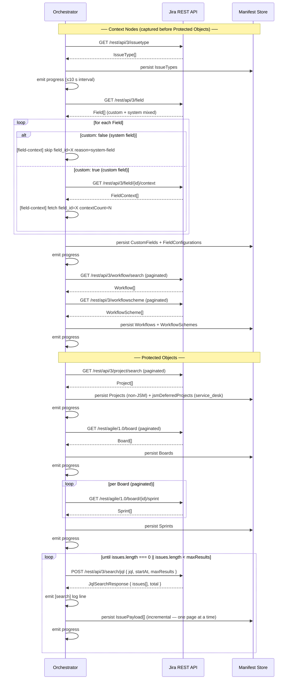

# Architecture — Jira Cloud Workload (Phase 1)

## Platform/Workload Boundary

### Overview

The DCC platform and the Jira Cloud workload communicate through a single,
transport-agnostic TypeScript interface. This keeps the platform free of any
Atlassian-specific SDK or HTTP concerns, and lets the workload be tested in
isolation with mock implementations.

### Key Files

| File | Purpose |
|------|---------|
| `src/platform_workload_iface.ts` | Boundary interface (`PlatformWorkloadInterface`) and its result types |
| `src/types/connection.ts` | Shared data contracts: `Connection`, `CredentialRecord`, and related input/output shapes |

### Interface Contract

```
PlatformWorkloadInterface
  discover(connection)               → DiscoverResult
  snapshot(connection, manifestId)   → SnapshotResult
  restore(connection, options)       → RestoreResult
  refresh_auth(connection)           → RefreshAuthResult
```

**`discover`** — Enumerates all Projects, Issues, Boards, and Sprints on the
connected Atlassian site and writes a manifest. Produces zero silent omissions.

**`snapshot`** — Captures a full backup of all objects listed in the manifest.
Emits a heartbeat progress event at least every 10 seconds. Returns
`SnapshotResult` with `errorCount > 0` when any individual item fails (the
UI displays "Completed with N errors", never "Completed successfully").

**`restore`** — Restores items from a named backup point. Enforces the write
dependency order required by T1 §1 and T5 §5.2:

> Project → Workflow + WorkflowScheme → CustomField + FieldConfiguration →
> Board → Sprint → Issue body → issue links + comments + attachments

A failure in any phase halts further execution and surfaces a named diagnostic
in `RestoreResult.phaseDiagnostic`.

**`refresh_auth`** — Rotates the Atlassian OAuth 2.0 access/refresh token pair
atomically. Both the new `accessToken` and new `refreshToken` are committed to
the credential store before the call resolves. The concrete implementation
must serialize concurrent refresh requests behind a mutex (T2 §4.5).

### Connection Record Shape

A `Connection` record (`src/types/connection.ts`) is the unit the platform
passes into every interface method. It bundles site identity (`cloudId`,
`siteName`) with the current credential pair and the OAuth scopes that were
granted at authorization time.

`CredentialRecord` — the embedded token pair — carries an `expiresAt` epoch
timestamp so callers can proactively trigger `refresh_auth` before the access
token expires rather than waiting for a 401.

### Design Constraints

- **No vendor HTTP imports in `src/platform_workload_iface.ts`.**  The boundary
  is transport-agnostic by design. `fetch`, `axios`, Atlassian SDK types, and
  similar concerns live in the workload implementation, not here.
- **`cloudId` is the stable site identifier.** `siteName` is display-only and
  must not be used as a key. A cloudId mismatch on re-auth must surface a 409
  to the platform (T2 §4.5).
- **`scopes` is an array of individual scope strings**, split from the
  space-delimited grant returned by Atlassian's token endpoint.

---

## Backup Engine

### Overview

The Backup Engine is the workload-side implementation of `PlatformWorkloadInterface.discover()`
and `PlatformWorkloadInterface.snapshot()`. It is entirely contained within
`src/workload/backup/`. All type contracts live in `src/workload/backup/types.ts`.

The engine is structured around three concerns:

1. **HTTP Client** — `IJiraHttpClient` abstracts all Atlassian REST calls behind
   a small, testable interface. The concrete implementation is `JiraHttpClient`
   (`src/http/JiraHttpClient.ts`), which holds the rotating-token mutex. Tests
   inject a double via the interface.

2. **Capture-Order Orchestrator** — `ICaptureOrchestrator` executes phases in the
   mandatory sequence and emits progress events. A phase failure halts the run and
   populates `phaseDiagnostic` before returning.

3. **Manifest** — `BackupManifest` is the artifact produced by `discover()`. It
   carries the full project inventory, JSM-deferred notices, and — after
   `snapshot()` — the coverage invariant.

### Phase Order

The orchestrator must execute phases **in this exact order**. No phase may be
skipped or reordered. Context nodes (IssueType through WorkflowScheme) are always
captured before Protected Objects (Project through Issue). Source: T1 §1, T3 §3.4.

```
Capture order (read-side / backup):
  IssueType
    → CustomField + FieldConfiguration
    → Workflow + WorkflowScheme
    → Project
    → Board
    → Sprint
    → Issue

Restore write order (mirror):
  Project
    → Workflow + WorkflowScheme
    → CustomField + FieldConfiguration
    → Board
    → Sprint
    → Issue body
    → issue links + comments + attachments (post-issue-creation pass)
```

### Key Files

| File | Purpose |
|------|---------|
| `src/workload/backup/types.ts` | All backup engine type contracts (see below) |
| `src/workload/http/JiraHttpClient.ts` | Concrete `IJiraHttpClient` implementation for the backup engine |
| `src/platform_workload_iface.ts` | `PlatformWorkloadInterface` — the boundary `discover()` / `snapshot()` sit on |

### `IJiraHttpClient` Interface

```typescript
interface IJiraHttpClient {
  getJson<T>(cloudBaseUrl: string, path: string, params?: Record<string, string>): Promise<T>;
  searchJql(cloudBaseUrl: string, body: JqlSearchRequest): Promise<JqlSearchResponse>;
  downloadAttachment(cloudBaseUrl: string, attachmentId: string): Promise<AttachmentDownload>;
}
```

- `getJson` — authenticated GET; caller drives pagination via `startAt` / `maxResults`.
- `searchJql` — **exclusive** Issue enumeration path. The deprecated
  `GET /rest/api/3/search` must not appear anywhere in backup-engine code
  (T2 §6 Constraint 6). Pagination terminates when
  `issues.length === 0 || issues.length < maxResults`.
- `downloadAttachment` — binary-faithful download via
  `GET /rest/api/3/attachment/content/{id}`. Returns raw bytes + SHA-256
  `contentHash`; no transcoding or recompression is applied (T3 §3.2, §4.4).

### `ICaptureOrchestrator` Interface

```typescript
interface ICaptureOrchestrator {
  runCapture(
    options: CaptureRunOptions,
    onProgress: (event: CaptureProgressEvent) => void
  ): Promise<CaptureRunResult>;
}
```

- `onProgress` is called at ≤10-second intervals. A gap of >20 s triggers a
  **stalled** alert in the UI (T5 §6.2).
- `CaptureRunResult.errorCount > 0` ⇒ UI shows "Completed with N errors",
  never "Completed successfully" (T5 §6.2b).
- `CaptureRunResult.phaseDiagnostic` is set and subsequent phases are not run
  when any phase returns `status: 'failed'` (T5 §5.2).

### `BackupManifest` Schema

```typescript
interface BackupManifest {
  manifestId: string;           // UUID
  cloudId: string;              // Atlassian site cloudId
  discoveredAt: string;         // ISO-8601
  projectScope: 'all' | 'selected';
  selectedProjectKeys: string[];
  projects: ProjectRecord[];
  jsmDeferredProjects: JsmDeferredProject[];
  coverageInvariant: CoverageInvariant | null;
}
```

**Zero-omissions invariant**: every project returned by
`GET /rest/api/3/project/search` appears in either `projects` or
`jsmDeferredProjects` — never silently omitted (T3 §4.3, T4 §6).

**JSM detection**: if `projectTypeKey === 'service_desk'`, the project is
placed in `jsmDeferredProjects` with `reason: 'PHASE_2_DEFERRED'` and excluded
from all backup phases. The onboarding wizard surfaces an out-of-scope notice
when this list is non-empty (T1 §1, T2 §6 Constraint 11).

**Coverage invariant** (`CoverageInvariant`): populated by the Issue phase.
`customFieldValues` on each `IssueRecord` must contain every custom field the
API returns — no field dropped. System fields (`custom: false`) are skipped
for context discovery but their IDs are recorded in `systemFieldsSkipped`
(T2 §6 Constraint 7, T3 §3.5).

### Project Discovery

Project discovery is performed via paginated
`GET /rest/api/3/project/search`. The `projectScope` field from the active
backup policy controls which projects are included:

- `"all"` — every page of results is consumed until the API returns an empty
  page; all projects are included.
- `"selected"` — same pagination, but only projects whose `key` appears in
  `selectedProjectKeys` are written to the manifest.

The paginated loop must consume all pages before proceeding to the next capture
phase. Discovery feeds `BackupManifest.projects` and
`BackupManifest.jsmDeferredProjects`.

### Custom Field Context Discovery

Custom field context is discovered via
`GET /rest/api/3/field/{id}/context` **only for fields where `custom: true`**.
System fields (`custom: false`) must never be passed to this endpoint — a
`[field-context] skip field_id=<id> reason=system-field` log line is emitted
for each skipped field (T2 §6 Constraint 7, T3 §4.2).

---

## Snapshot Orchestrator

### Overview

The Snapshot Orchestrator is the concrete implementation of
`ICaptureOrchestrator` (`src/workload/backup/types.ts`). All Snapshot-phase-
specific contracts live in `src/workload/snapshot/types.ts`.

The module defines:

- **`SnapshotPhase` enum** — the nine dependency-ordered capture phases as a
  TypeScript `enum` (not a string-union type), enabling runtime iteration via
  `Object.values(SnapshotPhase)` and exhaustive switch checking at compile time.
- **`SNAPSHOT_PHASE_ORDER`** — the canonical, immutable phase sequence.
- **`PhaseEmitBoundary` / `PHASE_EMIT_BOUNDARIES`** — per-phase emit and
  persist checkpoints.
- **`IssuePayload`** — the full Issue capture contract (coverage invariant).
- **`SearchLogLine` / `FieldContextLogLine`** — structured-log line shapes.
- **`PAGINATION_TERMINATION_CONTRACT`** — verbatim termination rule.

### Key Files

| File | Purpose |
|------|---------|
| `src/workload/snapshot/types.ts` | Snapshot-phase contracts: `SnapshotPhase` enum, `IssuePayload`, log-line shapes, pagination contract |
| `src/workload/backup/types.ts` | Shared backup-engine contracts: `CapturePhase`, `ICaptureOrchestrator`, `BackupManifest`, `IssueRecord` |

### Capture-Order Sequence Diagram



### SnapshotPhase Enum

Defined in `src/workload/snapshot/types.ts` as a TypeScript `enum`. The nine
phases in mandatory execution order:

| Phase | Class | API path |
|-------|-------|----------|
| `IssueType` | Context node | `GET /rest/api/3/issuetype` |
| `CustomField` | Context node | `GET /rest/api/3/field` |
| `FieldConfiguration` | Context node | `GET /rest/api/3/field/{id}/context` (custom only) |
| `Workflow` | Context node | `GET /rest/api/3/workflow/search` |
| `WorkflowScheme` | Context node | `GET /rest/api/3/workflowscheme` |
| `Project` | Protected object | `GET /rest/api/3/project/search` |
| `Board` | Protected object | `GET /rest/agile/1.0/board` |
| `Sprint` | Protected object | `GET /rest/agile/1.0/board/{id}/sprint` |
| `Issue` | Protected object | `POST /rest/api/3/search/jql` |

Context nodes are always captured before Protected Objects in every backup job
(T1 §1, T3 §3.4).

### Per-Phase Emit/Persist Boundaries

All phases share these invariants (defined in `PHASE_EMIT_BOUNDARIES`):

- `maxEmitIntervalSeconds: 10` — a progress event must be emitted at most every
  10 s. A gap of >20 s surfaces a **stalled** alert in the UI (T5 §6.2).
- `blocksNextPhase: true` — a phase must complete before the next phase begins.
  All phases are sequential; no concurrent phase execution is permitted.

| Phase | `persistsAtPhaseEnd` | Notes |
|-------|----------------------|-------|
| `IssueType` | `true` | Single GET; all items persisted at phase end |
| `CustomField` | `true` | Paginated GET; all items persisted at phase end |
| `FieldConfiguration` | `true` | Per-field GET (custom only); persisted at phase end |
| `Workflow` | `true` | Paginated GET; persisted at phase end |
| `WorkflowScheme` | `true` | Paginated GET; persisted at phase end |
| `Project` | `true` | Paginated GET; persisted at phase end |
| `Board` | `true` | Paginated GET; persisted at phase end |
| `Sprint` | `true` | Per-board paginated GET; persisted at phase end |
| `Issue` | **`false`** | Paginated JQL; **persisted incrementally** per page |

### Pagination Termination Contract

**Verbatim rule** (source: T2 §6 Constraint 6, CLAUDE.md Goals §8):

> Pagination for `POST /rest/api/3/search/jql` terminates when:
>
> ```
> issues.length === 0 || issues.length < maxResults
> ```
>
> The deprecated `GET /rest/api/3/search` endpoint must not appear anywhere in
> backup-engine code.

The paginator checks the condition **after** each page is received.
`issues.length < maxResults` catches partial (final) pages;
`issues.length === 0` catches the edge case where total is an exact multiple of
`maxResults`.

The contract is captured verbatim as `PAGINATION_TERMINATION_CONTRACT` in
`src/workload/snapshot/types.ts`.

### Structured-Log Line Shapes

#### `[search]` lines

Emitted **once per pagination request** to `POST /rest/api/3/search/jql`.

**Verbatim format** (source: `src/workload/http/JiraHttpClient.ts:107-109`):

```
[search] endpoint=search/jql project=<projectKey> page=<page> count=<count>
```

**Example — 3-page run, project PROJ, 243 issues, maxResults=100:**

```
[search] endpoint=search/jql project=PROJ page=1 count=100
[search] endpoint=search/jql project=PROJ page=2 count=100
[search] endpoint=search/jql project=PROJ page=3 count=43
```

Pagination terminates after the third request because `count(43) < maxResults(100)`.

Typed as `SearchLogLine` in `src/workload/snapshot/types.ts`.

#### `[field-context]` lines

Emitted **once per field** during the CustomField / FieldConfiguration phase.

**Verbatim format — skip (system field, `custom: false`):**

```
[field-context] skip field_id=<id> reason=system-field
```

**Verbatim format — fetch (custom field, `custom: true`):**

```
[field-context] fetch field_id=<id> contextCount=<n>
```

**Constraint**: `GET /rest/api/3/field/{id}/context` is called **only** for
fields where `custom: true`. Every system field (`custom: false`) always
produces a skip line — it is never passed to the context endpoint
(T2 §6 Constraint 7, T3 §4.2).

Typed as `FieldContextLogLine` (discriminated union) in
`src/workload/snapshot/types.ts`.

### IssuePayload Interface

`IssuePayload` (defined in `src/workload/snapshot/types.ts`) is the Snapshot-
phase contract for a fully captured Issue. It is the in-flight form produced
by the orchestrator; `IssueRecord` (`src/workload/backup/types.ts`) is the
persisted DB artifact that additionally carries `backupPointId` and `capturedAt`.

**Coverage invariant** (T3 §3.5):

- `customFieldValues` must contain **every** custom field (`custom: true`)
  returned by the API for this Issue.
- No entry may be dropped — the map must not omit any field.
- System fields (`custom: false`) must **not** appear in `customFieldValues`.

**Full field set** (T3 §3.3):

| Field | Type | Notes |
|-------|------|-------|
| `id` | `string` | Atlassian numeric Issue ID |
| `key` | `string` | e.g. "PROJ-42" |
| `projectId` | `string` | Atlassian numeric project ID |
| `summary` | `string` | System field |
| `description` | `AdfNode \| null` | ADF document |
| `issueType` | `{id, name}` | System field |
| `status` | `{id, name}` | System field |
| `priority` | `{id, name} \| null` | System field |
| `assignee` | `{accountId, displayName} \| null` | System field |
| `reporter` | `{accountId, displayName} \| null` | System field |
| `created` | `string` | ISO-8601 |
| `updated` | `string` | ISO-8601 |
| `resolutionDate` | `string \| null` | ISO-8601 |
| `labels` | `string[]` | System field |
| `customFieldValues` | `Record<string, unknown>` | All custom fields; no omissions |
| `comments` | `IssueComment[]` | ADF body + author + timestamps |
| `issueLinks` | `IssueLink[]` | All link types, both directions |
| `subtaskKeys` | `string[]` | Direct child Issue keys |
| `sprintIds` | `string[]` | Sprint membership (can be multiple) |
| `watcherAccountIds` | `string[]` | Issue watchers |
| `worklogs` | `WorklogEntry[]` | Worklog entries |
| `attachments` | `AttachmentRecord[]` | Attachment refs (binary stored separately) |

---

## Attachment Storage

### Overview

Attachment binaries are stored binary-faithful on disk under `data/attachments/`.
Every binary is byte-for-byte identical to the source returned by
`GET /rest/api/3/attachment/content/{id}` — no transcoding, recompression, or
filename rewriting is applied (T3 §3.2, §4.4).

Two files are written per attachment:

| File | Purpose |
|------|---------|
| `data/attachments/{backupPointId}/{issueKey}/{attachmentId}` | Raw binary — opaque bytes |
| `data/attachments/{backupPointId}/{issueKey}/{attachmentId}.meta.json` | Sidecar metadata JSON |

**Both paths are real and shipped** (Phase 2 Sprint 3). Path resolution is performed by
`resolveAttachmentPaths()` in `src/workload/types/Attachment.ts`; disk writes are in
`src/workload/snapshot/downloadIssueAttachments.ts`. The default base directory
(`data/attachments`) can be overridden via `DCC_ATTACHMENT_DIR` in `.env`.

Contracts (`src/workload/types/Attachment.ts`): `Attachment`, `AttachmentStoragePaths`,
`AttachmentSidecar`, `resolveAttachmentPaths`.

### Path Scheme

```
data/
  attachments/
    {backupPointId}/          ← one directory per backup point
      {issueKey}/             ← one directory per issue (e.g. PROJ-42)
        {attachmentId}        ← raw binary, no extension
        {attachmentId}.meta.json
```

`backupPointId` is the opaque backup-point UUID. `issueKey` is the Jira key
(e.g. `PROJ-42`). `attachmentId` is the Atlassian numeric attachment ID
(string form). Paths are resolved by `resolveAttachmentPaths()` in
`src/workload/types/Attachment.ts`.

### Sidecar Schema (`AttachmentSidecar`)

```typescript
interface AttachmentSidecar {
  attachmentId:  string;  // Atlassian numeric attachment ID
  issueKey:      string;  // e.g. "PROJ-42"
  backupPointId: string;  // backup-point UUID
  filename:      string;  // original filename — never rewritten
  mimeType:      string;  // from Content-Type response header
  size:          number;  // bytes
  sha256:        string;  // hex digest; re-verified on restore
  capturedAt:    string;  // ISO-8601
}
```

`sha256` is computed immediately after the binary is written to disk.
On restore, the engine reads the binary, recomputes SHA-256, and compares
it against the sidecar before sending the bytes to Atlassian. A mismatch
halts the restore for that attachment and adds an entry to `errors[]`.

### Design Constraints

- The binary file and its `.meta.json` sidecar are **always written together**.
  A binary without a sidecar (or vice versa) is treated as a corrupt entry.
- `AttachmentRecord` in `src/workload/backup/types.ts` is the **in-Issue
  reference** (stores `contentHash` and metadata inline with the Issue record).
  `AttachmentSidecar` is the **on-disk authority** for the binary.
- ADF media node rewriting after restore is Phase 2 (see Non-Goals in CLAUDE.md).
  A best-effort warning is surfaced in the restore report when attachment IDs
  change (T5 OQ-5).

---

## Manifest Deletion-Diff

### Overview

After every Discover run the engine computes a deletion-diff by comparing the
incoming project list against the persisted previous manifest. Each
`ProjectRecord` receives a `changeBadge` reflecting its state relative to the
prior backup point. The diff is stored as a `ManifestDiff` record alongside the
new `BackupManifest`.

Contracts (`src/workload/types/ManifestDiff.ts`): `ChangeBadge`,
`ProjectDiffEntry`, `ManifestDiffSummary`, `ManifestDiff`.

### ChangeBadge Computation

| Badge | Condition |
|-------|-----------|
| `added` | `projectId` present in current manifest; absent in previous |
| `modified` | `projectId` present in both; ≥1 tracked field differs |
| `deleted` | `projectId` present in previous manifest; absent in current |
| `unchanged` | `projectId` present in both; all tracked fields identical |

The comparison key is `projectId` (Atlassian numeric project ID), not
`projectKey` — project keys can be renamed without changing the ID.

On the **first-ever backup run** `previousManifestId` is `null` and every
project receives `changeBadge: 'added'`.

### ManifestDiff Schema

```typescript
interface ManifestDiff {
  previousManifestId: string | null;  // null on first run
  currentManifestId:  string;
  computedAt:         string;         // ISO-8601
  projects:           ProjectDiffEntry[];
  summary:            ManifestDiffSummary;
}

interface ProjectDiffEntry {
  projectId:   string;
  projectKey:  string;
  changeBadge: ChangeBadge;           // 'added' | 'modified' | 'deleted' | 'unchanged'
  current:     ProjectRecord | null;  // null for deleted entries
  previous:    ProjectRecord | null;  // null for added entries
}

interface ManifestDiffSummary {
  added:     number;
  modified:  number;
  deleted:   number;
  unchanged: number;
  total:     number;  // === projects.length
}
```

The UI displays the `changeBadge` alongside each project row in the Protected
Object Inventory view. `deleted` projects are shown with a strikethrough badge
to indicate they no longer exist on the Jira site.

---

## Progress Event Contract

### Overview

Both backup (`CaptureOrchestrator`) and restore jobs emit `ProgressEvent`
objects on a heartbeat cadence. The platform layer handles them uniformly
regardless of job type.

Contracts (`src/workload/types/ProgressEvent.ts`): `ProgressEvent`,
`ProgressError`, `JobStatus`, `MAX_HEARTBEAT_INTERVAL_MS`, `STALLED_THRESHOLD_MS`.

### Event Shape

```typescript
interface ProgressEvent {
  jobId:     string;           // backup-point ID or restore job ID
  ts:        string;           // ISO-8601 — moment of emission
  phase:     string;           // current phase name, e.g. "Issue", "Sprint"
  processed: number;           // items successfully processed in current phase
  total:     number | null;    // null while total is not yet known
  errors:    ProgressError[];  // all item-level errors accumulated across phases
}

interface ProgressError {
  itemId:  string;  // Issue key, project ID, attachment ID, etc.
  message: string;
  phase:   string;  // phase in which the error occurred
}
```

`errors` accumulates across the full job lifetime and is never reset between
phases — the consumer always sees a running total.

### Cadence and Stalled Detection

| Constant | Value | Meaning |
|----------|-------|---------|
| `MAX_HEARTBEAT_INTERVAL_MS` | `10 000` | Maximum ms between emitted events |
| `STALLED_THRESHOLD_MS` | `20 000` | Silence threshold before 'stalled' alert |

A job with no heartbeat for >20 s must be surfaced as `'stalled'` in the UI
(T5 §6.2). The orchestrator is responsible for emitting at least one event
every 10 s; the platform is responsible for detecting the 20 s silence
boundary and transitioning the job status.

### Terminal Status Semantics (`JobStatus`)

```typescript
type JobStatus =
  | 'pending'
  | 'running'
  | 'completed'
  | 'completed_with_errors'
  | 'failed'
  | 'stalled';
```

| Status | When set |
|--------|----------|
| `completed` | Job finished, `errors.length === 0` |
| `completed_with_errors` | Job finished, `errors.length > 0` |
| `failed` | A phase returned `status: 'failed'`; subsequent phases not run |
| `stalled` | Platform-set; no heartbeat received for >20 s |

**Invariant**: when `status === 'completed_with_errors'` the UI **must** display
"Completed with N errors". The string "Completed successfully" must not appear
when `errors.length > 0` (T5 §6.2b).

---

## Policy Record

### Overview

A `PolicyRecord` is created or replaced by `POST /api/policies`. It extends
the previously documented request body with `rpoHours` (which drives the
platform backup schedule) and an optional `jqlFilter` validated before storage.

Contracts (`src/workload/types/PolicyRecord.ts`): `PolicyRecord`,
`PolicyRequest`, `JqlParseRequest`, `JqlParseResponse`.

### PolicyRecord Shape

```typescript
interface PolicyRecord {
  policyId:            string;           // UUID
  connectionId:        string;
  rpoHours:            number;           // Recovery Point Objective in hours
  retentionDays:       number;
  projectScope:        'all' | 'selected';
  selectedProjectKeys: string[];         // empty when projectScope === 'all'
  jqlFilter?:          string;           // validated JQL; absent when not configured
  createdAt:           string;           // ISO-8601
  updatedAt:           string;           // ISO-8601
}
```

`rpoHours` is consumed by the platform scheduler to determine backup frequency.
Phase 1 does not expose a custom backup window in the operator UI (Non-Goal),
but the field is stored for platform-internal use (T4 §3).

At most one `PolicyRecord` exists per `connectionId` at any time. A new
`POST /api/policies` for an existing connection replaces the prior record
(`updatedAt` is refreshed; `createdAt` is preserved).

### jqlFilter Validation Flow

When `PolicyRequest.jqlFilter` is present and non-empty, the server executes
this validation sequence before writing the record:

```
1. POST /rest/api/3/jql/parse
   Body: { "queries": ["<jqlFilter>"] }

2. If response.queries[0].errors is non-empty:
   → HTTP 400 { "error": "invalid_jql", "details": response.queries[0].errors }

3. On success:
   → Write PolicyRecord with the validated jqlFilter
   → HTTP 201 PolicyRecord (as JSON)
```

**`JqlParseRequest`:**
```json
{ "queries": ["project = PROJ AND created >= -30d"] }
```

**`JqlParseResponse`** (success):
```json
{
  "queries": [
    { "query": "project = PROJ AND created >= -30d", "errors": [] }
  ]
}
```

**`JqlParseResponse`** (failure):
```json
{
  "queries": [
    { "query": "project = INVALID SYNTAX", "errors": ["Expecting operator but got 'SYNTAX'."] }
  ]
}
```

### Updated POST /api/policies Request Body

The full request body (superset of the stub documented in the API Surface
section below) is:

```json
{
  "connectionId":        "550e8400-...",
  "rpoHours":            24,
  "retentionDays":       30,
  "projectScope":        "all",
  "selectedProjectKeys": [],
  "jqlFilter":           "created >= -90d"
}
```

`rpoHours` and `retentionDays` are required. `jqlFilter` and
`selectedProjectKeys` are optional. Implementations must accept both bodies
(with and without `rpoHours`/`jqlFilter`) for backwards compatibility during
the transition sprint.

---

## Inventory Browse Flow

### Overview

The Inventory Browse Flow delivers the operator-facing Inventory sidebar and
Object Explorer. It reads exclusively from the SQLite-backed snapshot manifest
produced by `JiraWorkload.snapshot()` — it **never** issues calls to the
Atlassian REST API at browse time.

### Data Flow

```
┌─────────────────────────────────────────────────────────────────────┐
│  Snapshot Phase  (JiraWorkload.snapshot)                            │
│  CaptureOrchestrator persists:                                      │
│    backup_manifests.manifest_json  ← BackupManifest (JSON blob)     │
│    backup_jobs.completed_at        ← ISO-8601 timestamp             │
└──────────────────────────────┬──────────────────────────────────────┘
                               │ SQLite read  (zero Atlassian calls)
                               ▼
┌─────────────────────────────────────────────────────────────────────┐
│  Inventory Handlers  (inline — no separate repository class)        │
│  (src/routes/inventory.ts)                                          │
│                                                                     │
│  handleGetInventory(req, res)                                       │
│    ► loads latest BackupManifest from backup_manifests              │
│    ► counts each type; strips JSM-deferred project entries          │
│    ► returns InventoryResponse                                      │
│                                                                     │
│  handleGetInventoryByType(req, res)                                 │
│    ► reads backup_point_items rows for (connectionId, backupPointId,│
│      objectType) — with filter, search, and JSM-exclusion applied   │
│    ► projects each row to InventoryItem                             │
│    ► returns InventoryItemsResponse                                 │
└──────────────────────────────┬──────────────────────────────────────┘
                               │
                ┌──────────────┴──────────────┐
                ▼                             ▼
   GET /api/inventory            GET /api/inventory/:type
   (src/routes/inventory.ts)     (src/routes/inventory.ts)
                │                             │
                ▼                             ▼
   Inventory Sidebar              Object Explorer
   (React — Phase 1 UI)           (React — Phase 1 UI)
   4 types: Issue, Project,        Pagination, filter facets,
   Board, Sprint (Issues default)  search, traceability click
```

### Boundary Rule

The inventory handlers in `src/routes/inventory.ts` read only from the SQLite
tables written by the snapshot phase. The two relevant tables are:

- `backup_manifests` — stores `BackupManifest` JSON blobs (JSM deferred list,
  project/field counts, coverage invariant). Used by both handlers.
- `backup_point_items` — per-object-type item rows written during the snapshot
  phase. Used by `handleGetInventoryByType` as the primary item source for all
  paginated listings.

Neither handler constructs or executes any HTTP request to the Atlassian REST
API. All inventory data reflects the state captured during the most recent
successful snapshot for the given `connectionId`.

### JSM Exclusion Rule

Projects, Issues, Boards, and Sprints that belong to a project where
`projectTypeKey === 'service_desk'` are **excluded** from all inventory responses:

- `objectTypes[].count` in `GET /api/inventory` never includes JSM items.
- `items[]` in `GET /api/inventory/:type` never contains JSM items.

The driving manifest field is `BackupManifest.jsmDeferredProjects[]`. Any item
whose `projectId` appears in that array is filtered inside the inventory handlers
before the response is built. Callers cannot override this filter.

---

### GET /api/inventory (expanded)

This sprint expands the stub response (previously documented in §API Surface)
with the full `objectTypes[]` array. The route handler is
`src/routes/inventory.ts`.

**Query parameters:**

| Parameter | Required | Description |
|-----------|----------|-------------|
| `connectionId` | Yes | The `connectionId` of the target connection |

**Success response (200) — `InventoryObjectTypesResponse`:**

```typescript
/** Stable object-type identifier; used as the :type path param. */
type InventoryObjectType =
  | 'Issue'
  | 'Project'
  | 'Board'
  | 'Sprint'
  | 'Workflow'
  | 'CustomField';

interface InventoryObjectTypeEntry {
  /** Stable machine identifier — used as the :type path param. */
  type:         InventoryObjectType;
  /** Human-readable label for the sidebar row. */
  displayName:  string;
  /** Count of backed-up objects of this type, excluding JSM-deferred items. */
  count:        number;
  /**
   * ISO-8601 timestamp of the most recent snapshot that captured this type.
   * null when the type has never been snapshotted (e.g. snapshot not yet run).
   */
  lastBackupAt: string | null;
  /** true when ≥1 JSM project was excluded from this type's count. */
  jsmExcluded:  boolean;
}

interface InventoryObjectTypesResponse {
  /** UUID of the most recent BackupManifest for this connection. */
  manifestId:  string;
  /** ISO-8601 timestamp when the snapshot that produced this manifest completed. */
  completedAt: string;
  /** One entry per object type, in the order: Issue, Project, Board, Sprint, Workflow, CustomField. */
  objectTypes: InventoryObjectTypeEntry[];
}
```

**Example:**
```json
{
  "manifestId": "7f3d1234-...",
  "completedAt": "2026-05-04T03:00:00Z",
  "objectTypes": [
    { "type": "Issue",       "displayName": "Issues",        "count": 1248, "lastBackupAt": "2026-05-04T03:00:00Z", "jsmExcluded": false },
    { "type": "Project",     "displayName": "Projects",      "count": 5,    "lastBackupAt": "2026-05-04T03:00:00Z", "jsmExcluded": false },
    { "type": "Board",       "displayName": "Boards",        "count": 3,    "lastBackupAt": "2026-05-04T03:00:00Z", "jsmExcluded": false },
    { "type": "Sprint",      "displayName": "Sprints",       "count": 12,   "lastBackupAt": "2026-05-04T03:00:00Z", "jsmExcluded": false },
    { "type": "Workflow",    "displayName": "Workflows",     "count": 4,    "lastBackupAt": "2026-05-04T03:00:00Z", "jsmExcluded": false },
    { "type": "CustomField", "displayName": "Custom Fields", "count": 22,   "lastBackupAt": "2026-05-04T03:00:00Z", "jsmExcluded": false }
  ]
}
```

**Sidebar rendering rule (T8 §2, §3):** The Phase 1 sidebar renders exactly four
object types in fixed order — Issues (default selection), Projects, Boards,
Sprints. Workflow and CustomField entries are included in the API response for
future use but are not rendered in the Phase 1 sidebar.

**Error responses:**

| Status | `error` field | Meaning |
|--------|--------------|---------|
| `400` | `missing_required_fields` | `connectionId` query parameter absent |
| `404` | `connection_not_found` | No connection matches the supplied `connectionId` |
| `404` | `no_manifest_found` | Connection exists but no snapshot has been run |

---

### GET /api/inventory/:type

Returns a paginated list of backed-up objects of a single type. The route
handler is `src/routes/inventory.ts`.

**Path parameter:**

| Parameter | Values |
|-----------|--------|
| `:type` | `Issue` \| `Project` \| `Board` \| `Sprint` \| `Workflow` \| `CustomField` |

**Query parameters:**

| Parameter | Required | Default | Description |
|-----------|----------|---------|-------------|
| `connectionId` | Yes | — | `connectionId` of the target connection |
| `backupPointId` | **Yes** | — | UUID of the backup point to query; returned by `GET /api/inventory` as `backupPointId` |
| `limit` | No | `50` | Page size; max `200` |
| `offset` | No | `0` | Zero-based offset into the result set |

**Success response (200) — `InventoryItemsResponse`:**

```typescript
interface InventoryPagination {
  limit:  number;   // effective page size used
  offset: number;   // zero-based offset
  total:  number;   // total matched items (drives page-control rendering)
}

/** Base item shape shared by all object types. */
interface InventoryItem {
  /** Atlassian numeric object ID (string form). */
  id:                   string;
  /**
   * Human-readable label rendered in the Object Explorer row.
   * Per-type format:
   *   Issue       → IssueRecord.key verbatim, e.g. "PROJ-42"  (see displayName invariant below)
   *   Project     → project name
   *   Board       → board name
   *   Sprint      → sprint name
   *   Workflow    → workflow name
   *   CustomField → field display name
   */
  displayName:          string;
  /**
   * Deletion-diff badge relative to the previous backup point.
   * Sourced from ProjectRecord.changeBadge; Issues inherit their project's badge.
   * Enum: 'added' | 'modified' | 'deleted' | 'unchanged'
   * Source: src/workload/backup/types.ts :: ChangeBadge
   */
  changeBadge:          'added' | 'modified' | 'deleted' | 'unchanged';
  /** UUID of the backup point under which this item was captured. Single-click traceability (T5 §6.2). */
  backupPointId:        string;
  /** ISO-8601 timestamp when this item was captured. Single-click traceability. */
  backupPointTimestamp: string;
}

/**
 * Issue-specific item shape.
 *
 * displayName MUST equal IssueRecord.key verbatim (e.g. "PROJ-42").
 * InventoryRepository populates displayName directly from the persisted
 * IssueRecord.key — it does NOT construct the key from parts.
 *
 * projectKey and issueNumber are extracted from the key string (split on '-')
 * for filter/sort use only.
 */
interface IssueInventoryItem extends InventoryItem {
  /** Jira project key, e.g. "PROJ". Used for project-based filtering. */
  projectKey:  string;
  /** Numeric part of the issue key (42 for "PROJ-42"). Used for numeric sort. */
  issueNumber: number;
  /** Issue summary text — rendered as secondary label in the Object Explorer row. */
  summary:     string;
}

interface InventoryItemsResponse {
  items:      InventoryItem[];   // IssueInventoryItem[] when type === 'Issue'
  pagination: InventoryPagination;
}
```

**Issue `displayName` invariant:** For Issues, `displayName` is always
`IssueRecord.key` verbatim (e.g. `"PROJ-42"`). The format is
`<PROJECT_KEY>-<N>` where `PROJECT_KEY` is the Jira project key and `N` is the
sequential issue number. `InventoryRepository` reads this directly from the
persisted `IssueRecord.key` field — it never reconstructs the key from parts.

**`changeBadge` enum** (source: `src/workload/backup/types.ts :: ChangeBadge`):

| Value | Meaning |
|-------|---------|
| `added` | Object is present in current manifest; absent in previous |
| `modified` | Object present in both; ≥1 tracked field differs |
| `deleted` | Object present in previous manifest; absent in current |
| `unchanged` | Object present in both; all tracked fields identical |

**Error responses:**

| Status | `error` field | Meaning |
|--------|--------------|---------|
| `400` | `missing_required_fields` | `connectionId` absent or `:type` is not a valid `InventoryObjectType` |
| `404` | `connection_not_found` | No connection matches the supplied `connectionId` |
| `404` | `backup_point_not_found` | Supplied `backupPointId` does not exist for this connection |

---

### Inventory Handler Functions

Inventory logic lives inline in `src/routes/inventory.ts` (no separate repository class).

```typescript
/** Pure helper — builds the objectTypes[] response from a manifest (or null). Directly testable. */
export function buildInventoryResponse(manifest: BackupManifest | null): InventoryResponse;

/** Route handler for GET /api/inventory — returns objectTypes[] sourced from the latest manifest. */
export function handleGetInventory(req: Request, res: Response): void;

/** Route handler for GET /api/inventory/:type — returns paginated items from backup_point_items. */
export function handleGetInventoryByType(req: Request, res: Response): void;
```

**Data sourcing per type:**

All paginated item lists are sourced from the `backup_point_items` table
(migration `011_inventory_items.sql`). Rows are filtered by
`(connectionId, backupPointId, objectType)`. JSM-deferred project IDs and keys
are loaded from the `backup_manifests` row for defense-in-depth exclusion.

| Object Type | `objectType` value in `backup_point_items` | ID field (`itemId`) |
|-------------|-------------------------------------------|---------------------|
| `Issue` | `'Issue'` | Jira issue key, e.g. `"PROJ-42"` |
| `Project` | `'Project'` | Atlassian project ID |
| `Board` | `'Board'` | Board ID string |
| `Sprint` | `'Sprint'` | Sprint ID string |

**Key files:**

| File | Purpose |
|------|---------|
| `src/routes/inventory.ts` | Express router + inline repository logic — handles both `GET /api/inventory` and `GET /api/inventory/:type`; exports `buildInventoryResponse()` as a pure testable helper |
| `src/platform/contracts.ts` | Extended with `ObjectTypeEntry`, `InventoryResponse`; item-level shapes (`InventoryItem`, `InventoryItemsResponse`) are defined locally in `src/ui/components/ObjectExplorer.tsx` |

### Search and Filter Capabilities (Object Explorer)

Documented here for architectural completeness; UI implementation is a separate
sprint task.

| Capability | Applies to | Rule |
|-----------|------------|------|
| Exact-match Issue key search | Issues | Match `IssueRecord.key` exactly, case-insensitive |
| Tokenized case-insensitive summary search | Issues | Tokenise query on whitespace; all tokens must appear in `IssueRecord.summary` |
| Tokenised partial-match attachment filename | Attachments (via Issues) | Each token matched as a substring of `AttachmentRecord.filename` |
| Body-content search | **Disabled** | Full-text search across ADF description/comment text is explicitly disabled in Phase 1 |
| Filter facets | Issues | `status`, `issueType`, `assignee`, `sprint`, `board`, `label`, `priority`, `updated` date-range |

Body-content search (ADF `description` and `comments[].body`) is explicitly
disabled in Phase 1 (T8 §3). The route must return `400 body_search_disabled`
if a body-search parameter is passed.

### Single-Click Traceability

Every `InventoryItem` carries `backupPointId` and `backupPointTimestamp`. A
single UI click on any Object Explorer row navigates to its backup-point detail,
showing the backup-point UUID, completion timestamp, and job status. This
satisfies the traceability requirement (T5 §6.2, T8 §3).

- For Issues: `backupPointId` is sourced from `IssueRecord.backupPointId`.
- For all other types: `backupPointId` is sourced from the
  `backup_jobs.backupPointId` column that owns the manifest.

---

### Inventory Browse Contracts

This subsection codifies the precise query-parameter contracts for the filter,
search, traceability, and JSM-exclusion extensions to `GET /api/inventory/:type`.
These are the net-new structures introduced in Phase 3 Sprint 2.

#### Filter Facet Parameters (`:type === 'Issue'`)

When `:type === 'Issue'`, the handler accepts the following filter parameters in
addition to `connectionId`, `backupPointId`, `limit`, and `offset`:

| Parameter | Type | Multi-value | Semantics |
|-----------|------|-------------|-----------|
| `status` | `string` | Yes (OR) | Match issues where `status.name` equals any supplied value. Case-insensitive. |
| `issueType` | `string` | Yes (OR) | Match issues where `issueType.name` equals any supplied value. Case-insensitive. |
| `assignee` | `string` | Yes (OR) | Match issues where `assignee.accountId` equals any supplied value. Issues with no assignee are excluded when this param is present. |
| `sprint` | `string` | Yes (OR) | Match issues where `sprintIds[]` contains any of the supplied sprint IDs. |
| `board` | `string` | Yes (OR) | Match issues that belong to any of the supplied board IDs. |
| `label` | `string` | Yes (**AND**) | Match issues where `labels[]` contains **all** supplied label values. |
| `priority` | `string` | Yes (OR) | Match issues where `priority.name` equals any supplied value. Case-insensitive. |
| `updatedFrom` | `string` (ISO-8601) | No | Include issues where `updated >= updatedFrom`. |
| `updatedTo` | `string` (ISO-8601) | No | Include issues where `updated <= updatedTo`. |

**Combining rules**: filter parameters are AND-combined across types (e.g.
`status=Done&issueType=Bug` requires both). Within a single repeatable parameter,
values are OR-combined (except `label`, which is AND-combined). All filter
parameters are optional; omitting a parameter applies no constraint for that
dimension.

#### Issue Search Parameters (`:type === 'Issue'`)

| Parameter | Semantics |
|-----------|-----------|
| `q` | Dual-mode search. If the value matches `[A-Z][A-Z0-9_]+-\d+`, performs **exact-match** on `itemId` (Issue key lookup; returns at most one result). Otherwise, tokenizes on whitespace; all tokens must appear in `LOWER(summary)` (AND across tokens, case-insensitive summary search). |
| `attachmentFilename` | **Tokenized partial-match** against the `attachments` JSON array column. Query is split on whitespace; each token is matched as a case-insensitive substring of each stored filename (AND across tokens). Returns the parent Issue when any attachment filename satisfies all tokens. |

#### Body-Content Search — Explicitly Disabled (Phase 1)

Full-text search across ADF `description` and `comments[].body` is **explicitly
disabled in Phase 1** (T8 §3). This is a hard non-contract, not a deferred backlog
item. The route **must** return HTTP 400 if any body-search query parameter is
supplied:

```json
{ "error": "body_search_disabled", "message": "Full-text search across ADF description and comment body is not supported in Phase 1." }
```

No partial implementation of ADF body search is permitted.

#### JSM Exclusion Rule — InventoryRepository Boundary

The JSM exclusion filter is applied at the data boundary — before any response
object is constructed — using the following rule:

```
If item.projectId ∈ BackupManifest.jsmDeferredProjects[].projectId:
  → exclude item from all inventory responses

Implementation:
  1. Load BackupManifest.jsmDeferredProjects[] from the persisted manifest.
  2. Build: excludedProjectIds = new Set(jsmDeferredProjects.map(p => p.projectId))
  3. Keep item only when item.projectId ∉ excludedProjectIds.
```

`jsmDeferredProjects[]` is populated during the Discover phase: any project where
`projectTypeKey === 'service_desk'` is written to `jsmDeferredProjects` (with
`reason: 'PHASE_2_DEFERRED'`) rather than `projects`. The inventory handler reads
this array from the persisted manifest at query time.

The filter is unconditional at both response layers:

- **`GET /api/inventory`** — `objectTypes[].count` never includes JSM items;
  `jsmExcluded: true` is set when ≥1 project was excluded.
- **`GET /api/inventory/:type`** — `items[]` never contains any item whose
  `projectId` appears in `jsmDeferredProjects[]`.

Callers cannot override or bypass this filter (T1 §1, T2 §6 Constraint 11,
T3 §3.2).

#### Traceability Contract

Every `InventoryItem` returned by `GET /api/inventory/:type` carries two
traceability fields regardless of object type:

| Field | Type | Source |
|-------|------|--------|
| `backupPointId` | `string` (UUID) | The `backupPointId` query parameter echoed back verbatim; identifies the backup point that produced this item. |
| `backupPointTimestamp` | `string` (ISO-8601) | The `capturedAt` value from the `backup_point_items` row — the moment the item was written to the backup store. |

Both fields are always present — never `null`, never omitted. A single UI click on
any Object Explorer row uses these fields to navigate to the backup-point detail
view (UUID, completion timestamp, job status), satisfying T5 §6.2 and T8 §3.

---

## API Surface (T0 §2)

The Platform Stub exposes four endpoint groups. All paths are mounted under
`/api`. TypeScript request/response types for every endpoint live in
`src/platform/contracts.ts`.

### Endpoint Map

| Method | Path | Description |
|--------|------|-------------|
| `POST` | `/api/connections` | Create or update a connection (OAuth or Manual) |
| `GET` | `/api/inventory` | Return the latest discovery manifest for a connection |
| `POST` | `/api/policies` | Create or update the backup policy for a connection |
| `POST` | `/api/restores` | Initiate a restore job |
| `GET` | `/api/restores/:id` | Poll restore job status |
| `GET` | `/api/restores/:id/events` | Server-Sent Events stream for restore progress |

---

### POST /api/connections

Creates or updates a connection. Accepts two variants distinguished by the
`connectionType` discriminator field.

**OAuth request body:**

```json
{
  "connectionType": "oauth",
  "cloudId": "a1b2c3d4-...",
  "siteName": "my-org.atlassian.net",
  "accessToken": "<bearer>",
  "refreshToken": "<refresh>",
  "expiresAt": 1746500000,
  "scopes": ["read:jira-user", "read:jira-work", "write:jira-work", "..."]
}
```

**Manual request body:**

```json
{
  "connectionType": "manual",
  "cloudId": "a1b2c3d4-...",
  "siteName": "my-org.atlassian.net",
  "clientId": "ATL-CLIENT-ID",
  "clientSecret": "s3cr3t"
}
```

**Success response (201):**

```json
{
  "connectionId": "550e8400-...",
  "cloudId": "a1b2c3d4-...",
  "siteName": "my-org.atlassian.net",
  "scopes": ["read:jira-user", "..."],
  "createdAt": "2026-05-04T12:00:00Z",
  "clientIdMasked": "****WXYZ"
}
```

> `clientIdMasked` is present only for Manual connections. It contains `****`
> followed by the last 4 characters of the supplied `clientId`. The full
> `clientId` and `clientSecret` are never returned in any response.

**Error responses:**

| Status | `error` field | Meaning |
|--------|--------------|---------|
| `400` | `missing_required_fields` | One or more required body fields are absent |
| `409` | `cloudid_mismatch` | Re-auth `cloudId` differs from the stored `cloudId` for this connection |

**409 example payload:**

```json
{
  "error": "cloudid_mismatch",
  "message": "The cloudId in the re-authorization response does not match the stored cloudId for this connection. Re-authorization must use the same Atlassian site.",
  "storedCloudId": "a1b2c3d4-...",
  "receivedCloudId": "b2c3d4e5-..."
}
```

---

### GET /api/inventory

Returns the latest discovery manifest for a connected Jira site. Maps to
`PlatformWorkloadInterface.discover()`.

**Query parameters:**

| Parameter | Required | Description |
|-----------|----------|-------------|
| `connectionId` | Yes | The `connectionId` of the target connection |

**Success response (200):**

```json
{
  "manifestId": "7f3d...",
  "completedAt": "2026-05-04T03:00:00Z",
  "counts": {
    "projects": 5,
    "issues": 1248,
    "boards": 3,
    "sprints": 12
  }
}
```

**Error responses:**

| Status | `error` field | Meaning |
|--------|--------------|---------|
| `404` | `connection_not_found` | No connection matches the supplied `connectionId` |

---

### POST /api/policies

Creates or replaces the backup policy for a connection.

**Request body:**

```json
{
  "connectionId": "550e8400-...",
  "projectScope": "all",
  "selectedProjectKeys": [],
  "retentionDays": 30
}
```

`projectScope` is `"all"` (every project on the site) or `"selected"` (only
the keys listed in `selectedProjectKeys`).

**Success response (201):**

```json
{
  "policyId": "a2b3c4d5-...",
  "connectionId": "550e8400-...",
  "projectScope": "all",
  "selectedProjectKeys": [],
  "retentionDays": 30,
  "updatedAt": "2026-05-04T12:05:00Z"
}
```

**Error responses:**

| Status | `error` field | Meaning |
|--------|--------------|---------|
| `400` | `missing_required_fields` | Required body fields absent |
| `404` | `connection_not_found` | No connection matches the supplied `connectionId` |

---

### POST /api/restores

Initiates a restore job. Maps to `PlatformWorkloadInterface.restore()`.

**Request body:**

```json
{
  "connectionId": "550e8400-...",
  "backupPointId": "bp-20260504-...",
  "itemIds": ["PROJ-1", "PROJ-2"],
  "conflictMode": "skip",
  "destination": {
    "type": "original"
  }
}
```

`conflictMode` values: `"override"`, `"skip"` (default), `"ask"`.

`destination.type` values: `"original"`, `"alternate"`, `"export"`.
For `"alternate"` destination, also include `cloudId` and `projectKey` fields.
Cross-site restore is not supported in Phase 1 (T5 §5.2).

**Success response (201):**

```json
{
  "restoreId": "rj-9f3a...",
  "status": "pending"
}
```

**Error responses:**

| Status | `error` field | Meaning |
|--------|--------------|---------|
| `400` | `missing_required_fields` | Required body fields absent |
| `404` | `connection_not_found` | No connection matches the supplied `connectionId` |
| `404` | `backup_point_not_found` | No backup point matches the supplied `backupPointId` |

---

### GET /api/restores/:id

Polls the status of a restore job.

**Success response (200):**

```json
{
  "restoreId": "rj-9f3a...",
  "connectionId": "550e8400-...",
  "backupPointId": "bp-20260504-...",
  "status": "completed_with_errors",
  "restoredCount": 47,
  "errorCount": 2,
  "phaseDiagnostic": "Sprint phase: 2 sprints failed to restore — see item-level errors.",
  "createdAt": "2026-05-04T12:10:00Z",
  "completedAt": "2026-05-04T12:15:32Z"
}
```

`status` values: `"pending"`, `"running"`, `"completed"`, `"completed_with_errors"`,
`"failed"`, `"stalled"`. The stub initialises new jobs as `"pending"`.

A job is `"stalled"` if no heartbeat has been received for >20 seconds
(T5 §6.2). `"completed_with_errors"` is used when `errorCount > 0`; the UI
must display "Completed with N errors", never "Completed successfully"
(T5 §6.2b).

**Error responses:**

| Status | `error` field | Meaning |
|--------|--------------|---------|
| `404` | `restore_not_found` | No restore job matches the supplied `id` |

---

### Manual vs OAuth Connection Flow

```
OAuth flow                              Manual flow
─────────────────────────────────────   ──────────────────────────────────────
Operator clicks [Authorize]             Operator enters Client ID + Secret
        │                                              │
        ▼                                              ▼
GET /api/oauth/authorize                 POST /api/connections
(redirect to Atlassian consent)          { connectionType: "manual",
        │                                  clientId, clientSecret }
        ▼                                              │
Atlassian consent screen                               │
        │                                              │
        ▼                               Platform resolves cloudId via
GET /api/oauth/callback                  GET /rest/api/3/myself,
(code + state exchange)                  stores masked clientId (****XXXX),
        │                                stores clientSecret encrypted at rest
        ▼                                              │
POST /api/connections                                  │
{ connectionType: "oauth",                             │
  accessToken, refreshToken,             ┌─────────────┘
  expiresAt, cloudId, siteName, scopes } │
        │                                │
        └──────────────┬─────────────────┘
                       ▼
           HTTP 201 ConnectionResponse
           { connectionId, cloudId, siteName,
             scopes, createdAt, clientIdMasked? }
```

---

### Credential Masking Rules

| Credential | Storage | Returned in responses |
|------------|---------|----------------------|
| `accessToken` | Credential store | Never returned after initial 201 |
| `refreshToken` | Credential store | Never returned in any response |
| `clientId` (Manual) | Stored internally | Only `clientIdMasked` ("****" + last 4 chars) returned |
| `clientSecret` (Manual) | Encrypted at rest | Never returned in any response |

The `clientIdMasked` field appears in the 201 creation response and in
subsequent `GET /api/connections` list responses for display purposes. The
plaintext `clientId` is never returned after the initial request.
