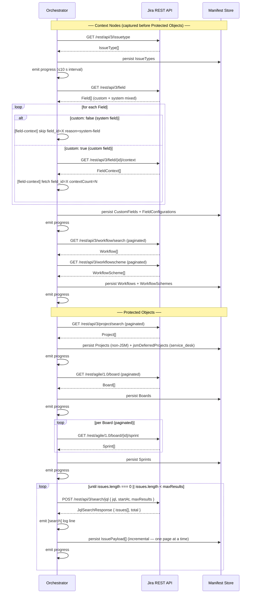

# Architecture — Jira Cloud Workload (Phase 1)

## Platform/Workload Boundary

### Overview

The DCC platform and the Jira Cloud workload communicate through a single,
transport-agnostic TypeScript interface. This keeps the platform free of any
Atlassian-specific SDK or HTTP concerns, and lets the workload be tested in
isolation with mock implementations.

### Key Files

| File | Purpose |
|------|---------|
| `src/platform_workload_iface.ts` | Boundary interface (`PlatformWorkloadInterface`) and its result types |
| `src/types/connection.ts` | Shared data contracts: `Connection`, `CredentialRecord`, and related input/output shapes |

### Interface Contract

```
PlatformWorkloadInterface
  discover(connection)               → DiscoverResult
  snapshot(connection, manifestId)   → SnapshotResult
  restore(connection, options)       → RestoreResult
  refresh_auth(connection)           → RefreshAuthResult
```

**`discover`** — Enumerates all Projects, Issues, Boards, and Sprints on the
connected Atlassian site and writes a manifest. Produces zero silent omissions.

**`snapshot`** — Captures a full backup of all objects listed in the manifest.
Emits a heartbeat progress event at least every 10 seconds. Returns
`SnapshotResult` with `errorCount > 0` when any individual item fails (the
UI displays "Completed with N errors", never "Completed successfully").

**`restore`** — Restores items from a named backup point. Enforces the write
dependency order required by T1 §1 and T5 §5.2:

> Project → Workflow + WorkflowScheme → CustomField + FieldConfiguration →
> Board → Sprint → Issue body → issue links + comments + attachments

A failure in any phase halts further execution and surfaces a named diagnostic
in `RestoreResult.phaseDiagnostic`.

**`refresh_auth`** — Rotates the Atlassian OAuth 2.0 access/refresh token pair
atomically. Both the new `accessToken` and new `refreshToken` are committed to
the credential store before the call resolves. The concrete implementation
must serialize concurrent refresh requests behind a mutex (T2 §4.5).

### Connection Record Shape

A `Connection` record (`src/types/connection.ts`) is the unit the platform
passes into every interface method. It bundles site identity (`cloudId`,
`siteName`) with the current credential pair and the OAuth scopes that were
granted at authorization time.

`CredentialRecord` — the embedded token pair — carries an `expiresAt` epoch
timestamp so callers can proactively trigger `refresh_auth` before the access
token expires rather than waiting for a 401.

### Design Constraints

- **No vendor HTTP imports in `src/platform_workload_iface.ts`.**  The boundary
  is transport-agnostic by design. `fetch`, `axios`, Atlassian SDK types, and
  similar concerns live in the workload implementation, not here.
- **`cloudId` is the stable site identifier.** `siteName` is display-only and
  must not be used as a key. A cloudId mismatch on re-auth must surface a 409
  to the platform (T2 §4.5).
- **`scopes` is an array of individual scope strings**, split from the
  space-delimited grant returned by Atlassian's token endpoint.

---

## Backup Engine

### Overview

The Backup Engine is the workload-side implementation of `PlatformWorkloadInterface.discover()`
and `PlatformWorkloadInterface.snapshot()`. It is entirely contained within
`src/workload/backup/`. All type contracts live in `src/workload/backup/types.ts`.

The engine is structured around three concerns:

1. **HTTP Client** — `IJiraHttpClient` abstracts all Atlassian REST calls behind
   a small, testable interface. The concrete implementation is `JiraHttpClient`
   (`src/http/JiraHttpClient.ts`), which holds the rotating-token mutex. Tests
   inject a double via the interface.

2. **Capture-Order Orchestrator** — `ICaptureOrchestrator` executes phases in the
   mandatory sequence and emits progress events. A phase failure halts the run and
   populates `phaseDiagnostic` before returning.

3. **Manifest** — `BackupManifest` is the artifact produced by `discover()`. It
   carries the full project inventory, JSM-deferred notices, and — after
   `snapshot()` — the coverage invariant.

### Phase Order

The orchestrator must execute phases **in this exact order**. No phase may be
skipped or reordered. Context nodes (IssueType through WorkflowScheme) are always
captured before Protected Objects (Project through Issue). Source: T1 §1, T3 §3.4.

```
Capture order (read-side / backup):
  IssueType
    → CustomField + FieldConfiguration
    → Workflow + WorkflowScheme
    → Project
    → Board
    → Sprint
    → Issue

Restore write order (mirror):
  Project
    → Workflow + WorkflowScheme
    → CustomField + FieldConfiguration
    → Board
    → Sprint
    → Issue body
    → issue links + comments + attachments (post-issue-creation pass)
```

### Key Files

| File | Purpose |
|------|---------|
| `src/workload/backup/types.ts` | All backup engine type contracts (see below) |
| `src/workload/http/JiraHttpClient.ts` | Concrete `IJiraHttpClient` implementation for the backup engine |
| `src/platform_workload_iface.ts` | `PlatformWorkloadInterface` — the boundary `discover()` / `snapshot()` sit on |

### `IJiraHttpClient` Interface

```typescript
interface IJiraHttpClient {
  getJson<T>(cloudBaseUrl: string, path: string, params?: Record<string, string>): Promise<T>;
  searchJql(cloudBaseUrl: string, body: JqlSearchRequest): Promise<JqlSearchResponse>;
  downloadAttachment(cloudBaseUrl: string, attachmentId: string): Promise<AttachmentDownload>;
}
```

- `getJson` — authenticated GET; caller drives pagination via `startAt` / `maxResults`.
- `searchJql` — **exclusive** Issue enumeration path. The deprecated
  `GET /rest/api/3/search` must not appear anywhere in backup-engine code
  (T2 §6 Constraint 6). Pagination terminates when
  `issues.length === 0 || issues.length < maxResults`.
- `downloadAttachment` — binary-faithful download via
  `GET /rest/api/3/attachment/content/{id}`. Returns raw bytes + SHA-256
  `contentHash`; no transcoding or recompression is applied (T3 §3.2, §4.4).

### `ICaptureOrchestrator` Interface

```typescript
interface ICaptureOrchestrator {
  runCapture(
    options: CaptureRunOptions,
    onProgress: (event: CaptureProgressEvent) => void
  ): Promise<CaptureRunResult>;
}
```

- `onProgress` is called at ≤10-second intervals. A gap of >20 s triggers a
  **stalled** alert in the UI (T5 §6.2).
- `CaptureRunResult.errorCount > 0` ⇒ UI shows "Completed with N errors",
  never "Completed successfully" (T5 §6.2b).
- `CaptureRunResult.phaseDiagnostic` is set and subsequent phases are not run
  when any phase returns `status: 'failed'` (T5 §5.2).

### `BackupManifest` Schema

```typescript
interface BackupManifest {
  manifestId: string;           // UUID
  cloudId: string;              // Atlassian site cloudId
  discoveredAt: string;         // ISO-8601
  projectScope: 'all' | 'selected';
  selectedProjectKeys: string[];
  projects: ProjectRecord[];
  jsmDeferredProjects: JsmDeferredProject[];
  coverageInvariant: CoverageInvariant | null;
}
```

**Zero-omissions invariant**: every project returned by
`GET /rest/api/3/project/search` appears in either `projects` or
`jsmDeferredProjects` — never silently omitted (T3 §4.3, T4 §6).

**JSM detection**: if `projectTypeKey === 'service_desk'`, the project is
placed in `jsmDeferredProjects` with `reason: 'PHASE_2_DEFERRED'` and excluded
from all backup phases. The onboarding wizard surfaces an out-of-scope notice
when this list is non-empty (T1 §1, T2 §6 Constraint 11).

**Coverage invariant** (`CoverageInvariant`): populated by the Issue phase.
`customFieldValues` on each `IssueRecord` must contain every custom field the
API returns — no field dropped. System fields (`custom: false`) are skipped
for context discovery but their IDs are recorded in `systemFieldsSkipped`
(T2 §6 Constraint 7, T3 §3.5).

### Project Discovery

Project discovery is performed via paginated
`GET /rest/api/3/project/search`. The `projectScope` field from the active
backup policy controls which projects are included:

- `"all"` — every page of results is consumed until the API returns an empty
  page; all projects are included.
- `"selected"` — same pagination, but only projects whose `key` appears in
  `selectedProjectKeys` are written to the manifest.

The paginated loop must consume all pages before proceeding to the next capture
phase. Discovery feeds `BackupManifest.projects` and
`BackupManifest.jsmDeferredProjects`.

### Custom Field Context Discovery

Custom field context is discovered via
`GET /rest/api/3/field/{id}/context` **only for fields where `custom: true`**.
System fields (`custom: false`) must never be passed to this endpoint — a
`[field-context] skip field_id=<id> reason=system-field` log line is emitted
for each skipped field (T2 §6 Constraint 7, T3 §4.2).

---

## Snapshot Orchestrator

### Overview

The Snapshot Orchestrator is the concrete implementation of
`ICaptureOrchestrator` (`src/workload/backup/types.ts`). All Snapshot-phase-
specific contracts live in `src/workload/snapshot/types.ts`.

The module defines:

- **`SnapshotPhase` enum** — the nine dependency-ordered capture phases as a
  TypeScript `enum` (not a string-union type), enabling runtime iteration via
  `Object.values(SnapshotPhase)` and exhaustive switch checking at compile time.
- **`SNAPSHOT_PHASE_ORDER`** — the canonical, immutable phase sequence.
- **`PhaseEmitBoundary` / `PHASE_EMIT_BOUNDARIES`** — per-phase emit and
  persist checkpoints.
- **`IssuePayload`** — the full Issue capture contract (coverage invariant).
- **`SearchLogLine` / `FieldContextLogLine`** — structured-log line shapes.
- **`PAGINATION_TERMINATION_CONTRACT`** — verbatim termination rule.

### Key Files

| File | Purpose |
|------|---------|
| `src/workload/snapshot/types.ts` | Snapshot-phase contracts: `SnapshotPhase` enum, `IssuePayload`, log-line shapes, pagination contract |
| `src/workload/backup/types.ts` | Shared backup-engine contracts: `CapturePhase`, `ICaptureOrchestrator`, `BackupManifest`, `IssueRecord` |

### Capture-Order Sequence Diagram



### SnapshotPhase Enum

Defined in `src/workload/snapshot/types.ts` as a TypeScript `enum`. The nine
phases in mandatory execution order:

| Phase | Class | API path |
|-------|-------|----------|
| `IssueType` | Context node | `GET /rest/api/3/issuetype` |
| `CustomField` | Context node | `GET /rest/api/3/field` |
| `FieldConfiguration` | Context node | `GET /rest/api/3/field/{id}/context` (custom only) |
| `Workflow` | Context node | `GET /rest/api/3/workflow/search` |
| `WorkflowScheme` | Context node | `GET /rest/api/3/workflowscheme` |
| `Project` | Protected object | `GET /rest/api/3/project/search` |
| `Board` | Protected object | `GET /rest/agile/1.0/board` |
| `Sprint` | Protected object | `GET /rest/agile/1.0/board/{id}/sprint` |
| `Issue` | Protected object | `POST /rest/api/3/search/jql` |

Context nodes are always captured before Protected Objects in every backup job
(T1 §1, T3 §3.4).

### Per-Phase Emit/Persist Boundaries

All phases share these invariants (defined in `PHASE_EMIT_BOUNDARIES`):

- `maxEmitIntervalSeconds: 10` — a progress event must be emitted at most every
  10 s. A gap of >20 s surfaces a **stalled** alert in the UI (T5 §6.2).
- `blocksNextPhase: true` — a phase must complete before the next phase begins.
  All phases are sequential; no concurrent phase execution is permitted.

| Phase | `persistsAtPhaseEnd` | Notes |
|-------|----------------------|-------|
| `IssueType` | `true` | Single GET; all items persisted at phase end |
| `CustomField` | `true` | Paginated GET; all items persisted at phase end |
| `FieldConfiguration` | `true` | Per-field GET (custom only); persisted at phase end |
| `Workflow` | `true` | Paginated GET; persisted at phase end |
| `WorkflowScheme` | `true` | Paginated GET; persisted at phase end |
| `Project` | `true` | Paginated GET; persisted at phase end |
| `Board` | `true` | Paginated GET; persisted at phase end |
| `Sprint` | `true` | Per-board paginated GET; persisted at phase end |
| `Issue` | **`false`** | Paginated JQL; **persisted incrementally** per page |

### Pagination Termination Contract

**Verbatim rule** (source: T2 §6 Constraint 6, CLAUDE.md Goals §8):

> Pagination for `POST /rest/api/3/search/jql` terminates when:
>
> ```
> issues.length === 0 || issues.length < maxResults
> ```
>
> The deprecated `GET /rest/api/3/search` endpoint must not appear anywhere in
> backup-engine code.

The paginator checks the condition **after** each page is received.
`issues.length < maxResults` catches partial (final) pages;
`issues.length === 0` catches the edge case where total is an exact multiple of
`maxResults`.

The contract is captured verbatim as `PAGINATION_TERMINATION_CONTRACT` in
`src/workload/snapshot/types.ts`.

### Structured-Log Line Shapes

#### `[search]` lines

Emitted **once per pagination request** to `POST /rest/api/3/search/jql`.

**Verbatim format:**

```
[search] project=<projectKey> jql="<jql>" startAt=<startAt> maxResults=<maxResults> returned=<returned> total=<total>
```

**Example — 3-page run, project PROJ, 243 issues, maxResults=100:**

```
[search] project=PROJ jql="project = PROJ ORDER BY created ASC" startAt=0   maxResults=100 returned=100 total=243
[search] project=PROJ jql="project = PROJ ORDER BY created ASC" startAt=100 maxResults=100 returned=100 total=243
[search] project=PROJ jql="project = PROJ ORDER BY created ASC" startAt=200 maxResults=100 returned=43  total=243
```

Pagination terminates after the third request because `returned(43) < maxResults(100)`.

Typed as `SearchLogLine` in `src/workload/snapshot/types.ts`.

#### `[field-context]` lines

Emitted **once per field** during the CustomField / FieldConfiguration phase.

**Verbatim format — skip (system field, `custom: false`):**

```
[field-context] skip field_id=<id> reason=system-field
```

**Verbatim format — fetch (custom field, `custom: true`):**

```
[field-context] fetch field_id=<id> contextCount=<n>
```

**Constraint**: `GET /rest/api/3/field/{id}/context` is called **only** for
fields where `custom: true`. Every system field (`custom: false`) always
produces a skip line — it is never passed to the context endpoint
(T2 §6 Constraint 7, T3 §4.2).

Typed as `FieldContextLogLine` (discriminated union) in
`src/workload/snapshot/types.ts`.

### IssuePayload Interface

`IssuePayload` (defined in `src/workload/snapshot/types.ts`) is the Snapshot-
phase contract for a fully captured Issue. It is the in-flight form produced
by the orchestrator; `IssueRecord` (`src/workload/backup/types.ts`) is the
persisted DB artifact that additionally carries `backupPointId` and `capturedAt`.

**Coverage invariant** (T3 §3.5):

- `customFieldValues` must contain **every** custom field (`custom: true`)
  returned by the API for this Issue.
- No entry may be dropped — the map must not omit any field.
- System fields (`custom: false`) must **not** appear in `customFieldValues`.

**Full field set** (T3 §3.3):

| Field | Type | Notes |
|-------|------|-------|
| `id` | `string` | Atlassian numeric Issue ID |
| `key` | `string` | e.g. "PROJ-42" |
| `projectId` | `string` | Atlassian numeric project ID |
| `summary` | `string` | System field |
| `description` | `AdfNode \| null` | ADF document |
| `issueType` | `{id, name}` | System field |
| `status` | `{id, name}` | System field |
| `priority` | `{id, name} \| null` | System field |
| `assignee` | `{accountId, displayName} \| null` | System field |
| `reporter` | `{accountId, displayName} \| null` | System field |
| `created` | `string` | ISO-8601 |
| `updated` | `string` | ISO-8601 |
| `resolutionDate` | `string \| null` | ISO-8601 |
| `labels` | `string[]` | System field |
| `customFieldValues` | `Record<string, unknown>` | All custom fields; no omissions |
| `comments` | `IssueComment[]` | ADF body + author + timestamps |
| `issueLinks` | `IssueLink[]` | All link types, both directions |
| `subtaskKeys` | `string[]` | Direct child Issue keys |
| `sprintIds` | `string[]` | Sprint membership (can be multiple) |
| `watcherAccountIds` | `string[]` | Issue watchers |
| `worklogs` | `WorklogEntry[]` | Worklog entries |
| `attachments` | `AttachmentRecord[]` | Attachment refs (binary stored separately) |

---

## API Surface (T0 §2)

The Platform Stub exposes four endpoint groups. All paths are mounted under
`/api`. TypeScript request/response types for every endpoint live in
`src/platform/contracts.ts`.

### Endpoint Map

| Method | Path | Description |
|--------|------|-------------|
| `POST` | `/api/connections` | Create or update a connection (OAuth or Manual) |
| `GET` | `/api/inventory` | Return the latest discovery manifest for a connection |
| `POST` | `/api/policies` | Create or update the backup policy for a connection |
| `POST` | `/api/restores` | Initiate a restore job |
| `GET` | `/api/restores/:id` | Poll restore job status |
| `GET` | `/api/restores/:id/events` | Server-Sent Events stream for restore progress |

---

### POST /api/connections

Creates or updates a connection. Accepts two variants distinguished by the
`connectionType` discriminator field.

**OAuth request body:**

```json
{
  "connectionType": "oauth",
  "cloudId": "a1b2c3d4-...",
  "siteName": "my-org.atlassian.net",
  "accessToken": "<bearer>",
  "refreshToken": "<refresh>",
  "expiresAt": 1746500000,
  "scopes": ["read:jira-user", "read:jira-work", "write:jira-work", "..."]
}
```

**Manual request body:**

```json
{
  "connectionType": "manual",
  "cloudId": "a1b2c3d4-...",
  "siteName": "my-org.atlassian.net",
  "clientId": "ATL-CLIENT-ID",
  "clientSecret": "s3cr3t"
}
```

**Success response (201):**

```json
{
  "connectionId": "550e8400-...",
  "cloudId": "a1b2c3d4-...",
  "siteName": "my-org.atlassian.net",
  "scopes": ["read:jira-user", "..."],
  "createdAt": "2026-05-04T12:00:00Z",
  "clientIdMasked": "****WXYZ"
}
```

> `clientIdMasked` is present only for Manual connections. It contains `****`
> followed by the last 4 characters of the supplied `clientId`. The full
> `clientId` and `clientSecret` are never returned in any response.

**Error responses:**

| Status | `error` field | Meaning |
|--------|--------------|---------|
| `400` | `missing_required_fields` | One or more required body fields are absent |
| `409` | `cloudid_mismatch` | Re-auth `cloudId` differs from the stored `cloudId` for this connection |

**409 example payload:**

```json
{
  "error": "cloudid_mismatch",
  "message": "The cloudId in the re-authorization response does not match the stored cloudId for this connection. Re-authorization must use the same Atlassian site.",
  "storedCloudId": "a1b2c3d4-...",
  "receivedCloudId": "b2c3d4e5-..."
}
```

---

### GET /api/inventory

Returns the latest discovery manifest for a connected Jira site. Maps to
`PlatformWorkloadInterface.discover()`.

**Query parameters:**

| Parameter | Required | Description |
|-----------|----------|-------------|
| `connectionId` | Yes | The `connectionId` of the target connection |

**Success response (200):**

```json
{
  "manifestId": "7f3d...",
  "completedAt": "2026-05-04T03:00:00Z",
  "counts": {
    "projects": 5,
    "issues": 1248,
    "boards": 3,
    "sprints": 12
  }
}
```

**Error responses:**

| Status | `error` field | Meaning |
|--------|--------------|---------|
| `404` | `connection_not_found` | No connection matches the supplied `connectionId` |

---

### POST /api/policies

Creates or replaces the backup policy for a connection.

**Request body:**

```json
{
  "connectionId": "550e8400-...",
  "projectScope": "all",
  "selectedProjectKeys": [],
  "retentionDays": 30
}
```

`projectScope` is `"all"` (every project on the site) or `"selected"` (only
the keys listed in `selectedProjectKeys`).

**Success response (201):**

```json
{
  "policyId": "a2b3c4d5-...",
  "connectionId": "550e8400-...",
  "projectScope": "all",
  "selectedProjectKeys": [],
  "retentionDays": 30,
  "updatedAt": "2026-05-04T12:05:00Z"
}
```

**Error responses:**

| Status | `error` field | Meaning |
|--------|--------------|---------|
| `400` | `missing_required_fields` | Required body fields absent |
| `404` | `connection_not_found` | No connection matches the supplied `connectionId` |

---

### POST /api/restores

Initiates a restore job. Maps to `PlatformWorkloadInterface.restore()`.

**Request body:**

```json
{
  "connectionId": "550e8400-...",
  "backupPointId": "bp-20260504-...",
  "itemIds": ["PROJ-1", "PROJ-2"],
  "conflictMode": "skip",
  "destination": {
    "type": "original"
  }
}
```

`conflictMode` values: `"override"`, `"skip"` (default), `"ask"`.

`destination.type` values: `"original"`, `"alternate"`, `"export"`.
For `"alternate"` destination, also include `cloudId` and `projectKey` fields.
Cross-site restore is not supported in Phase 1 (T5 §5.2).

**Success response (201):**

```json
{
  "restoreId": "rj-9f3a...",
  "status": "pending"
}
```

**Error responses:**

| Status | `error` field | Meaning |
|--------|--------------|---------|
| `400` | `missing_required_fields` | Required body fields absent |
| `404` | `connection_not_found` | No connection matches the supplied `connectionId` |
| `404` | `backup_point_not_found` | No backup point matches the supplied `backupPointId` |

---

### GET /api/restores/:id

Polls the status of a restore job.

**Success response (200):**

```json
{
  "restoreId": "rj-9f3a...",
  "connectionId": "550e8400-...",
  "backupPointId": "bp-20260504-...",
  "status": "completed_with_errors",
  "restoredCount": 47,
  "errorCount": 2,
  "phaseDiagnostic": "Sprint phase: 2 sprints failed to restore — see item-level errors.",
  "createdAt": "2026-05-04T12:10:00Z",
  "completedAt": "2026-05-04T12:15:32Z"
}
```

`status` values: `"pending"`, `"running"`, `"completed"`, `"completed_with_errors"`,
`"failed"`, `"stalled"`. The stub initialises new jobs as `"pending"`.

A job is `"stalled"` if no heartbeat has been received for >20 seconds
(T5 §6.2). `"completed_with_errors"` is used when `errorCount > 0`; the UI
must display "Completed with N errors", never "Completed successfully"
(T5 §6.2b).

**Error responses:**

| Status | `error` field | Meaning |
|--------|--------------|---------|
| `404` | `restore_not_found` | No restore job matches the supplied `id` |

---

### Manual vs OAuth Connection Flow

```
OAuth flow                              Manual flow
─────────────────────────────────────   ──────────────────────────────────────
Operator clicks [Authorize]             Operator enters Client ID + Secret
        │                                              │
        ▼                                              ▼
GET /api/oauth/authorize                 POST /api/connections
(redirect to Atlassian consent)          { connectionType: "manual",
        │                                  clientId, clientSecret }
        ▼                                              │
Atlassian consent screen                               │
        │                                              │
        ▼                               Platform resolves cloudId via
GET /api/oauth/callback                  GET /rest/api/3/myself,
(code + state exchange)                  stores masked clientId (****XXXX),
        │                                stores clientSecret encrypted at rest
        ▼                                              │
POST /api/connections                                  │
{ connectionType: "oauth",                             │
  accessToken, refreshToken,             ┌─────────────┘
  expiresAt, cloudId, siteName, scopes } │
        │                                │
        └──────────────┬─────────────────┘
                       ▼
           HTTP 201 ConnectionResponse
           { connectionId, cloudId, siteName,
             scopes, createdAt, clientIdMasked? }
```

---

### Credential Masking Rules

| Credential | Storage | Returned in responses |
|------------|---------|----------------------|
| `accessToken` | Credential store | Never returned after initial 201 |
| `refreshToken` | Credential store | Never returned in any response |
| `clientId` (Manual) | Stored internally | Only `clientIdMasked` ("****" + last 4 chars) returned |
| `clientSecret` (Manual) | Encrypted at rest | Never returned in any response |

The `clientIdMasked` field appears in the 201 creation response and in
subsequent `GET /api/connections` list responses for display purposes. The
plaintext `clientId` is never returned after the initial request.
