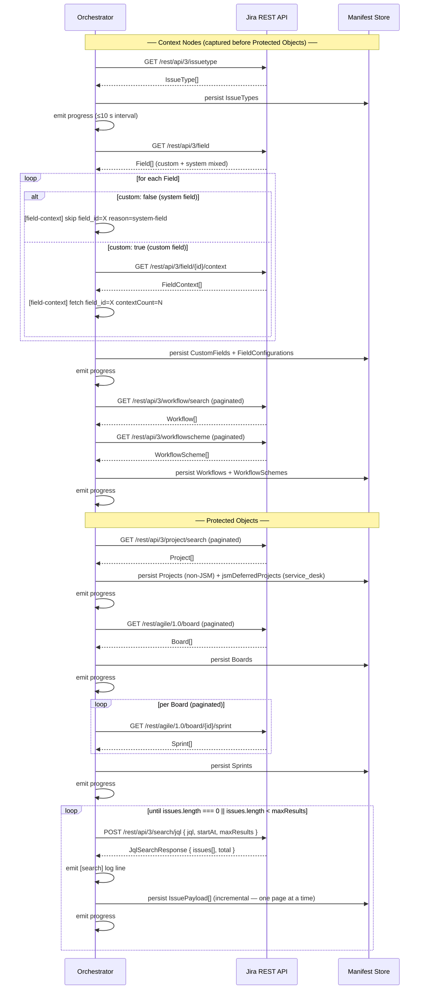
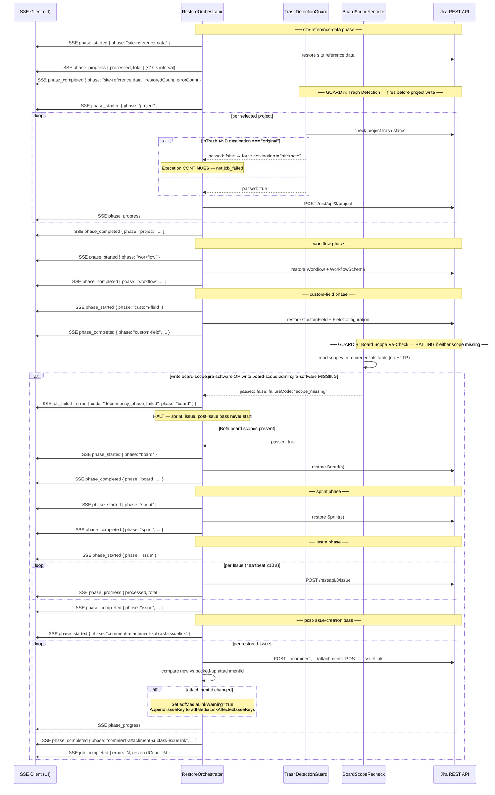

# Architecture — Jira Cloud Workload (Phase 1)

## Platform/Workload Boundary

### Overview

The DCC platform and the Jira Cloud workload communicate through a single,
transport-agnostic TypeScript interface. This keeps the platform free of any
Atlassian-specific SDK or HTTP concerns, and lets the workload be tested in
isolation with mock implementations.

### Key Files

| File | Purpose |
|------|---------|
| `src/platform_workload_iface.ts` | Boundary interface (`PlatformWorkloadInterface`) and its result types |
| `src/types/connection.ts` | Shared data contracts: `Connection`, `CredentialRecord`, and related input/output shapes |

### Interface Contract

```
PlatformWorkloadInterface
  discover(connection)               → DiscoverResult
  snapshot(connection, manifestId)   → SnapshotResult
  restore(connection, options)       → RestoreResult
  refresh_auth(connection)           → RefreshAuthResult
```

**`discover`** — Enumerates all Projects, Issues, Boards, and Sprints on the
connected Atlassian site and writes a manifest. Produces zero silent omissions.

**`snapshot`** — Captures a full backup of all objects listed in the manifest.
Emits a heartbeat progress event at least every 10 seconds. Returns
`SnapshotResult` with `errorCount > 0` when any individual item fails (the
UI displays "Completed with N errors", never "Completed successfully").

**`restore`** — Restores items from a named backup point. Enforces the write
dependency order required by T1 §1 and T5 §5.2:

> Project → Workflow + WorkflowScheme → CustomField + FieldConfiguration →
> Board → Sprint → Issue body → issue links + comments + attachments

A failure in any phase halts further execution and surfaces a named diagnostic
in `RestoreResult.phaseDiagnostic`.

**`refresh_auth`** — Rotates the Atlassian OAuth 2.0 access/refresh token pair
atomically. Both the new `accessToken` and new `refreshToken` are committed to
the credential store before the call resolves. The concrete implementation
must serialize concurrent refresh requests behind a mutex (T2 §4.5).

### Connection Record Shape

A `Connection` record (`src/types/connection.ts`) is the unit the platform
passes into every interface method. It bundles site identity (`cloudId`,
`siteName`) with the current credential pair and the OAuth scopes that were
granted at authorization time.

`CredentialRecord` — the embedded token pair — carries an `expiresAt` epoch
timestamp so callers can proactively trigger `refresh_auth` before the access
token expires rather than waiting for a 401.

### Design Constraints

- **No vendor HTTP imports in `src/platform_workload_iface.ts`.**  The boundary
  is transport-agnostic by design. `fetch`, `axios`, Atlassian SDK types, and
  similar concerns live in the workload implementation, not here.
- **`cloudId` is the stable site identifier.** `siteName` is display-only and
  must not be used as a key. A cloudId mismatch on re-auth must surface a 409
  to the platform (T2 §4.5).
- **`scopes` is an array of individual scope strings**, split from the
  space-delimited grant returned by Atlassian's token endpoint.

---

## Backup Engine

### Overview

The Backup Engine is the workload-side implementation of `PlatformWorkloadInterface.discover()`
and `PlatformWorkloadInterface.snapshot()`. It is entirely contained within
`src/workload/backup/`. All type contracts live in `src/workload/backup/types.ts`.

The engine is structured around three concerns:

1. **HTTP Client** — `IJiraHttpClient` abstracts all Atlassian REST calls behind
   a small, testable interface. The concrete implementation is `JiraHttpClient`
   (`src/workload/http/JiraHttpClient.ts`), which holds the rotating-token mutex.
   Note: a separate `JiraHttpClient` at `src/http/JiraHttpClient.ts` handles
   OAuth/connection-layer calls; these are distinct implementations.
   Tests inject a double via the interface.

2. **Capture-Order Orchestrator** — `ICaptureOrchestrator` executes phases in the
   mandatory sequence and emits progress events. A phase failure halts the run and
   populates `phaseDiagnostic` before returning.

3. **Manifest** — `BackupManifest` is the artifact produced by `discover()`. It
   carries the full project inventory, JSM-deferred notices, and — after
   `snapshot()` — the coverage invariant.

### Phase Order

The orchestrator must execute phases **in this exact order**. No phase may be
skipped or reordered. Context nodes (IssueType through WorkflowScheme) are always
captured before Protected Objects (Project through Issue). Source: T1 §1, T3 §3.4.

```
Capture order (read-side / backup):
  IssueType
    → CustomField + FieldConfiguration
    → Workflow + WorkflowScheme
    → Project
    → Board
    → Sprint
    → Issue

Restore write order (mirror):
  Project
    → Workflow + WorkflowScheme
    → CustomField + FieldConfiguration
    → Board
    → Sprint
    → Issue body
    → issue links + comments + attachments (post-issue-creation pass)
```

### Key Files

| File | Purpose |
|------|---------|
| `src/workload/backup/types.ts` | All backup engine type contracts (see below) |
| `src/workload/http/JiraHttpClient.ts` | Concrete `IJiraHttpClient` implementation for the backup engine |
| `src/platform_workload_iface.ts` | `PlatformWorkloadInterface` — the boundary `discover()` / `snapshot()` sit on |

### `IJiraHttpClient` Interface

```typescript
interface IJiraHttpClient {
  getJson<T>(cloudBaseUrl: string, path: string, params?: Record<string, string>): Promise<T>;
  searchJql(cloudBaseUrl: string, body: JqlSearchRequest): Promise<JqlSearchResponse>;
  downloadAttachment(cloudBaseUrl: string, attachmentId: string): Promise<AttachmentDownload>;
}
```

- `getJson` — authenticated GET; caller drives pagination via `startAt` / `maxResults`.
- `searchJql` — **exclusive** Issue enumeration path. The deprecated
  `GET /rest/api/3/search` must not appear anywhere in backup-engine code
  (T2 §6 Constraint 6). Pagination terminates when
  `issues.length === 0 || issues.length < maxResults`.
- `downloadAttachment` — binary-faithful download via
  `GET /rest/api/3/attachment/content/{id}`. Returns raw bytes + SHA-256
  `contentHash`; no transcoding or recompression is applied (T3 §3.2, §4.4).

### `ICaptureOrchestrator` Interface

```typescript
interface ICaptureOrchestrator {
  runCapture(
    options: CaptureRunOptions,
    onProgress: (event: CaptureProgressEvent) => void
  ): Promise<CaptureRunResult>;
}
```

- `onProgress` is called at ≤10-second intervals. A gap of >20 s triggers a
  **stalled** alert in the UI (T5 §6.2).
- `CaptureRunResult.errorCount > 0` ⇒ UI shows "Completed with N errors",
  never "Completed successfully" (T5 §6.2b).
- `CaptureRunResult.phaseDiagnostic` is set and subsequent phases are not run
  when any phase returns `status: 'failed'` (T5 §5.2).

### `BackupManifest` Schema

```typescript
interface BackupManifest {
  manifestId: string;           // UUID
  cloudId: string;              // Atlassian site cloudId
  discoveredAt: string;         // ISO-8601
  projectScope: 'all' | 'selected';
  selectedProjectKeys: string[];
  projects: ProjectRecord[];
  jsmDeferredProjects: JsmDeferredProject[];
  coverageInvariant: CoverageInvariant | null;
}
```

**Zero-omissions invariant**: every project returned by
`GET /rest/api/3/project/search` appears in either `projects` or
`jsmDeferredProjects` — never silently omitted (T3 §4.3, T4 §6).

**JSM detection**: if `projectTypeKey === 'service_desk'`, the project is
placed in `jsmDeferredProjects` with `reason: 'PHASE_2_DEFERRED'` and excluded
from all backup phases. The onboarding wizard surfaces an out-of-scope notice
when this list is non-empty (T1 §1, T2 §6 Constraint 11).

**Coverage invariant** (`CoverageInvariant`): populated by the Issue phase.
`customFieldValues` on each `IssueRecord` must contain every custom field the
API returns — no field dropped. System fields (`custom: false`) are skipped
for context discovery but their IDs are recorded in `systemFieldsSkipped`
(T2 §6 Constraint 7, T3 §3.5).

### Project Discovery

Project discovery is performed via paginated
`GET /rest/api/3/project/search`. The `projectScope` field from the active
backup policy controls which projects are included:

- `"all"` — every page of results is consumed until the API returns an empty
  page; all projects are included.
- `"selected"` — same pagination, but only projects whose `key` appears in
  `selectedProjectKeys` are written to the manifest.

The paginated loop must consume all pages before proceeding to the next capture
phase. Discovery feeds `BackupManifest.projects` and
`BackupManifest.jsmDeferredProjects`.

### Custom Field Context Discovery

Custom field context is discovered via
`GET /rest/api/3/field/{id}/context` **only for fields where `custom: true`**.
System fields (`custom: false`) must never be passed to this endpoint — a
`[field-context] skip field_id=<id> reason=system-field` log line is emitted
for each skipped field (T2 §6 Constraint 7, T3 §4.2).

---

## Snapshot Orchestrator

### Overview

The Snapshot Orchestrator is the concrete implementation of
`ICaptureOrchestrator` (`src/workload/backup/types.ts`). All Snapshot-phase-
specific contracts live in `src/workload/snapshot/types.ts`.

The module defines:

- **`SnapshotPhase` enum** — the nine dependency-ordered capture phases as a
  TypeScript `enum` (not a string-union type), enabling runtime iteration via
  `Object.values(SnapshotPhase)` and exhaustive switch checking at compile time.
- **`SNAPSHOT_PHASE_ORDER`** — the canonical, immutable phase sequence.
- **`PhaseEmitBoundary` / `PHASE_EMIT_BOUNDARIES`** — per-phase emit and
  persist checkpoints.
- **`IssuePayload`** — the full Issue capture contract (coverage invariant).
- **`SearchLogLine` / `FieldContextLogLine`** — structured-log line shapes.
- **`PAGINATION_TERMINATION_CONTRACT`** — verbatim termination rule.

### Key Files

| File | Purpose |
|------|---------|
| `src/workload/snapshot/types.ts` | Snapshot-phase contracts: `SnapshotPhase` enum, `IssuePayload`, log-line shapes, pagination contract |
| `src/workload/backup/types.ts` | Shared backup-engine contracts: `CapturePhase`, `ICaptureOrchestrator`, `BackupManifest`, `IssueRecord` |

### Capture-Order Sequence Diagram



### SnapshotPhase Enum

Defined in `src/workload/snapshot/types.ts` as a TypeScript `enum`. The nine
phases in mandatory execution order:

| Phase | Class | API path |
|-------|-------|----------|
| `IssueType` | Context node | `GET /rest/api/3/issuetype` |
| `CustomField` | Context node | `GET /rest/api/3/field` |
| `FieldConfiguration` | Context node | `GET /rest/api/3/field/{id}/context` (custom only) |
| `Workflow` | Context node | `GET /rest/api/3/workflow/search` |
| `WorkflowScheme` | Context node | `GET /rest/api/3/workflowscheme` |
| `Project` | Protected object | `GET /rest/api/3/project/search` |
| `Board` | Protected object | `GET /rest/agile/1.0/board` |
| `Sprint` | Protected object | `GET /rest/agile/1.0/board/{id}/sprint` |
| `Issue` | Protected object | `POST /rest/api/3/search/jql` |

Context nodes are always captured before Protected Objects in every backup job
(T1 §1, T3 §3.4).

### Per-Phase Emit/Persist Boundaries

All phases share these invariants (defined in `PHASE_EMIT_BOUNDARIES`):

- `maxEmitIntervalSeconds: 10` — a progress event must be emitted at most every
  10 s. A gap of >20 s surfaces a **stalled** alert in the UI (T5 §6.2).
- `blocksNextPhase: true` — a phase must complete before the next phase begins.
  All phases are sequential; no concurrent phase execution is permitted.

| Phase | `persistsAtPhaseEnd` | Notes |
|-------|----------------------|-------|
| `IssueType` | `true` | Single GET; all items persisted at phase end |
| `CustomField` | `true` | Paginated GET; all items persisted at phase end |
| `FieldConfiguration` | `true` | Per-field GET (custom only); persisted at phase end |
| `Workflow` | `true` | Paginated GET; persisted at phase end |
| `WorkflowScheme` | `true` | Paginated GET; persisted at phase end |
| `Project` | `true` | Paginated GET; persisted at phase end |
| `Board` | `true` | Paginated GET; persisted at phase end |
| `Sprint` | `true` | Per-board paginated GET; persisted at phase end |
| `Issue` | **`false`** | Paginated JQL; **persisted incrementally** per page |

### Pagination Termination Contract

**Verbatim rule** (source: T2 §6 Constraint 6, CLAUDE.md Goals §8):

> Pagination for `POST /rest/api/3/search/jql` terminates when:
>
> ```
> issues.length === 0 || issues.length < maxResults
> ```
>
> The deprecated `GET /rest/api/3/search` endpoint must not appear anywhere in
> backup-engine code.

The paginator checks the condition **after** each page is received.
`issues.length < maxResults` catches partial (final) pages;
`issues.length === 0` catches the edge case where total is an exact multiple of
`maxResults`.

The contract is captured verbatim as `PAGINATION_TERMINATION_CONTRACT` in
`src/workload/snapshot/types.ts`.

### Structured-Log Line Shapes

#### `[search]` lines

Emitted **once per pagination request** to `POST /rest/api/3/search/jql`.

**Verbatim format** (source: `src/workload/http/JiraHttpClient.ts:134`):

```
[search] endpoint=search/jql project=<projectKey> page=<page> pageSize=<pageSize> returnedCount=<returnedCount>
```

**Example — 3-page run, project PROJ, 243 issues, maxResults=100:**

```
[search] endpoint=search/jql project=PROJ page=1 pageSize=100 returnedCount=100
[search] endpoint=search/jql project=PROJ page=2 pageSize=100 returnedCount=100
[search] endpoint=search/jql project=PROJ page=3 pageSize=100 returnedCount=43
```

Pagination terminates after the third request because `returnedCount(43) < pageSize(100)`.

Typed as `SearchLogLine` in `src/workload/snapshot/types.ts`.

#### `[field-context]` lines

Emitted **once per field** during the CustomField / FieldConfiguration phase.

**Verbatim format — skip (system field, `custom: false`):**

```
[field-context] skip field_id=<id> reason=system-field
```

**Verbatim format — fetch (custom field, `custom: true`):**

```
[field-context] fetch field_id=<id> contextCount=<n>
```

**Constraint**: `GET /rest/api/3/field/{id}/context` is called **only** for
fields where `custom: true`. Every system field (`custom: false`) always
produces a skip line — it is never passed to the context endpoint
(T2 §6 Constraint 7, T3 §4.2).

Typed as `FieldContextLogLine` (discriminated union) in
`src/workload/snapshot/types.ts`.

### IssuePayload Interface

`IssuePayload` (defined in `src/workload/snapshot/types.ts`) is the Snapshot-
phase contract for a fully captured Issue. It is the in-flight form produced
by the orchestrator; `IssueRecord` (`src/workload/backup/types.ts`) is the
persisted DB artifact that additionally carries `backupPointId` and `capturedAt`.

**Coverage invariant** (T3 §3.5):

- `customFieldValues` must contain **every** custom field (`custom: true`)
  returned by the API for this Issue.
- No entry may be dropped — the map must not omit any field.
- System fields (`custom: false`) must **not** appear in `customFieldValues`.

**Full field set** (T3 §3.3):

| Field | Type | Notes |
|-------|------|-------|
| `id` | `string` | Atlassian numeric Issue ID |
| `key` | `string` | e.g. "PROJ-42" |
| `projectId` | `string` | Atlassian numeric project ID |
| `summary` | `string` | System field |
| `description` | `AdfNode \| null` | ADF document |
| `issueType` | `{id, name}` | System field |
| `status` | `{id, name}` | System field |
| `priority` | `{id, name} \| null` | System field |
| `assignee` | `{accountId, displayName} \| null` | System field |
| `reporter` | `{accountId, displayName} \| null` | System field |
| `created` | `string` | ISO-8601 |
| `updated` | `string` | ISO-8601 |
| `resolutionDate` | `string \| null` | ISO-8601 |
| `labels` | `string[]` | System field |
| `customFieldValues` | `Record<string, unknown>` | All custom fields; no omissions |
| `comments` | `IssueComment[]` | ADF body + author + timestamps |
| `issueLinks` | `IssueLink[]` | All link types, both directions |
| `subtaskKeys` | `string[]` | Direct child Issue keys |
| `sprintIds` | `string[]` | Sprint membership (can be multiple) |
| `watcherAccountIds` | `string[]` | Issue watchers |
| `worklogs` | `WorklogEntry[]` | Worklog entries |
| `attachments` | `AttachmentRecord[]` | Attachment refs (binary stored separately) |

---

## Attachment Storage

### Overview

Attachment binaries are stored binary-faithful on disk under `data/attachments/`.
Every binary is byte-for-byte identical to the source returned by
`GET /rest/api/3/attachment/content/{id}` — no transcoding, recompression, or
filename rewriting is applied (T3 §3.2, §4.4).

Two files are written per attachment:

| File | Purpose |
|------|---------|
| `data/attachments/{backupPointId}/{issueKey}/{attachmentId}` | Raw binary — opaque bytes |
| `data/attachments/{backupPointId}/{issueKey}/{attachmentId}.meta.json` | Sidecar metadata JSON |

**Both paths are real and shipped** (Phase 2 Sprint 3). Path resolution is performed by
`resolveAttachmentPaths()` in `src/workload/types/Attachment.ts`; disk writes are in
`src/workload/snapshot/downloadIssueAttachments.ts`. The default base directory
(`data/attachments`) can be overridden via `DCC_ATTACHMENT_DIR` in `.env`.

Contracts (`src/workload/types/Attachment.ts`): `Attachment`, `AttachmentStoragePaths`,
`AttachmentSidecar`, `resolveAttachmentPaths`.

### Path Scheme

```
data/
  attachments/
    {backupPointId}/          ← one directory per backup point
      {issueKey}/             ← one directory per issue (e.g. PROJ-42)
        {attachmentId}        ← raw binary, no extension
        {attachmentId}.meta.json
```

`backupPointId` is the opaque backup-point UUID. `issueKey` is the Jira key
(e.g. `PROJ-42`). `attachmentId` is the Atlassian numeric attachment ID
(string form). Paths are resolved by `resolveAttachmentPaths()` in
`src/workload/types/Attachment.ts`.

### Sidecar Schema (`AttachmentSidecar`)

```typescript
interface AttachmentSidecar {
  attachmentId:  string;  // Atlassian numeric attachment ID
  issueKey:      string;  // e.g. "PROJ-42"
  backupPointId: string;  // backup-point UUID
  filename:      string;  // original filename — never rewritten
  mimeType:      string;  // from Content-Type response header
  size:          number;  // bytes
  sha256:        string;  // hex digest; re-verified on restore
  capturedAt:    string;  // ISO-8601
}
```

`sha256` is computed immediately after the binary is written to disk.
On restore, the engine reads the binary, recomputes SHA-256, and compares
it against the sidecar before sending the bytes to Atlassian. A mismatch
halts the restore for that attachment and adds an entry to `errors[]`.

### Design Constraints

- The binary file and its `.meta.json` sidecar are **always written together**.
  A binary without a sidecar (or vice versa) is treated as a corrupt entry.
- `AttachmentRecord` in `src/workload/backup/types.ts` is the **in-Issue
  reference** (stores `contentHash` and metadata inline with the Issue record).
  `AttachmentSidecar` is the **on-disk authority** for the binary.
- ADF media node rewriting after restore is Phase 2 (see Non-Goals in CLAUDE.md).
  A best-effort warning is surfaced in the restore report when attachment IDs
  change (T5 OQ-5).

---

## Manifest Deletion-Diff

### Overview

After every Discover run the engine computes a deletion-diff by comparing the
incoming project list against the persisted previous manifest. Each
`ProjectRecord` receives a `changeBadge` reflecting its state relative to the
prior backup point. The diff is stored as a `ManifestDiff` record alongside the
new `BackupManifest`.

Contracts (`src/workload/types/ManifestDiff.ts`): `ChangeBadge`,
`ProjectDiffEntry`, `ManifestDiffSummary`, `ManifestDiff`.

### ChangeBadge Computation

| Badge | Condition |
|-------|-----------|
| `added` | `projectId` present in current manifest; absent in previous |
| `modified` | `projectId` present in both; ≥1 tracked field differs |
| `deleted` | `projectId` present in previous manifest; absent in current |
| `unchanged` | `projectId` present in both; all tracked fields identical |

The comparison key is `projectId` (Atlassian numeric project ID), not
`projectKey` — project keys can be renamed without changing the ID.

On the **first-ever backup run** `previousManifestId` is `null` and every
project receives `changeBadge: 'added'`.

### ManifestDiff Schema

```typescript
interface ManifestDiff {
  previousManifestId: string | null;  // null on first run
  currentManifestId:  string;
  computedAt:         string;         // ISO-8601
  projects:           ProjectDiffEntry[];
  summary:            ManifestDiffSummary;
}

interface ProjectDiffEntry {
  projectId:   string;
  projectKey:  string;
  changeBadge: ChangeBadge;           // 'added' | 'modified' | 'deleted' | 'unchanged'
  current:     ProjectRecord | null;  // null for deleted entries
  previous:    ProjectRecord | null;  // null for added entries
}

interface ManifestDiffSummary {
  added:     number;
  modified:  number;
  deleted:   number;
  unchanged: number;
  total:     number;  // === projects.length
}
```

The UI displays the `changeBadge` alongside each project row in the Protected
Object Inventory view. `deleted` projects are shown with a strikethrough badge
to indicate they no longer exist on the Jira site.

---

## Progress Event Contract

### Overview

Both backup (`CaptureOrchestrator`) and restore jobs emit `ProgressEvent`
objects on a heartbeat cadence. The platform layer handles them uniformly
regardless of job type.

Contracts (`src/workload/types/ProgressEvent.ts`): `ProgressEvent`,
`ProgressError`, `JobStatus`, `MAX_HEARTBEAT_INTERVAL_MS`, `STALLED_THRESHOLD_MS`.

### Event Shape

```typescript
interface ProgressEvent {
  jobId:     string;           // backup-point ID or restore job ID
  ts:        string;           // ISO-8601 — moment of emission
  phase:     string;           // current phase name, e.g. "Issue", "Sprint"
  processed: number;           // items successfully processed in current phase
  total:     number | null;    // null while total is not yet known
  errors:    ProgressError[];  // all item-level errors accumulated across phases
}

interface ProgressError {
  itemId:  string;  // Issue key, project ID, attachment ID, etc.
  message: string;
  phase:   string;  // phase in which the error occurred
}
```

`errors` accumulates across the full job lifetime and is never reset between
phases — the consumer always sees a running total.

### Cadence and Stalled Detection

| Constant | Value | Meaning |
|----------|-------|---------|
| `MAX_HEARTBEAT_INTERVAL_MS` | `10 000` | Maximum ms between emitted events |
| `STALLED_THRESHOLD_MS` | `20 000` | Silence threshold before 'stalled' alert |

A job with no heartbeat for >20 s must be surfaced as `'stalled'` in the UI
(T5 §6.2). The orchestrator is responsible for emitting at least one event
every 10 s; the platform is responsible for detecting the 20 s silence
boundary and transitioning the job status.

### Terminal Status Semantics (`JobStatus`)

```typescript
type JobStatus =
  | 'pending'
  | 'running'
  | 'completed'
  | 'completed_with_errors'
  | 'failed'
  | 'stalled';
```

| Status | When set |
|--------|----------|
| `completed` | Job finished, `errors.length === 0` |
| `completed_with_errors` | Job finished, `errors.length > 0` |
| `failed` | A phase returned `status: 'failed'`; subsequent phases not run |
| `stalled` | Platform-set; no heartbeat received for >20 s |

**Invariant**: when `status === 'completed_with_errors'` the UI **must** display
"Completed with N errors". The string "Completed successfully" must not appear
when `errors.length > 0` (T5 §6.2b).

---

## Policy Record

### Overview

A `PolicyRecord` is created or replaced by `POST /api/policies`. It extends
the previously documented request body with `rpoHours` (which drives the
platform backup schedule) and an optional `jqlFilter` validated before storage.

Contracts (`src/workload/types/PolicyRecord.ts`): `PolicyRecord`,
`PolicyRequest`, `JqlParseRequest`, `JqlParseResponse`.

### PolicyRecord Shape

```typescript
interface PolicyRecord {
  policyId:            string;           // UUID
  connectionId:        string;
  rpoHours:            number;           // Recovery Point Objective in hours
  retentionDays:       number;
  projectScope:        'all' | 'selected';
  selectedProjectKeys: string[];         // empty when projectScope === 'all'
  jqlFilter?:          string;           // validated JQL; absent when not configured
  createdAt:           string;           // ISO-8601
  updatedAt:           string;           // ISO-8601
}
```

`rpoHours` is consumed by the platform scheduler to determine backup frequency.
Phase 1 does not expose a custom backup window in the operator UI (Non-Goal),
but the field is stored for platform-internal use (T4 §3).

At most one `PolicyRecord` exists per `connectionId` at any time. A new
`POST /api/policies` for an existing connection replaces the prior record
(`updatedAt` is refreshed; `createdAt` is preserved).

### jqlFilter Validation Flow

When `PolicyRequest.jqlFilter` is present and non-empty, the server executes
this validation sequence before writing the record:

```
1. POST /rest/api/3/jql/parse
   Body: { "queries": ["<jqlFilter>"] }

2. If response.queries[0].errors is non-empty:
   → HTTP 400 { "error": "invalid_jql", "details": response.queries[0].errors }

3. On success:
   → Write PolicyRecord with the validated jqlFilter
   → HTTP 201 PolicyRecord (as JSON)
```

**`JqlParseRequest`:**
```json
{ "queries": ["project = PROJ AND created >= -30d"] }
```

**`JqlParseResponse`** (success):
```json
{
  "queries": [
    { "query": "project = PROJ AND created >= -30d", "errors": [] }
  ]
}
```

**`JqlParseResponse`** (failure):
```json
{
  "queries": [
    { "query": "project = INVALID SYNTAX", "errors": ["Expecting operator but got 'SYNTAX'."] }
  ]
}
```

### Updated POST /api/policies Request Body

The full request body (superset of the stub documented in the API Surface
section below) is:

```json
{
  "connectionId":        "550e8400-...",
  "rpoHours":            24,
  "retentionDays":       30,
  "projectScope":        "all",
  "selectedProjectKeys": [],
  "jqlFilter":           "created >= -90d"
}
```

`rpoHours` and `retentionDays` are required. `jqlFilter` and
`selectedProjectKeys` are optional. Implementations must accept both bodies
(with and without `rpoHours`/`jqlFilter`) for backwards compatibility during
the transition sprint.

---

## Inventory Browse Flow

### Overview

The Inventory Browse Flow delivers the operator-facing Inventory sidebar and
Object Explorer. It reads exclusively from the SQLite-backed snapshot manifest
produced by `JiraWorkload.snapshot()` — it **never** issues calls to the
Atlassian REST API at browse time.

### Data Flow

```
┌─────────────────────────────────────────────────────────────────────┐
│  Snapshot Phase  (JiraWorkload.snapshot)                            │
│  CaptureOrchestrator persists:                                      │
│    backup_manifests.manifest_json  ← BackupManifest (JSON blob)     │
│    backup_jobs.completed_at        ← ISO-8601 timestamp             │
└──────────────────────────────┬──────────────────────────────────────┘
                               │ SQLite read  (zero Atlassian calls)
                               ▼
┌─────────────────────────────────────────────────────────────────────┐
│  Inventory Handlers  (inline — no separate repository class)        │
│  (src/routes/inventory.ts)                                          │
│                                                                     │
│  handleGetInventory(req, res)                                       │
│    ► loads latest BackupManifest from backup_manifests              │
│    ► counts each type; strips JSM-deferred project entries          │
│    ► returns InventoryResponse                                      │
│                                                                     │
│  handleGetInventoryByType(req, res)                                 │
│    ► reads backup_point_items rows for (connectionId, backupPointId,│
│      objectType) — with filter, search, and JSM-exclusion applied   │
│    ► projects each row to InventoryItem                             │
│    ► returns InventoryItemsResponse                                 │
└──────────────────────────────┬──────────────────────────────────────┘
                               │
                ┌──────────────┴──────────────┐
                ▼                             ▼
   GET /api/inventory            GET /api/inventory/:type
   (src/routes/inventory.ts)     (src/routes/inventory.ts)
                │                             │
                ▼                             ▼
   Inventory Sidebar              Object Explorer
   (React — Phase 1 UI)           (React — Phase 1 UI)
   4 types: Issue, Project,        Pagination, filter facets,
   Board, Sprint (Issues default)  search, traceability click
```

### Boundary Rule

The inventory handlers in `src/routes/inventory.ts` read only from the SQLite
tables written by the snapshot phase. The two relevant tables are:

- `backup_manifests` — stores `BackupManifest` JSON blobs (JSM deferred list,
  project/field counts, coverage invariant). Used by both handlers.
- `backup_point_items` — per-object-type item rows written during the snapshot
  phase. Used by `handleGetInventoryByType` as the primary item source for all
  paginated listings.

Neither handler constructs or executes any HTTP request to the Atlassian REST
API. All inventory data reflects the state captured during the most recent
successful snapshot for the given `connectionId`.

### JSM Exclusion Rule

Projects, Issues, Boards, and Sprints that belong to a project where
`projectTypeKey === 'service_desk'` are **excluded** from all inventory responses:

- `objectTypes[].count` in `GET /api/inventory` never includes JSM items.
- `items[]` in `GET /api/inventory/:type` never contains JSM items.

The driving manifest field is `BackupManifest.jsmDeferredProjects[]`. Any item
whose `projectId` appears in that array is filtered inside the inventory handlers
before the response is built. Callers cannot override this filter.

---

### GET /api/inventory (expanded)

This sprint expands the stub response (previously documented in §API Surface)
with the full `objectTypes[]` array. The route handler is
`src/routes/inventory.ts`.

**Query parameters:**

| Parameter | Required | Description |
|-----------|----------|-------------|
| `connectionId` | Yes | The `connectionId` of the target connection |

**Success response (200) — `InventoryObjectTypesResponse`:**

```typescript
/** Stable object-type identifier; used as the :type path param. */
type InventoryObjectType =
  | 'Issue'
  | 'Project'
  | 'Board'
  | 'Sprint'
  | 'Workflow'
  | 'CustomField';

interface InventoryObjectTypeEntry {
  /** Stable machine identifier — used as the :type path param. */
  type:         InventoryObjectType;
  /** Human-readable label for the sidebar row. */
  displayName:  string;
  /** Count of backed-up objects of this type, excluding JSM-deferred items. */
  count:        number;
  /**
   * ISO-8601 timestamp of the most recent snapshot that captured this type.
   * null when the type has never been snapshotted (e.g. snapshot not yet run).
   */
  lastBackupAt: string | null;
  /** true when ≥1 JSM project was excluded from this type's count. */
  jsmExcluded:  boolean;
}

interface InventoryObjectTypesResponse {
  /** UUID of the most recent BackupManifest for this connection. */
  manifestId:  string;
  /** ISO-8601 timestamp when the snapshot that produced this manifest completed. */
  completedAt: string;
  /** One entry per object type, in the order: Issue, Project, Board, Sprint, Workflow, CustomField. */
  objectTypes: InventoryObjectTypeEntry[];
}
```

**Example:**
```json
{
  "manifestId": "7f3d1234-...",
  "completedAt": "2026-05-04T03:00:00Z",
  "objectTypes": [
    { "type": "Issue",       "displayName": "Issues",        "count": 1248, "lastBackupAt": "2026-05-04T03:00:00Z", "jsmExcluded": false },
    { "type": "Project",     "displayName": "Projects",      "count": 5,    "lastBackupAt": "2026-05-04T03:00:00Z", "jsmExcluded": false },
    { "type": "Board",       "displayName": "Boards",        "count": 3,    "lastBackupAt": "2026-05-04T03:00:00Z", "jsmExcluded": false },
    { "type": "Sprint",      "displayName": "Sprints",       "count": 12,   "lastBackupAt": "2026-05-04T03:00:00Z", "jsmExcluded": false },
    { "type": "Workflow",    "displayName": "Workflows",     "count": 4,    "lastBackupAt": "2026-05-04T03:00:00Z", "jsmExcluded": false },
    { "type": "CustomField", "displayName": "Custom Fields", "count": 22,   "lastBackupAt": "2026-05-04T03:00:00Z", "jsmExcluded": false }
  ]
}
```

**Sidebar rendering rule (T8 §2, §3):** The Phase 1 sidebar renders exactly four
object types in fixed order — Issues (default selection), Projects, Boards,
Sprints. Workflow and CustomField entries are included in the API response for
future use but are not rendered in the Phase 1 sidebar.

**Error responses:**

| Status | `error` field | Meaning |
|--------|--------------|---------|
| `400` | `missing_required_fields` | `connectionId` query parameter absent |
| `404` | `connection_not_found` | No connection matches the supplied `connectionId` |
| `404` | `no_manifest_found` | Connection exists but no snapshot has been run |

---

### GET /api/inventory/:type

Returns a paginated list of backed-up objects of a single type. The route
handler is `src/routes/inventory.ts`.

**Path parameter:**

| Parameter | Values |
|-----------|--------|
| `:type` | `Issue` \| `Project` \| `Board` \| `Sprint` \| `Workflow` \| `CustomField` |

**Query parameters:**

| Parameter | Required | Default | Description |
|-----------|----------|---------|-------------|
| `connectionId` | Yes | — | `connectionId` of the target connection |
| `backupPointId` | **Yes** | — | UUID of the backup point to query; returned by `GET /api/inventory` as `backupPointId` |
| `limit` | No | `50` | Page size; max `200` |
| `offset` | No | `0` | Zero-based offset into the result set |

**Success response (200) — `InventoryItemsResponse`:**

```typescript
interface InventoryPagination {
  limit:  number;   // effective page size used
  offset: number;   // zero-based offset
  total:  number;   // total matched items (drives page-control rendering)
}

/** Base item shape shared by all object types. */
interface InventoryItem {
  /** Atlassian numeric object ID (string form). */
  id:                   string;
  /**
   * Human-readable label rendered in the Object Explorer row.
   * Per-type format:
   *   Issue       → IssueRecord.key verbatim, e.g. "PROJ-42"  (see displayName invariant below)
   *   Project     → project name
   *   Board       → board name
   *   Sprint      → sprint name
   *   Workflow    → workflow name
   *   CustomField → field display name
   */
  displayName:          string;
  /**
   * Deletion-diff badge relative to the previous backup point.
   * Sourced from ProjectRecord.changeBadge; Issues inherit their project's badge.
   * Enum: 'added' | 'modified' | 'deleted' | 'unchanged'
   * Source: src/workload/backup/types.ts :: ChangeBadge
   */
  changeBadge:          'added' | 'modified' | 'deleted' | 'unchanged';
  /** UUID of the backup point under which this item was captured. Single-click traceability (T5 §6.2). */
  backupPointId:        string;
  /** ISO-8601 timestamp when this item was captured. Single-click traceability. */
  backupPointTimestamp: string;
}

/**
 * Issue-specific item shape.
 *
 * displayName MUST equal IssueRecord.key verbatim (e.g. "PROJ-42").
 * The inventory handler populates displayName directly from the persisted
 * IssueRecord.key — it does NOT construct the key from parts.
 *
 * projectKey and issueNumber are extracted from the key string (split on '-')
 * for filter/sort use only.
 */
interface IssueInventoryItem extends InventoryItem {
  /** Jira project key, e.g. "PROJ". Used for project-based filtering. */
  projectKey:  string;
  /** Numeric part of the issue key (42 for "PROJ-42"). Used for numeric sort. */
  issueNumber: number;
  /** Issue summary text — rendered as secondary label in the Object Explorer row. */
  summary:     string;
}

interface InventoryItemsResponse {
  items:      InventoryItem[];   // IssueInventoryItem[] when type === 'Issue'
  pagination: InventoryPagination;
}
```

**Issue `displayName` invariant:** For Issues, `displayName` is always
`IssueRecord.key` verbatim (e.g. `"PROJ-42"`). The format is
`<PROJECT_KEY>-<N>` where `PROJECT_KEY` is the Jira project key and `N` is the
sequential issue number. The inventory handler reads this directly from the
persisted `IssueRecord.key` field — it never reconstructs the key from parts.

**`changeBadge` enum** (source: `src/workload/backup/types.ts :: ChangeBadge`):

| Value | Meaning |
|-------|---------|
| `added` | Object is present in current manifest; absent in previous |
| `modified` | Object present in both; ≥1 tracked field differs |
| `deleted` | Object present in previous manifest; absent in current |
| `unchanged` | Object present in both; all tracked fields identical |

**Error responses:**

| Status | `error` field | Meaning |
|--------|--------------|---------|
| `400` | `missing_required_fields` | `connectionId` absent or `:type` is not a valid `InventoryObjectType` |
| `404` | `connection_not_found` | No connection matches the supplied `connectionId` |
| `404` | `backup_point_not_found` | Supplied `backupPointId` does not exist for this connection |

---

### Inventory Handler Functions

Inventory logic lives inline in `src/routes/inventory.ts` (no separate repository class).

```typescript
/** Pure helper — builds the objectTypes[] response from a manifest (or null). Directly testable. */
export function buildInventoryResponse(manifest: BackupManifest | null): InventoryResponse;

/** Route handler for GET /api/inventory — returns objectTypes[] sourced from the latest manifest. */
export function handleGetInventory(req: Request, res: Response): void;

/** Route handler for GET /api/inventory/:type — returns paginated items from backup_point_items. */
export function handleGetInventoryByType(req: Request, res: Response): void;
```

**Data sourcing per type:**

All paginated item lists are sourced from the `backup_point_items` table
(migration `011_inventory_items.sql`). Rows are filtered by
`(connectionId, backupPointId, objectType)`. JSM-deferred project IDs and keys
are loaded from the `backup_manifests` row for defense-in-depth exclusion.

| Object Type | `objectType` value in `backup_point_items` | ID field (`itemId`) |
|-------------|-------------------------------------------|---------------------|
| `Issue` | `'Issue'` | Jira issue key, e.g. `"PROJ-42"` |
| `Project` | `'Project'` | Atlassian project ID |
| `Board` | `'Board'` | Board ID string |
| `Sprint` | `'Sprint'` | Sprint ID string |

**Key files:**

| File | Purpose |
|------|---------|
| `src/routes/inventory.ts` | Express router + inline repository logic — handles both `GET /api/inventory` and `GET /api/inventory/:type`; exports `buildInventoryResponse()` as a pure testable helper |
| `src/platform/contracts.ts` | Extended with `ObjectTypeEntry`, `InventoryResponse`; item-level shapes (`InventoryItem`, `InventoryItemsResponse`) are defined locally in `src/ui/components/ObjectExplorer.tsx` |

### Search and Filter Capabilities (Object Explorer)

Documented here for architectural completeness; UI implementation is a separate
sprint task.

| Capability | Applies to | Rule |
|-----------|------------|------|
| Exact-match Issue key search | Issues | Match `IssueRecord.key` exactly, case-insensitive |
| Tokenized case-insensitive summary search | Issues | Tokenise query on whitespace; all tokens must appear in `IssueRecord.summary` |
| Tokenised partial-match attachment filename | Attachments (via Issues) | Each token matched as a substring of `AttachmentRecord.filename` |
| Body-content search | **Disabled** | Full-text search across ADF description/comment text is explicitly disabled in Phase 1 |
| Filter facets | Issues | `status`, `issueType`, `assignee`, `sprint`, `board`, `label`, `priority`, `updated` date-range |

Body-content search (ADF `description` and `comments[].body`) is explicitly
disabled in Phase 1 (T8 §3). The route must return `400 body_search_disabled`
if a body-search parameter is passed.

### Single-Click Traceability

Every `InventoryItem` carries `backupPointId` and `backupPointTimestamp`. A
single UI click on any Object Explorer row navigates to its backup-point detail,
showing the backup-point UUID, completion timestamp, and job status. This
satisfies the traceability requirement (T5 §6.2, T8 §3).

- For Issues: `backupPointId` is sourced from `IssueRecord.backupPointId`.
- For all other types: `backupPointId` is sourced from the
  `backup_jobs.backupPointId` column that owns the manifest.

---

### Inventory Browse Contracts

This subsection codifies the precise query-parameter contracts for the filter,
search, traceability, and JSM-exclusion extensions to `GET /api/inventory/:type`.
These are the net-new structures introduced in Phase 3 Sprint 2.

#### Filter Facet Parameters (`:type === 'Issue'`)

When `:type === 'Issue'`, the handler accepts the following filter parameters in
addition to `connectionId`, `backupPointId`, `limit`, and `offset`:

| Parameter | Type | Multi-value | Semantics |
|-----------|------|-------------|-----------|
| `status` | `string` | Yes (OR) | Match issues where `status.name` equals any supplied value. Case-insensitive. |
| `issueType` | `string` | Yes (OR) | Match issues where `issueType.name` equals any supplied value. Case-insensitive. |
| `assignee` | `string` | Yes (OR) | Match issues where `assignee.accountId` equals any supplied value. Issues with no assignee are excluded when this param is present. |
| `sprint` | `string` | Yes (OR) | Match issues where `sprintIds[]` contains any of the supplied sprint IDs. |
| `board` | `string` | Yes (OR) | Match issues that belong to any of the supplied board IDs. |
| `label` | `string` | Yes (**AND**) | Match issues where `labels[]` contains **all** supplied label values. |
| `priority` | `string` | Yes (OR) | Match issues where `priority.name` equals any supplied value. Case-insensitive. |
| `updatedFrom` | `string` (ISO-8601) | No | Include issues where `updated >= updatedFrom`. |
| `updatedTo` | `string` (ISO-8601) | No | Include issues where `updated <= updatedTo`. |

**Combining rules**: filter parameters are AND-combined across types (e.g.
`status=Done&issueType=Bug` requires both). Within a single repeatable parameter,
values are OR-combined (except `label`, which is AND-combined). All filter
parameters are optional; omitting a parameter applies no constraint for that
dimension.

#### Issue Search Parameters (`:type === 'Issue'`)

| Parameter | Semantics |
|-----------|-----------|
| `q` | Dual-mode search. If the value matches `[A-Z][A-Z0-9_]+-\d+`, performs **exact-match** on `itemId` (Issue key lookup; returns at most one result). Otherwise, tokenizes on whitespace; all tokens must appear in `LOWER(summary)` (AND across tokens, case-insensitive summary search). |
| `attachmentFilename` | **Tokenized partial-match** against the `attachments` JSON array column. Query is split on whitespace; each token is matched as a case-insensitive substring of each stored filename (AND across tokens). Returns the parent Issue when any attachment filename satisfies all tokens. |

#### Body-Content Search — Explicitly Disabled (Phase 1)

Full-text search across ADF `description` and `comments[].body` is **explicitly
disabled in Phase 1** (T8 §3). This is a hard non-contract, not a deferred backlog
item. The route **must** return HTTP 400 if any body-search query parameter is
supplied:

```json
{ "error": "body_search_disabled", "message": "Full-text search across ADF description and comment body is not supported in Phase 1." }
```

No partial implementation of ADF body search is permitted.

#### JSM Exclusion Rule — Inventory Handler Boundary

The JSM exclusion filter is applied at the data boundary — before any response
object is constructed — using the following rule:

```
If item.projectId ∈ BackupManifest.jsmDeferredProjects[].projectId:
  → exclude item from all inventory responses

Implementation:
  1. Load BackupManifest.jsmDeferredProjects[] from the persisted manifest.
  2. Build: excludedProjectIds = new Set(jsmDeferredProjects.map(p => p.projectId))
  3. Keep item only when item.projectId ∉ excludedProjectIds.
```

`jsmDeferredProjects[]` is populated during the Discover phase: any project where
`projectTypeKey === 'service_desk'` is written to `jsmDeferredProjects` (with
`reason: 'PHASE_2_DEFERRED'`) rather than `projects`. The inventory handler reads
this array from the persisted manifest at query time.

The filter is unconditional at both response layers:

- **`GET /api/inventory`** — `objectTypes[].count` never includes JSM items;
  `jsmExcluded: true` is set when ≥1 project was excluded.
- **`GET /api/inventory/:type`** — `items[]` never contains any item whose
  `projectId` appears in `jsmDeferredProjects[]`.

Callers cannot override or bypass this filter (T1 §1, T2 §6 Constraint 11,
T3 §3.2).

#### Traceability Contract

Every `InventoryItem` returned by `GET /api/inventory/:type` carries two
traceability fields regardless of object type:

| Field | Type | Source |
|-------|------|--------|
| `backupPointId` | `string` (UUID) | The `backupPointId` query parameter echoed back verbatim; identifies the backup point that produced this item. |
| `backupPointTimestamp` | `string` (ISO-8601) | The `capturedAt` value from the `backup_point_items` row — the moment the item was written to the backup store. |

Both fields are always present — never `null`, never omitted. A single UI click on
any Object Explorer row uses these fields to navigate to the backup-point detail
view (UUID, completion timestamp, job status), satisfying T5 §6.2 and T8 §3.

---

## Restore Subsystem

### Overview

The Restore Subsystem is the workload-side implementation of
`PlatformWorkloadInterface.restore()`. All restore-phase type contracts live in
`src/workload/restore/types.ts`. The subsystem exposes two HTTP endpoints:
`POST /api/restore-jobs` to initiate a restore job, and
`GET /api/restore-jobs/{id}/events` as a Server-Sent Events stream for
real-time phase progress.

The restore orchestrator enforces a hard write-dependency chain. A failure in
any phase halts execution immediately; subsequent phases are never started. The
operator always sees a named diagnostic before the next phase would have begun.
Source: T1 §1, T5 §5.2.

### Key Files

| File | Purpose |
|------|---------|
| `src/workload/restore/types.ts` | All restore subsystem type contracts (see below) |
| `src/workload/restore/RestoreOrchestrator.ts` | Concrete `IRestoreOrchestrator` — iterates `RESTORE_PHASE_ORDER`, emits SSE events, halts on phase failure |
| `src/workload/restore/eventBus.ts` | In-memory event bus — `publish`, `subscribe` (with replay), `clearJob` |
| `src/routes/restore-jobs.ts` | Express router — `POST /api/restore-jobs`, `GET /api/restore-jobs/:id/events` |

### RestorePhase Enum

Defined in `src/workload/restore/types.ts` as a TypeScript `enum`. The eight
phases in mandatory execution order:

| Phase | String value | Notes |
|-------|-------------|-------|
| `SiteReferenceData` | `'site-reference-data'` | Issue types, field metadata — captured before project write |
| `Project` | `'project'` | Creates / updates the project shell |
| `Workflow` | `'workflow'` | Workflow + WorkflowScheme restore |
| `CustomField` | `'custom-field'` | Custom field definitions + FieldConfiguration |
| `Board` | `'board'` | Board restore — **preceded by pre-restore scope re-check** |
| `Sprint` | `'sprint'` | Sprint restore (per board) |
| `Issue` | `'issue'` | Issue body restore |
| `CommentAttachmentSubtaskIssuelink` | `'comment-attachment-subtask-issuelink'` | Post-issue-creation pass |

The `comment-attachment-subtask-issuelink` phase is a single combined pass that
restores comments, attachment binaries, subtask linkages, and issue links after
all Issue shells exist, avoiding forward-reference failures.

### Dependency Chain

```
Restore write order (mirror of capture order):

  site-reference-data
    → project
    → workflow
    → custom-field
    → board              ← pre-restore scope re-check (write:board-scope:jira-software
    → sprint                 + write:board-scope.admin:jira-software)
    → issue
    → comment-attachment-subtask-issuelink  (post-issue-creation pass)
```

Context (site-reference-data through custom-field) is always restored before
protected objects (board through issue). Source: T1 §1, T5 §5.2.

### Restore Flow Sequence Diagram

```mermaid
sequenceDiagram
    participant Op  as Operator (UI)
    participant RJ  as RestoreJobsRouter
    participant Orch as RestoreOrchestrator
    participant API  as Jira REST API
    participant DB   as SQLite Store

    Op->>RJ: POST /api/restore-jobs<br/>{ connectionId, backupPointId, selection, conflictMode, destination }
    RJ->>DB: INSERT restore job (status=queued)
    RJ-->>Op: 201 { jobId, status: "queued" }

    Op->>RJ: GET /api/restore-jobs/{jobId}/events (SSE)
    RJ->>Orch: runRestore(options, onEvent)
    RJ-->>Op: SSE stream open (text/event-stream)

    Note over Orch,DB: ── site-reference-data phase ──
    Orch->>Op: SSE phase_started { phase: "site-reference-data" }
    Orch->>API: GET /rest/api/3/issuetype, GET /rest/api/3/field
    API-->>Orch: IssueType[], Field[]
    Orch->>DB: read backup snapshot data for restore context
    Orch->>Op: SSE phase_progress { processed, total }
    Orch->>Op: SSE phase_completed { phase: "site-reference-data", restoredCount, errorCount }

    Note over Orch,DB: ── project phase ──
    Orch->>Op: SSE phase_started { phase: "project" }
    Orch->>API: check project trash status (30–60d window)
    alt project in native trash
        Orch->>Orch: block in-place restore; force alternate-location
    end
    Orch->>API: POST /rest/api/3/project (or PUT for override)
    Orch->>Op: SSE phase_completed { phase: "project", ... }

    Note over Orch,DB: ── workflow → custom-field phases ──
    Orch->>Op: SSE phase_started { phase: "workflow" }
    Orch->>API: restore Workflow + WorkflowScheme
    Orch->>Op: SSE phase_completed { phase: "workflow", ... }
    Orch->>Op: SSE phase_started { phase: "custom-field" }
    Orch->>API: restore CustomField + FieldConfiguration
    Orch->>Op: SSE phase_completed { phase: "custom-field", ... }

    Note over Orch,API: ── board phase — scope re-check first ──
    Orch->>DB: SELECT scopes FROM credentials WHERE connectionId = ? (verify write:board-scope:jira-software<br/>+ write:board-scope.admin:jira-software)
    alt scope check fails
        Orch->>Op: SSE job_failed { error: { code: "dependency_phase_failed",<br/>phase: "board", message: "..." } }
        Orch->>DB: UPDATE restore status=failed, phaseDiagnostic
        Note over Orch: Execution halts — no further phases
    else scope check passes
        Orch->>Op: SSE phase_started { phase: "board" }
        Orch->>API: restore Board
        Orch->>Op: SSE phase_completed { phase: "board", ... }
    end

    Note over Orch,DB: ── sprint phase ──
    Orch->>Op: SSE phase_started { phase: "sprint" }
    Orch->>API: restore Sprint (per board)
    Orch->>Op: SSE phase_completed { phase: "sprint", ... }

    Note over Orch,DB: ── issue phase ──
    Orch->>Op: SSE phase_started { phase: "issue" }
    loop per Issue in selection (heartbeat ≤10 s)
        Orch->>API: POST /rest/api/3/issue (create issue body)
        Orch->>Op: SSE phase_progress { processed, total }
    end
    Orch->>Op: SSE phase_completed { phase: "issue", ... }

    Note over Orch,DB: ── comment-attachment-subtask-issuelink phase ──
    Orch->>Op: SSE phase_started { phase: "comment-attachment-subtask-issuelink" }
    loop per Issue
        Orch->>API: POST /rest/api/3/issue/{id}/comment (restore comments)
        Orch->>API: POST /rest/api/3/issue/{id}/attachments (restore attachments)
        Orch->>API: POST /rest/api/3/issueLink (restore issue links + subtask refs)
        Orch->>Op: SSE phase_progress { processed, total }
    end
    Orch->>Op: SSE phase_completed { phase: "comment-attachment-subtask-issuelink", ... }
    Note over Orch: Best-effort ADF media-link rewrite warning emitted<br/>in restore report when attachment IDs changed (T5 OQ-5)

    Orch->>DB: UPDATE restore status, restoredCount, errorCount, completedAt
    Orch->>Op: SSE job_completed { errors: N, restoredCount: M }
```

### Phase Failure Semantics

When any phase returns `status: 'failed'`:

1. The orchestrator emits `job_failed` with `error.code: 'dependency_phase_failed'`
   and `error.phase` set to the failing phase.
2. All subsequent phases in `RESTORE_PHASE_ORDER` are skipped.
3. `RestoreRunResult.phaseDiagnostic` is populated with a human-readable message.
4. The restore job record in the DB is updated to `status: 'failed'`.
5. The SSE stream is closed after the `job_failed` event.

No partial re-run or retry is supported in Phase 1. Operators must initiate a new
restore job after resolving the blocking condition.

### Special Cases

**Pre-restore scope re-check (Board phase):** Before the Board phase begins, the
orchestrator reads the stored `scopes` column from the `credentials` table for
the active connection (no additional HTTP request) and verifies that both
`write:board-scope:jira-software` and `write:board-scope.admin:jira-software`
are present. Scopes are persisted at token-exchange time and updated atomically
on every refresh via `JiraHttpClient`. If either scope is missing, a `job_failed`
event is emitted with `phase: 'board'` and execution halts. The UI surfaces a
403 remediation banner explaining which scope is missing.

**Atlassian native trash detection (Project phase):** If a selected project is
in the 30–60 day Atlassian-managed trash window, in-place restore (`destination:
'original'`) is blocked. The orchestrator forces the alternate-location path and
records a diagnostic in `RestoreRunResult`. Operators must use `destination:
'alternate'` for trashed projects. Restoring from the native Atlassian trash
UI is out of scope in Phase 1 (T5 §4.2).

**ADF media-link warning:** After the comment-attachment-subtask-issuelink phase
completes, the orchestrator checks whether any restored attachment received a new
`attachmentId`. If so, a best-effort warning is written to the restore report
noting that ADF media node references in Issue descriptions and comments may be
broken. Full ADF media-link rewriting is a Phase 2 item (T5 OQ-5).

### Progress Heartbeat and Stalled Detection

Shared constants from `src/workload/types/ProgressEvent.ts`:

| Constant | Value | Meaning |
|----------|-------|---------|
| `MAX_HEARTBEAT_INTERVAL_MS` | `10 000` | Orchestrator must emit a `phase_progress` or phase transition event at most every 10 s |
| `STALLED_THRESHOLD_MS` | `20 000` | Platform transitions job to `'stalled'` after 20 s silence |

### `IRestoreOrchestrator` Interface

```typescript
interface IRestoreOrchestrator {
  runRestore(
    options: RestoreRunOptions,
    onEvent: (event: RestoreSseEvent) => void
  ): Promise<RestoreRunResult>;
}
```

- `onEvent` receives every `RestoreSseEvent` in phase order.
- Events are forwarded to the SSE stream by the router layer.
- `RestoreRunResult.errorCount > 0` ⇒ UI shows "Completed with N errors",
  never "Completed successfully" (T5 §6.2b).
- `RestoreRunResult.phaseDiagnostic` is set when any phase returns
  `status: 'failed'` (T5 §5.2).

### SSE Event Types (`RestoreSseEvent`)

Defined in `src/workload/restore/types.ts` as a discriminated union:

```typescript
type RestoreSseEvent =
  | PhaseStartedEvent                // type: 'phase_started'
  | PhaseCompletedEvent              // type: 'phase_completed'
  | PhaseProgressEvent               // type: 'phase_progress'
  | JobFailedEvent                   // type: 'job_failed'
  | JobCompletedEvent                // type: 'job_completed'
  | ConflictPauseEvent               // type: 'conflict_pause'    (conflictMode==='ask')
  | ConflictResumedEvent             // type: 'conflict_resumed'  (conflictMode==='ask')
  | PostIssueSubPhaseEvent;          // type: 'post_issue_sub_phase'
```

**`job_failed` event shape** (T5 §5.2):

```typescript
interface JobFailedEvent {
  type:  'job_failed';
  jobId: string;
  ts:    string;            // ISO-8601
  error: {
    code:    'dependency_phase_failed';   // always this literal
    phase:   RestorePhase;               // the phase that failed
    message: string;                     // human-readable diagnostic
  };
}
```

**`job_completed` event shape** (T5 §6.2b):

```typescript
interface JobCompletedEvent {
  type:          'job_completed';
  jobId:         string;
  ts:            string;      // ISO-8601
  errors:        number;      // total item-level errors across all phases
  restoredCount: number;      // total items successfully restored
}
```

---

### POST /api/restore-jobs

Initiates a restore job against the full dependency-ordered restore orchestrator.

**Request body:**

```json
{
  "connectionId":        "550e8400-...",
  "backupPointId":       "bp-20260504-...",
  "selection":           ["PROJ-1", "PROJ-2"],
  "conflictMode":        "skip",
  "destination":         "original",
  "alternateDestination": null
}
```

| Field | Required | Default | Description |
|-------|----------|---------|-------------|
| `connectionId` | Yes | — | The `connectionId` of the target connection |
| `backupPointId` | Yes | — | UUID of the backup point to restore from |
| `selection` | Yes | — | Array of item IDs to restore (Issue keys, project IDs, etc.) |
| `conflictMode` | No | `"skip"` | `"override"` \| `"skip"` \| `"ask"`. Source: T5 §5.1 |
| `destination` | Yes | — | `"original"` \| `"alternate"` \| `"export"`. Plain string — not a nested object. |
| `alternateDestination` | No | `null` | Required when `destination === "alternate"`. `{ "cloudId": "...", "projectKey": "..." }` |

**Destination values:**

- `"original"` — restore to the original Jira project (blocked when project is in native trash).
- `"alternate"` — restore to a different project on the same site; `alternateDestination` must be provided.
- `"export"` — export/browser download (no live write to Jira).

**Alternate destination example:**

```json
{
  "destination":         "alternate",
  "alternateDestination": { "cloudId": "a1b2...", "projectKey": "BACKUP" }
}
```

Cross-site restore (`alternateDestination.cloudId` differs from the connected site's `cloudId`)
is explicitly blocked in Phase 1 (T5 §5.2). The server returns
`400 cross_site_restore_not_supported` in that case.

**Success response (201):**

```json
{
  "jobId":  "rj-9f3a...",
  "status": "queued"
}
```

**Error responses:**

| Status | `error` field | Meaning |
|--------|--------------|---------|
| `400` | `missing_required_fields` | Required body fields absent |
| `400` | `invalid_conflict_mode` | `conflictMode` is not a valid value |
| `400` | `invalid_destination` | `destination` is not a valid value |
| `400` | `cross_site_restore_not_supported` | `alternateDestination.cloudId` differs from connection cloudId |
| `404` | `connection_not_found` | No connection matches `connectionId` |

---

### GET /api/restore-jobs/{id}/events

Server-Sent Events stream for a restore job. The client subscribes immediately
after receiving the `jobId` from `POST /api/restore-jobs`.

**Response headers:**

```
Content-Type:  text/event-stream
Cache-Control: no-cache
Connection:    keep-alive
```

**Stream protocol:**

Each SSE message is a single `data:` line carrying the JSON-serialised
`RestoreSseEvent`, followed by a blank line:

```
data: {"type":"phase_started","jobId":"rj-9f3a...","ts":"2026-05-05T03:00:01Z","phase":"site-reference-data"}

data: {"type":"phase_progress","jobId":"rj-9f3a...","ts":"2026-05-05T03:00:05Z","phase":"project","processed":1,"total":5}

data: {"type":"job_completed","jobId":"rj-9f3a...","ts":"2026-05-05T03:05:32Z","errors":0,"restoredCount":47}

```

**Event ordering guarantee:** Events are emitted strictly in dependency order.
A `phase_started` event for phase N is never emitted before `phase_completed`
for phase N-1. The stream always ends with exactly one terminal event:
`job_failed` OR `job_completed` — never both.

**Error responses (before stream opens):**

| Status | `error` field | Meaning |
|--------|--------------|---------|
| `404` | `restore_job_not_found` | No restore job matches the supplied `{id}` |

---

### GET /api/restore-jobs/trash-check

Pre-flight check for Atlassian-managed project trash status. The Restore Wizard
calls this endpoint when entering Step 3 (destination selection) to determine
whether any selected project is in the 60-day native trash window. If any project
is trashed, the wizard forces `destination: "alternate"` and shows a warning banner.

**Query parameters:**

| Parameter | Required | Description |
|-----------|----------|-------------|
| `connectionId` | Yes | The `connectionId` of the active connection |
| `projectKeys` | Yes | Comma-separated project keys, e.g. `"PROJ,ABC"` |

**Success response (200):**

```json
{ "trashedProjectKeys": ["PROJ"] }
```

`trashedProjectKeys` is an empty array when no selected project is in trash.

**Stub behaviour:** Any project key whose uppercase form starts with `"TRASH"` is
treated as in the trash window. A real implementation would call
`GET /rest/api/3/project/{projectIdOrKey}` and inspect `project.archived` /
`project.deleted`.

**Error responses:**

| Status | `error` field | Meaning |
|--------|--------------|---------|
| `400` | `missing_required_fields` | `connectionId` query parameter absent |
| `404` | `connection_not_found` | No connection matches the supplied `connectionId` |

---

## Restore Phase Chain — Guards, Conflict Modes & Post-Issue Pass

### Overview

This section formalises three behavioral contracts that the Restore Subsystem
must enforce beyond the basic phase ordering documented above:

1. **Pre-restore guard chain** — two guards fire at defined points in the phase
   sequence. Each guard either permits the phase to continue, halts the job
   (`job_failed`), or silently reroutes execution (trash detection).

2. **Conflict-mode semantics** — concrete rules for all three modes (Override,
   Skip, Ask), including the full SSE event taxonomy for the interactive `ask`
   mode and its companion HTTP endpoint.

3. **Post-issue-creation pass** — the `comment-attachment-subtask-issuelink`
   phase ordering, per-item error semantics, and the `PostIssuePassReport`
   counts surfaced in the restore report.

### Shared Types File

All contracts defined in this section are declared in:

```
src/workload/restore/types.ts
```

New interfaces (added in Phase 4 Sprint 2):

| Interface | Purpose |
|-----------|---------|
| `GuardResult` | Result of any pre-restore guard check |
| `TrashStatus` | Atlassian project trash-window state |
| `PostIssuePassReport` | Per-item counts from the post-issue pass |
| `ConflictDecision` | Operator resolution for an `ask`-mode conflict |
| `ConflictPauseEvent` | SSE event pausing the stream on a conflict |
| `ConflictResumedEvent` | SSE event resuming after a conflict decision |

`RestoreSseEvent` is extended to include `ConflictPauseEvent | ConflictResumedEvent`.
`RestoreRunResult` gains two optional fields: `trashDetectionResults?: TrashStatus[]`
and `postIssuePassReport?: PostIssuePassReport`.

---

### Pre-Restore Guard Chain

Two guards fire at specific, fixed points in the restore phase sequence. Guards
are implemented as pure functions returning `GuardResult` and are injected into
the orchestrator at the phase-dispatch boundary.

#### Guard 1 — Trash Detection (Project Phase)

**When:** At the start of the Project phase, before any project write.
Fires once per selected project.

**What it checks:** Whether the project is in Atlassian's 60-day native trash
window.

**How it checks:** The orchestrator calls the Jira project-trash API for each
selected project and maps the response to a `TrashStatus` record.

**Outcomes:**

| Condition | Action |
|-----------|--------|
| `inTrash === false` | `GuardResult { passed: true }` — proceed with in-place write |
| `inTrash === true` AND `destination === 'original'` | `GuardResult { passed: false, failureCode: 'project_in_trash' }` — force `destination = 'alternate'`; add `TrashStatus` to `trashDetectionResults[]`; **continue execution** (not a `job_failed`) |
| `inTrash === true` AND `destination !== 'original'` | `GuardResult { passed: true }` — destination already avoids in-place restore; proceed normally |

Trash detection is **not a halting failure**. The orchestrator silently routes
the project to alternate-location restore and continues. Operators see the
rerouted project listed in `RestoreRunResult.trashDetectionResults`.

The Phase 1 restriction (T5 §4.2): restoring from Atlassian's native trash UI
is out of scope. Projects in the trash window must use `destination: 'alternate'`.

#### Guard 2 — Board Scope Re-Check (Before Board Phase)

**When:** Immediately before the Board phase begins. Fires exactly once per
restore job, regardless of how many boards are in scope.

**What it checks:** Both board-write scopes are present in the current token:
- `write:board-scope:jira-software`
- `write:board-scope.admin:jira-software`

**How it checks:** Reads the `scopes` column from the `credentials` table for the
active `connectionId` (no HTTP request). Scopes are persisted at token-exchange
time and updated atomically on every token refresh. The guard parses the
space-delimited scope string and checks that both scope strings are present.

**Outcomes:**

| Condition | Action |
|-----------|--------|
| Both scopes present | `GuardResult { passed: true }` — Board phase proceeds |
| Either scope missing | `GuardResult { passed: false, failureCode: 'scope_missing', missingScopes: ['...'] }` — emit `job_failed`; halt execution |

When the guard fails, the orchestrator:
1. Emits `job_failed { error: { code: 'dependency_phase_failed', phase: 'board', message: '...' } }`
2. Updates the DB: `status = 'failed'`, `phaseDiagnostic = 'board scope missing: [...]'`
3. Closes the SSE stream
4. Sprint, Issue, and post-issue phases are never started

The UI surfaces a 403 remediation banner listing the missing scopes when this
failure is detected.

---

### Conflict Mode Semantics

The `conflictMode` field on `POST /api/restore-jobs` controls how the
orchestrator handles items that already exist on the target Jira site.

#### Override

The orchestrator unconditionally overwrites the existing item. No pause, no
operator interaction. Issues are updated via `PUT /rest/api/3/issue/{id}`;
projects are updated via `PUT /rest/api/3/project/{id}`.

#### Skip (default)

When an item already exists, the orchestrator records a skip (logged but not
counted as an error) and moves to the next item. `restoredCount` is not
incremented for skipped items.

#### Ask per Conflict

When an item conflict is detected:

1. The orchestrator **pauses execution for that item**.
2. A `conflict_pause` SSE event is emitted to the client.
3. The SSE stream remains open (the client stays connected).
4. The orchestrator awaits a `ConflictDecision` delivered by the client via
   `POST /api/restore-jobs/{id}/conflict-decision`.
5. On receipt of the decision, a `conflict_resumed` SSE event is emitted.
6. The orchestrator applies the decision and continues to the next item.

Execution of the current phase is paused only for the conflicting item. All
other items in the selection queue are deferred until the decision arrives.
The `MAX_HEARTBEAT_INTERVAL_MS` (10 s) / `STALLED_THRESHOLD_MS` (20 s)
constants do not apply during a conflict pause — the stalled-alert timer is
suspended while the orchestrator is awaiting a decision.

**`applyToAll` shortcut:** When `ConflictDecision.applyToAll === true`, the
orchestrator caches the decision against the `conflictType` and applies it
to all subsequent conflicts of the same type without pausing. No further
`conflict_pause` events are emitted for those conflicts.

#### SSE Event Taxonomy for 'ask' Mode

New event types introduced in Phase 4 Sprint 2 (defined in
`src/workload/restore/types.ts`):

**`conflict_pause` event:**

```typescript
interface ConflictPauseEvent extends RestoreSseEventBase {
  type: 'conflict_pause';
  conflictId: string;               // UUID — referenced in decision POST body
  phase: RestorePhase;
  itemId: string;                   // Issue key, project ID, etc.
  conflictType: ConflictType;       // 'item_exists' | 'project_exists' | ...
  existingItemSummary: Record<string, unknown>;  // display-only snapshot
}
```

**`conflict_resumed` event:**

```typescript
interface ConflictResumedEvent extends RestoreSseEventBase {
  type: 'conflict_resumed';
  conflictId: string;
  phase: RestorePhase;
  itemId: string;
  decision: 'override' | 'skip';
}
```

#### Conflict Decision Endpoint (implementer-owned for this sprint)

```
POST /api/restore-jobs/{id}/conflict-decision
```

**Request body:**

```json
{
  "conflictId": "cf-7a3b...",
  "itemId":     "PROJ-42",
  "decision":   "override",
  "decidedAt":  "2026-05-05T10:12:34Z",
  "applyToAll": false
}
```

**Response:** `202 Accepted` (no body).

**Error responses:**

| Status | `error` field | Meaning |
|--------|--------------|---------|
| `404` | `restore_job_not_found` | No restore job matches `{id}` |
| `404` | `conflict_not_found` | No pending conflict matches `conflictId` |
| `400` | `invalid_decision` | `decision` is not `'override'` or `'skip'` |

**Implementation note (implementer-owned):** The route handler resolves a
`Promise` registered by the orchestrator in an in-memory `Map<conflictId, resolver>`.
The orchestrator registers the resolver before emitting `conflict_pause` and
awaits the Promise to block the phase loop. The route handler deletes the
resolver entry after calling it to prevent double-resolution.

---

### Post-Issue-Creation Pass Contract

The `comment-attachment-subtask-issuelink` phase restores all per-issue
secondary data after every Issue shell has been written. This ordering avoids
forward-reference failures when issue links point to issues that had not yet
been created.

#### Item Ordering Within the Pass (per Issue, strictly sequential)

```
For each restored Issue (in the order Issues were restored in the Issue phase):
  1. Comments    — POST /rest/api/3/issue/{id}/comment
                   Restored in authored chronological order (oldest first).
  2. Attachments — POST /rest/api/3/issue/{id}/attachments
                   Each attachment is individually uploaded (multipart/form-data).
                   SHA-256 is re-verified against the sidecar before upload.
  3. Subtask links — POST /rest/api/3/issueLink (type: Jira subtask link type)
                     Inward direction only; prevents double-linking.
  4. Issue links   — POST /rest/api/3/issueLink (all non-subtask types)
                     Both directions where the link target was restored in this job.
                     Links to items outside the selection are skipped and logged.
```

#### Error Handling

An error on any individual item (comment, attachment, link) is:

1. Logged with `itemId`, `phase`, and `message`.
2. Counted in the relevant `*Errors` field of `PostIssuePassReport`.
3. Accumulated into `RestoreRunResult.errorCount`.
4. **Does not halt the pass** — execution continues with the next item.

A per-issue failure in this phase does not emit `job_failed`. The pass always
runs to completion. When `errorCount > 0` the job status becomes
`completed_with_errors` and the UI must display "Completed with N errors"
(T5 §6.2b).

#### ADF Media-Link Warning

After every attachment is uploaded, the orchestrator compares the new
Atlassian-assigned `attachmentId` with the backed-up `attachmentId`. When they
differ:

- `PostIssuePassReport.adfMediaLinkWarning` is set to `true`.
- The affected Issue key is added to `adfMediaLinkAffectedIssueKeys[]`.
- A best-effort warning line is written to the restore report noting that ADF
  `media` nodes in Issue descriptions or comments may reference the old ID and
  be broken.

Full ADF media-link rewriting is a Phase 2 item (T5 OQ-5).

#### PostIssuePassReport Counts (restore report)

`RestoreRunResult.postIssuePassReport` is populated by the orchestrator at the
end of the `comment-attachment-subtask-issuelink` phase. Counts are
per-individual-item, not per-issue. The restore report UI surfaces these six
count pairs:

| Displayed label | Fields |
|-----------------|--------|
| Comments | `commentsRestored` / `commentErrors` |
| Attachments | `attachmentsRestored` / `attachmentErrors` |
| Subtask links | `subtaskLinksRestored` / `subtaskLinkErrors` |
| Issue links | `issueLinksRestored` / `issueLinkErrors` |

---

### Restore Phase Chain — Full Sequence Diagram (Guard Insertion Points)

The diagram below is the authoritative visual for restore phase sequencing. It
expands the Restore Flow Sequence Diagram (in the Restore Subsystem section
above) to show exactly where each guard fires, where conflict pauses can occur,
and where the post-issue pass runs.

```mermaid
sequenceDiagram
    participant Op    as Operator (UI)
    participant RJ    as RestoreJobsRouter
    participant Guard as GuardChain
    participant Orch  as RestoreOrchestrator
    participant API   as Jira REST API
    participant DB    as SQLite Store

    Op->>RJ: POST /api/restore-jobs
    RJ->>DB: INSERT restore_jobs (status=queued)
    RJ-->>Op: 201 { jobId, status: "queued" }
    Op->>RJ: GET /api/restore-jobs/{jobId}/events (SSE)
    RJ-->>Op: SSE stream open

    Note over Orch,DB: ── site-reference-data ──
    Orch->>Op: SSE phase_started { phase: "site-reference-data" }
    Orch->>API: GET /rest/api/3/issuetype + GET /rest/api/3/field
    Orch->>DB: read backup snapshot for restore context
    Orch->>Op: SSE phase_completed { phase: "site-reference-data", restoredCount, errorCount }

    Note over Guard,API: ── GUARD 1: Trash Detection (Project Phase) ──
    Orch->>Op: SSE phase_started { phase: "project" }
    loop per selected project
        Guard->>API: GET /rest/api/3/project/{id} (check trash status)
        API-->>Guard: project metadata → TrashStatus
        alt TrashStatus.inTrash AND destination === "original"
            Guard-->>Orch: GuardResult { passed: false, failureCode: "project_in_trash" }
            Note over Orch: Force destination → "alternate"<br/>Append TrashStatus to trashDetectionResults[]<br/>Execution continues — NOT job_failed
        else
            Guard-->>Orch: GuardResult { passed: true, guardName: "trash-detection" }
        end
        Orch->>API: POST /rest/api/3/project (create) or PUT (override)
    end
    Orch->>Op: SSE phase_completed { phase: "project", restoredCount, errorCount }

    Note over Orch,API: ── workflow phase (no guard) ──
    Orch->>Op: SSE phase_started { phase: "workflow" }
    Orch->>API: restore Workflow + WorkflowScheme
    Orch->>Op: SSE phase_completed { phase: "workflow", ... }

    Note over Orch,API: ── custom-field phase (no guard) ──
    Orch->>Op: SSE phase_started { phase: "custom-field" }
    Orch->>API: restore CustomField + FieldConfiguration
    Orch->>Op: SSE phase_completed { phase: "custom-field", ... }

    Note over Guard,DB: ── GUARD 2: Board Scope Re-Check (before Board phase) ──
    Guard->>DB: SELECT scopes FROM credentials WHERE connectionId = ?
    DB-->>Guard: scopes (space-delimited scope string)
    alt write:board-scope:jira-software OR write:board-scope.admin:jira-software MISSING
        Guard-->>Orch: GuardResult { passed: false, failureCode: "scope_missing",<br/>missingScopes: ["write:board-scope.admin:jira-software"] }
        Orch->>Op: SSE job_failed { error: { code: "dependency_phase_failed",<br/>phase: "board", message: "Missing board scopes: [...]" } }
        Orch->>DB: UPDATE restore_jobs SET status="failed", phaseDiagnostic=...
        Note over Orch: Execution halts — sprint, issue, post-issue pass NEVER run
    else Both board scopes present
        Guard-->>Orch: GuardResult { passed: true, guardName: "board-scope-recheck" }
        Orch->>Op: SSE phase_started { phase: "board" }
        Orch->>API: restore Board(s)
        Orch->>Op: SSE phase_completed { phase: "board", ... }

        Note over Orch,DB: ── sprint phase ──
        Orch->>Op: SSE phase_started { phase: "sprint" }
        Orch->>API: restore Sprint(s) per board
        Orch->>Op: SSE phase_completed { phase: "sprint", ... }

        Note over Orch,API: ── issue phase (with conflict detection for "ask" mode) ──
        Orch->>Op: SSE phase_started { phase: "issue" }
        loop per Issue in selection (heartbeat ≤10 s)
            alt conflictMode === "ask" AND item already exists on site
                Orch->>Op: SSE conflict_pause { conflictId, phase: "issue",<br/>itemId, conflictType: "item_exists", existingItemSummary }
                Note over Op,Orch: Orchestrator awaits ConflictDecision<br/>(stalled-alert timer suspended during pause)
                Op->>RJ: POST /api/restore-jobs/{id}/conflict-decision<br/>{ conflictId, decision, applyToAll }
                RJ->>Orch: Resolve awaited Promise with ConflictDecision
                Orch->>Op: SSE conflict_resumed { conflictId, decision }
            else conflictMode === "override" AND item exists
                Orch->>API: PUT /rest/api/3/issue/{id} (overwrite)
            else conflictMode === "skip" AND item exists
                Note over Orch: Skip — no write; logged but not counted as error
            else item does not exist
                Orch->>API: POST /rest/api/3/issue (create)
            end
            Orch->>Op: SSE phase_progress { processed, total }
        end
        Orch->>Op: SSE phase_completed { phase: "issue", restoredCount, errorCount }

        Note over Orch,API: ── post-issue-creation pass ──
        Orch->>Op: SSE phase_started { phase: "comment-attachment-subtask-issuelink" }
        loop per restored Issue (chronological restore order)
            Orch->>API: POST /rest/api/3/issue/{id}/comment (per comment, oldest first)
            Orch->>API: POST /rest/api/3/issue/{id}/attachments (per attachment, SHA-256 verified)
            Orch->>API: POST /rest/api/3/issueLink (subtask links — inward only)
            Orch->>API: POST /rest/api/3/issueLink (issue links — targets in selection only)
            Orch->>Op: SSE phase_progress { processed, total }
        end
        Orch->>Orch: Compute PostIssuePassReport<br/>(compare new vs backed-up attachmentId for ADF warning)
        alt PostIssuePassReport.adfMediaLinkWarning === true
            Note over Orch: Write ADF media-link warning to restore report<br/>(affected issue keys logged — full rewrite is Phase 2)
        end
        Orch->>Op: SSE phase_completed { phase: "comment-attachment-subtask-issuelink",<br/>restoredCount, errorCount }

        Orch->>DB: UPDATE restore_jobs SET status, restoredCount, errorCount,<br/>postIssuePassReport, trashDetectionResults, completedAt
        Orch->>Op: SSE job_completed { errors, restoredCount }
    end
```

---

## Restore Orchestrator & SSE Phase Stream

### Overview

This section is the formal architect-level contract for the restore orchestrator
and the SSE phase event stream. It defines the dependency-chain invariants, the
two pre-restore guard firing points, the Atlassian native trash branch, and the
ADF media-link rewrite gap warning. Implementation details live in the Restore
Subsystem and Restore Phase Chain sections above; this section provides the
complete invariant set in one place.

**Key files:**

| File | Role |
|------|------|
| `src/workload/restore/RestoreOrchestrator.ts` | Concrete `IRestoreOrchestrator` + `RESTORE_PHASES` const |
| `src/workload/restore/types.ts` | All restore type contracts (`RestorePhase`, `RESTORE_PHASE_ORDER`, `RestoreSseEvent`, `IRestoreOrchestrator`) |
| `src/platform/restore/sseEvents.ts` | Platform-boundary SSE event types (`SseEvent` union, `RestorePhaseValue`) |

---

### Dependency-Chain Invariants

The restore orchestrator enforces a hard write-dependency order. All invariants
below are inviolable — no implementation may deviate.

**INV-1 (Phase order):** Phases MUST execute in exactly the sequence given by
`RESTORE_PHASES` / `RESTORE_PHASE_ORDER`. No phase may be skipped, repeated, or
run concurrently with another phase.

```
site-reference-data
  → project         ← GUARD: trash detection fires here
  → workflow
  → custom-field
  → board           ← GUARD: scope re-check fires here (HALTING)
  → sprint
  → issue
  → comment-attachment-subtask-issuelink  (post-issue-creation pass)
```

**INV-2 (Halt on failure):** A phase handler throw OR a halting guard failure
causes immediate job termination. The orchestrator MUST:
  1. Emit `job_failed { error: { code: 'dependency_phase_failed', phase, message } }`.
  2. Populate `RestoreRunResult.phaseDiagnostic`.
  3. Return without starting any subsequent phase.

**INV-3 (SSE ordering):** `phase_started` for phase N is never emitted before
`phase_completed` for phase N−1. The stream ends with exactly one terminal event
(`job_failed` XOR `job_completed`).

**INV-4 (Heartbeat cadence):** The orchestrator MUST emit at least one event
every `MAX_HEARTBEAT_INTERVAL_MS` (10 000 ms). A gap of >20 000 ms
(`STALLED_THRESHOLD_MS`) transitions the job to `'stalled'` in the UI.

**INV-5 (Error reporting):** When `RestoreRunResult.errorCount > 0`, the job
status is `'completed_with_errors'`. The UI MUST display "Completed with N errors"
— never "Completed successfully" (T5 §6.2b).

---

### Pre-Restore Guard Specification

#### Guard A — Atlassian Native Trash Detection (Project phase, non-halting)

**Fires:** At the start of the Project phase, once per project in the selection.

**What it checks:** Whether each selected project is in Atlassian's 60-day
managed trash window.

**Outcomes:**

| Condition | Effect |
|-----------|--------|
| Project is live (`inTrash: false`) | Proceed with in-place write |
| Project in trash AND `destination === 'original'` | Force `destination = 'alternate'`; append `TrashStatus` to `RestoreRunResult.trashDetectionResults`; **continue** (not `job_failed`) |
| Project in trash AND `destination !== 'original'` | No rerouting needed; proceed |

**This guard NEVER emits `job_failed`.** It silently reroutes the destination
and allows the phase to continue. Operators see the rerouted projects via
`RestoreRunResult.trashDetectionResults`.

Restoring from Atlassian's native trash UI is out of scope in Phase 1 (T5 §4.2,
CLAUDE.md Non-Goals). Projects in the trash window MUST use `destination: 'alternate'`.

#### Guard B — Board Scope Re-Check (before Board phase, HALTING)

**Fires:** Once per restore job, immediately before the Board phase begins. Fires
regardless of how many boards are in scope.

**What it checks:** Both board-write scopes are present in the stored credential:
- `write:board-scope:jira-software`
- `write:board-scope.admin:jira-software`

**How it checks:** Reads the `scopes` column from the `credentials` table for the
active `connectionId`. No HTTP request is made — scopes are persisted at
token-exchange time and updated atomically on every token refresh.

**Outcomes:**

| Condition | Effect |
|-----------|--------|
| Both scopes present | `GuardResult { passed: true }` — Board phase proceeds |
| Either scope missing | `GuardResult { passed: false, failureCode: 'scope_missing' }` — emit `job_failed`; halt |

When the guard fails (INV-2 applies):
1. Emit `job_failed { error: { code: 'dependency_phase_failed', phase: 'board', message: '...' } }`.
2. Set `status = 'failed'`, `phaseDiagnostic = 'board scope missing: [...]'` in the DB.
3. Close the SSE stream.
4. Sprint, Issue, and post-issue-creation-pass phases are never started.

The UI surfaces a 403 remediation banner listing the missing scopes.

---

### ADF Media-Link Rewrite Gap Warning

After every attachment upload in the post-issue-creation pass, the orchestrator
compares the new Atlassian-assigned `attachmentId` with the backed-up
`attachmentId`. When they differ:

- `PostIssuePassReport.adfMediaLinkWarning` is set to `true`.
- The affected Issue key is appended to `PostIssuePassReport.adfMediaLinkAffectedIssueKeys[]`.
- A best-effort warning is written to the restore report noting that ADF `media`
  nodes in Issue descriptions or comments may reference the old `attachmentId`
  and therefore be broken.

**This is a warning, not an error.** The restore job still completes normally.
Full ADF media-link rewriting is a Phase 2 item (T5 OQ-5, CLAUDE.md Non-Goals).

---

### SSE Phase Stream — Sequence Diagram

The diagram below shows the SSE event stream for a fully successful restore run.
Guard insertion points and the ADF warning check are annotated.



---

### `SseEvent` Type Union (platform/restore/sseEvents.ts)

The platform-boundary `SseEvent` union (defined in `src/platform/restore/sseEvents.ts`)
is the type used by the Express route layer and SSE client code. It is a
standalone type that does not depend on workload internals.

```typescript
type SseEvent =
  | PhaseStartedEvent       // type: 'phase_started'
  | PhaseProgressEvent      // type: 'phase_progress'
  | PhaseCompletedEvent     // type: 'phase_completed'
  | HeartbeatEvent          // type: 'heartbeat'       (transport keep-alive)
  | JobFailedEvent          // type: 'job_failed'      ← terminal
  | JobCompletedEvent       // type: 'job_completed'   ← terminal
  | ConflictPauseEvent      // type: 'conflict_pause'  (conflictMode==='ask')
  | ConflictResumedEvent    // type: 'conflict_resumed'
  | PostIssueSubPhaseEvent; // type: 'post_issue_sub_phase'
```

**`job_failed` invariant** (T5 §5.2):

```typescript
interface JobFailedEvent extends SseEventBase {
  type: 'job_failed';
  error: {
    code:    'dependency_phase_failed';  // always this literal string
    phase:   RestorePhaseValue;          // the phase that halted execution
    message: string;                     // human-readable diagnostic
  };
}
```

`error.code` is always the literal `'dependency_phase_failed'`. Clients MUST
NOT pattern-match on `error.message` for programmatic decisions — that field is
for operator display only.

**`job_completed` invariant** (T5 §6.2b):

```typescript
interface JobCompletedEvent extends SseEventBase {
  type:          'job_completed';
  errors:        number;   // 0 → "Completed"; >0 → "Completed with N errors"
  restoredCount: number;
}
```

When `errors > 0`, the UI MUST display `"Completed with N errors"`. The string
`"Completed successfully"` must never appear when `errors > 0`.

---

## API Surface (T0 §2)

The Platform Stub exposes four endpoint groups. All paths are mounted under
`/api`. TypeScript request/response types for every endpoint live in
`src/platform/contracts.ts`.

### Endpoint Map

| Method | Path | Description |
|--------|------|-------------|
| `POST` | `/api/connections` | Create or update a connection (OAuth or Manual) |
| `GET` | `/api/connections` | List all connected Jira sites |
| `GET` | `/api/connections/:id/probes` | Latest permission-probe results for a connection |
| `GET` | `/api/oauth/authorize` | Start the OAuth 3LO authorization flow |
| `GET` | `/api/oauth/callback` | OAuth callback — exchanges code for tokens |
| `POST` | `/api/discover` | Run project discovery for a connection |
| `GET` | `/api/inventory` | Return the latest discovery manifest for a connection |
| `GET` | `/api/inventory/:type` | Paginated object list (`Issue`, `Project`, `Board`, `Sprint`) |
| `POST` | `/api/policies` | Create or update the backup policy for a connection |
| `GET` | `/api/jobs/:id` | Get backup job status and last heartbeat event |
| `POST` | `/api/restore-jobs` | Create and launch a restore job |
| `GET` | `/api/restore-jobs/:id/events` | SSE stream of restore phase events for a job |
| `GET` | `/api/restore-jobs/trash-check` | Pre-flight trash-window check for selected project keys |
| `GET` | `/api/backup-points/:id/sdi-teaser` | SDI aggregate summary (issue/project counts, GDPR/PCI DSS regulation tags) for a backup point |
| `POST` | `/api/restores` | _(Legacy stub — superseded by `/api/restore-jobs`)_ |
| `GET` | `/api/restores/:id` | _(Legacy stub — superseded by `/api/restore-jobs`)_ |

---

### POST /api/connections

Creates or updates a connection. Accepts two variants distinguished by the
`connectionType` discriminator field.

**OAuth request body:**

```json
{
  "connectionType": "oauth",
  "cloudId": "a1b2c3d4-...",
  "siteName": "my-org.atlassian.net",
  "accessToken": "<bearer>",
  "refreshToken": "<refresh>",
  "expiresAt": 1746500000,
  "scopes": ["read:jira-user", "read:jira-work", "write:jira-work", "..."]
}
```

**Manual request body:**

```json
{
  "connectionType": "manual",
  "cloudId": "a1b2c3d4-...",
  "siteName": "my-org.atlassian.net",
  "clientId": "ATL-CLIENT-ID",
  "clientSecret": "s3cr3t"
}
```

**Success response (201):**

```json
{
  "connectionId": "550e8400-...",
  "cloudId": "a1b2c3d4-...",
  "siteName": "my-org.atlassian.net",
  "scopes": ["read:jira-user", "..."],
  "createdAt": "2026-05-04T12:00:00Z",
  "clientIdMasked": "****WXYZ"
}
```

> `clientIdMasked` is present only for Manual connections. It contains `****`
> followed by the last 4 characters of the supplied `clientId`. The full
> `clientId` and `clientSecret` are never returned in any response.

**Error responses:**

| Status | `error` field | Meaning |
|--------|--------------|---------|
| `400` | `missing_required_fields` | One or more required body fields are absent |
| `409` | `cloudid_mismatch` | Re-auth `cloudId` differs from the stored `cloudId` for this connection |

**409 example payload:**

```json
{
  "error": "cloudid_mismatch",
  "message": "The cloudId in the re-authorization response does not match the stored cloudId for this connection. Re-authorization must use the same Atlassian site.",
  "storedCloudId": "a1b2c3d4-...",
  "receivedCloudId": "b2c3d4e5-..."
}
```

---

### GET /api/inventory

Returns the latest discovery manifest for a connected Jira site. Maps to
`PlatformWorkloadInterface.discover()`.

> **Expanded response — see [Inventory Browse Flow](#inventory-browse-flow) for
> the current full `objectTypes[]` response shape (`InventoryObjectTypesResponse`).**
> The stub response below reflects the original T0 §2 specification; the actual
> implementation (Phase 3 Sprint 1 onward) returns an `objectTypes[]` array with
> per-type counts, `lastBackupAt`, `jsmExcluded`, and a top-level `backupPointId`.

**Query parameters:**

| Parameter | Required | Description |
|-----------|----------|-------------|
| `connectionId` | Yes | The `connectionId` of the target connection |

**Success response (200) — original T0 §2 stub shape (superseded):**

```json
{
  "manifestId": "7f3d...",
  "completedAt": "2026-05-04T03:00:00Z",
  "counts": {
    "projects": 5,
    "issues": 1248,
    "boards": 3,
    "sprints": 12
  }
}
```

**Error responses:**

| Status | `error` field | Meaning |
|--------|--------------|---------|
| `404` | `connection_not_found` | No connection matches the supplied `connectionId` |

---

### POST /api/policies

Creates or replaces the backup policy for a connection.

**Request body:**

```json
{
  "connectionId": "550e8400-...",
  "projectScope": "all",
  "selectedProjectKeys": [],
  "retentionDays": 30
}
```

`projectScope` is `"all"` (every project on the site) or `"selected"` (only
the keys listed in `selectedProjectKeys`).

**Success response (201):**

```json
{
  "policyId": "a2b3c4d5-...",
  "connectionId": "550e8400-...",
  "projectScope": "all",
  "selectedProjectKeys": [],
  "retentionDays": 30,
  "updatedAt": "2026-05-04T12:05:00Z"
}
```

**Error responses:**

| Status | `error` field | Meaning |
|--------|--------------|---------|
| `400` | `missing_required_fields` | Required body fields absent |
| `404` | `connection_not_found` | No connection matches the supplied `connectionId` |

---

### POST /api/restores

Initiates a restore job. Maps to `PlatformWorkloadInterface.restore()`.

**Request body:**

```json
{
  "connectionId": "550e8400-...",
  "backupPointId": "bp-20260504-...",
  "itemIds": ["PROJ-1", "PROJ-2"],
  "conflictMode": "skip",
  "destination": {
    "type": "original"
  }
}
```

`conflictMode` values: `"override"`, `"skip"` (default), `"ask"`.

`destination.type` values: `"original"`, `"alternate"`, `"export"`.
For `"alternate"` destination, also include `cloudId` and `projectKey` fields.
Cross-site restore is not supported in Phase 1 (T5 §5.2).

**Success response (201):**

```json
{
  "restoreId": "rj-9f3a...",
  "status": "pending"
}
```

**Error responses:**

| Status | `error` field | Meaning |
|--------|--------------|---------|
| `400` | `missing_required_fields` | Required body fields absent |
| `404` | `connection_not_found` | No connection matches the supplied `connectionId` |
| `404` | `backup_point_not_found` | No backup point matches the supplied `backupPointId` |

---

### GET /api/restores/:id

Polls the status of a restore job.

**Success response (200):**

```json
{
  "restoreId": "rj-9f3a...",
  "connectionId": "550e8400-...",
  "backupPointId": "bp-20260504-...",
  "status": "completed_with_errors",
  "restoredCount": 47,
  "errorCount": 2,
  "phaseDiagnostic": "Sprint phase: 2 sprints failed to restore — see item-level errors.",
  "createdAt": "2026-05-04T12:10:00Z",
  "completedAt": "2026-05-04T12:15:32Z"
}
```

`status` values: `"pending"`, `"running"`, `"completed"`, `"completed_with_errors"`,
`"failed"`, `"stalled"`. The stub initialises new jobs as `"pending"`.

A job is `"stalled"` if no heartbeat has been received for >20 seconds
(T5 §6.2). `"completed_with_errors"` is used when `errorCount > 0`; the UI
must display "Completed with N errors", never "Completed successfully"
(T5 §6.2b).

**Error responses:**

| Status | `error` field | Meaning |
|--------|--------------|---------|
| `404` | `restore_not_found` | No restore job matches the supplied `id` |

---

### Manual vs OAuth Connection Flow

```
OAuth flow                              Manual flow
─────────────────────────────────────   ──────────────────────────────────────
Operator clicks [Authorize]             Operator enters Client ID + Secret
        │                                              │
        ▼                                              ▼
GET /api/oauth/authorize                 POST /api/connections
(redirect to Atlassian consent)          { connectionType: "manual",
        │                                  clientId, clientSecret }
        ▼                                              │
Atlassian consent screen                               │
        │                                              │
        ▼                               Platform resolves cloudId via
GET /api/oauth/callback                  GET /rest/api/3/myself,
(code + state exchange)                  stores masked clientId (****XXXX),
        │                                stores clientSecret encrypted at rest
        ▼                                              │
POST /api/connections                                  │
{ connectionType: "oauth",                             │
  accessToken, refreshToken,             ┌─────────────┘
  expiresAt, cloudId, siteName, scopes } │
        │                                │
        └──────────────┬─────────────────┘
                       ▼
           HTTP 201 ConnectionResponse
           { connectionId, cloudId, siteName,
             scopes, createdAt, clientIdMasked? }
```

---

### Credential Masking Rules

| Credential | Storage | Returned in responses |
|------------|---------|----------------------|
| `accessToken` | Credential store | Never returned after initial 201 |
| `refreshToken` | Credential store | Never returned in any response |
| `clientId` (Manual) | Stored internally | Only `clientIdMasked` ("****" + last 4 chars) returned |
| `clientSecret` (Manual) | Encrypted at rest | Never returned in any response |

The `clientIdMasked` field appears in the 201 creation response and in
subsequent `GET /api/connections` list responses for display purposes. The
plaintext `clientId` is never returned after the initial request.

---

## SDI Teaser Scanner

### Overview

The Sensitive Data Intelligence (SDI) teaser scanner runs during the snapshot
pipeline to detect regulated data patterns across backed-up content. It operates
as a post-processing step after all attachments are downloaded and before the
backup manifest is finalized. The scanner produces aggregate rollup counts and
activates regulation tags — it does **not** surface per-item findings.

Source: T7 §2, §3, §4.

### Components

```
src/workload/sdi/detectors.ts
src/workload/sdi/scanDispatcher.ts
src/workload/sdi/types.ts
```

The SDI scanner is split across three modules:
- `detectors.ts` — pure functions (`detectEmails`, `detectApiKeys`, `detectCreditCards`,
  `detectPhones`) that run regex / Luhn checks against a string buffer. No file I/O.
- `scanDispatcher.ts` — classifies a file by extension and dispatches to the appropriate
  detectors; handles XML tag stripping and CSV row-by-row iteration. Exposes `scanFile`.
- `types.ts` — shared type contracts (`SdiRegulations`, `BackupPointSdiSummary`).

### SDI Scanner Interface

```typescript
// src/workload/sdi/scanDispatcher.ts
export interface ScanResult {
  email:  number;   // count of email address matches
  apiKey: number;   // count of API key / secret token matches
  cc:     number;   // count of credit card number matches (Luhn-validated)
  phone:  number;   // count of phone number matches
  class:  string;   // file class used for dispatch (e.g. 'dev-config', 'xml', 'tabular')
}

/**
 * Classifies the file at filePath by extension, dispatches to the appropriate
 * detector set, and returns aggregate counts. Reads content from the provided
 * Buffer (caller supplies the bytes; no file I/O inside scanFile).
 */
export function scanFile(filePath: string, buffer: Buffer): ScanResult;
```

```typescript
// src/workload/sdi/detectors.ts
export function detectEmails(buffer: string): number;
export function detectApiKeys(buffer: string): number;
export function detectCreditCards(buffer: string): number;
export function detectPhones(buffer: string): number;
```

**Key design decisions:**
- All four detectors are applied to every supported file class in Phase 1.
  The `class` field in `ScanResult` is recorded for future per-class tuning.
- Counts are additive across multiple `scanFile` calls for the same backup point
  (the pipeline accumulates them in the `BackupPointSdiSummary`).

### File-Type Dispatch Table

`scanDispatcher.ts` classifies each file before dispatching to detectors.
Classification is based solely on the file extension (case-insensitive).

| File class | Extensions | `ScanResult.class` value |
|-----------|------------|--------------------------|
| XML (Atlassian export) | `.xml` (e.g. `entities.xml`) | `'xml'` |
| Tabular export | `.csv`, `.xlsx`, `.tsv` | `'tabular'` |
| Developer configuration | `.env`, `.yaml`, `.yml`, `.json`, `.toml`, `.properties`, `.config` | `'dev-config'` |
| Text / log | `.txt`, `.log`, `.md` | `'text-log'` |
| Unsupported | All other extensions | `'unsupported'` |

Files in the `unsupported` class return zero counts and are not scanned. `.xlsx`
files are recognised as `tabular` but skipped (no XLSX parser available); a
`[sdi] xlsx-skipped path=<p> reason=no-parser` log line is emitted. Binary
attachments (images, compiled binaries, archives, etc.) are excluded from SDI
scanning in Phase 1.

### Detector Definitions

Four detectors run across all scanned content:

| Category | `ScanResult` field | Detection rule |
|----------|-------------------|----------------|
| Email address | `email` | Matches strings conforming to RFC 5321 local-part + `@` + domain structure |
| API key / secret token | `apiKey` | Matches high-entropy token patterns commonly used in API keys, bearer tokens, and secret strings (e.g. 32+ character hex/base64 sequences adjacent to key-like labels) |
| Credit card number | `cc` | Matches 13–19 digit sequences (plain, space-separated, or dash-separated) that pass Luhn checksum validation |
| Phone number | `phone` | Matches E.164 and NANP formatted phone number patterns |

**Implementation note:** The concrete regex/algorithm for each detector lives
entirely within `src/workload/sdi/detectors.ts`. The dispatch table and file-class
routing live in `src/workload/sdi/scanDispatcher.ts`.

### `BackupPointSdiSummary` Schema

One `BackupPointSdiSummary` record is persisted alongside the `BackupManifest`
after the snapshot pipeline completes the SDI scan pass.

```typescript
// src/workload/sdi/types.ts
interface SdiRegulations {
  gdpr:   'active' | 'inactive';
  pciDss: 'active' | 'inactive';
}

interface BackupPointSdiSummary {
  /** UUID of the backup point this summary belongs to. */
  backupPointId: string;

  /**
   * Count of Issues (by issueKey) in which ≥1 SDI match was found across any
   * scanned attachment. Per-item findings are not stored.
   */
  issueCount: number;

  /**
   * Count of Projects (by projectId) that contain ≥1 affected Issue.
   * Derived from the set of project IDs of all affected Issues.
   */
  projectCount: number;

  /** Regulation tag activation state. */
  regulations: SdiRegulations;
}
```

**Stored format:** `regulations` is persisted as a JSON object `{ "gdpr": "active"|"inactive", "pciDss": "active"|"inactive" }` in the `backup_point_sdi_summary.regulations` TEXT column.

**API wire format:** The `GET /api/backup-points/:id/sdi-teaser` endpoint converts the stored object to a `regulations[]` array of `{ code, status }` entries for the operator UI. See the endpoint spec below.

**HIPAA is intentionally absent.** The `regulations` object contains exactly two
keys — `gdpr` and `pciDss`. A `hipaa` key must never appear in Phase 1
responses or stored records. (T7 OQ-3, CLAUDE.md Non-Goals)

### Regulation-Tag Activation Rules

| Tag | Activation condition | Source |
|-----|---------------------|--------|
| `gdpr` | `email_total > 0 OR phone_total > 0` across the entire backup point | T7 §4 |
| `pciDss` | `cc_total > 0` across the entire backup point | T7 §4 |
| `HIPAA` | **Hidden in Phase 1** — not computed, not stored, not returned | T7 OQ-3 |

Where `*_total` is the sum of that category's `ScanResult` counts across all
`scanFile` calls for the backup point.

### Pipeline Invocation Point

The SDI scan pass runs **after all attachments are downloaded** and **before the
backup manifest is finalized**. This ensures all attachment content is available
for scanning before the summary is written.

```
Snapshot pipeline (CaptureOrchestrator):
  …
  Issue phase
    ↓
  downloadIssueAttachments   ← attachment binaries written to disk (SHA-256 verified)
    ↓
  ── SDI scan pass ──        ← scanDispatcher.scanFile() called per qualifying attachment
     Accumulate ScanResult counts per backupPointId
     Compute issueCount, projectCount rollups
     Evaluate gdpr / pciDss activation rules
     Write BackupPointSdiSummary to store
    ↓
  Manifest finalized          ← BackupManifest written to backup_manifests
```

The scan pass processes attachment files that already exist on disk (written by
`downloadIssueAttachments`). It reads each qualifying file by extension and calls
`scanFile(filePath, buffer)`. Non-qualifying files (`class === 'unsupported'`) are
skipped silently.

### Data Flow Diagram

```
┌───────────────────────────────────────────────────────────────────┐
│  CaptureOrchestrator (snapshot pipeline)                          │
│                                                                   │
│  ┌────────────────┐    disk     ┌──────────────────────────────┐  │
│  │ downloadIssue  │ ─────────► │ data/attachments/            │  │
│  │ Attachments.ts │  binaries   │   {backupPointId}/{issueKey}/│  │
│  └────────────────┘             │   {attachmentId}             │  │
│                                 │   {attachmentId}.meta.json   │  │
│                                 └──────────────────────────────┘  │
│                                              │                    │
│                                    read + classify by extension   │
│                                              │                    │
│                                              ▼                    │
│                                 ┌────────────────────────┐        │
│                                 │  scanDispatcher         │        │
│                                 │  scanFile(filePath,     │        │
│                                 │    buffer)              │        │
│                                 │  → ScanResult           │        │
│                                 └────────────────────────┘        │
│                                              │                    │
│                               accumulate counts per backupPointId │
│                                              │                    │
│                                              ▼                    │
│                                 ┌────────────────────────┐        │
│                                 │  BackupPointSdiSummary  │        │
│                                 │  { backupPointId,       │        │
│                                 │    issueCount,          │        │
│                                 │    projectCount,        │        │
│                                 │    regulations: {       │        │
│                                 │      gdpr, pciDss } }   │        │
│                                 └────────────────────────┘        │
│                                              │                    │
│                                           persist                 │
│                                              ▼                    │
│                                         SQLite store              │
└───────────────────────────────────────────────────────────────────┘
                                              │
                              ┌───────────────┘
                              ▼
           GET /api/backup-points/{id}/sdi-teaser
```

### GET /api/backup-points/{id}/sdi-teaser

Stub endpoint returning the pre-computed `BackupPointSdiSummary` for a given
backup point. The operator UI calls this endpoint to render the SDI teaser badge
and active regulation tags.

**Path parameter:**

| Parameter | Description |
|-----------|-------------|
| `{id}` | UUID of the backup point (`backupPointId`) |

**Query parameters:** None required. The endpoint looks up the SDI summary by
`backupPointId` only (no `connectionId` scoping in the Phase 1 stub).

**Success response (200):**

```json
{
  "backupPointId": "bp-20260505-abc123",
  "issueCount": 42,
  "projectCount": 3,
  "regulations": [
    { "code": "GDPR",    "status": "active"   },
    { "code": "PCI_DSS", "status": "inactive" }
  ]
}
```

**Response when no sensitive data was detected (200):**

```json
{
  "backupPointId": "bp-20260505-abc123",
  "issueCount": 0,
  "projectCount": 0,
  "regulations": [
    { "code": "GDPR",    "status": "inactive" },
    { "code": "PCI_DSS", "status": "inactive" }
  ]
}
```

The `regulations` array always contains exactly two entries in Phase 1: `GDPR`
and `PCI_DSS`. HIPAA is intentionally excluded (T7 OQ-3).

**Error responses:**

| Status | `error` field | Meaning |
|--------|--------------|---------|
| `404` | `not_found` | No SDI summary row found for the requested `backupPointId` |

### UI — Teaser Badge

The operator UI renders a `'Sensitive data detected'` teaser badge when
`issueCount > 0`. The badge is accompanied by the active regulation tags:

- **GDPR** chip — highlighted when `status === 'active'` on the `GDPR` entry
- **PCI DSS** chip — highlighted when `status === 'active'` on the `PCI_DSS` entry
- **HIPAA** chip — **never rendered in Phase 1** (filtered client-side by `r.code !== 'HIPAA'`) (T7 OQ-3)

When `issueCount === 0`, the badge is replaced by "No sensitive data detected in this backup point."

**Teaser badge rendering rules:**

| Condition | UI state |
|-----------|---------|
| `issueCount > 0` AND `GDPR active` | Badge shown; GDPR chip highlighted |
| `issueCount > 0` AND `PCI_DSS active` | Badge shown; PCI DSS chip highlighted |
| `issueCount > 0` AND both active | Badge shown; both chips highlighted |
| `issueCount === 0` | "No sensitive data detected" text shown |
| HIPAA | Never shown in Phase 1 |

### Design Constraints

- **No per-item findings stored or returned.** Only aggregate `issueCount` and
  `projectCount` rollups are persisted. Individual issue keys with matches are
  not surfaced in Phase 1.
- **HIPAA is explicitly hidden.** The `regulations` object contains only `GDPR`
  and `PCI_DSS`. Implementations must not add a `HIPAA` key.
- **Scan coverage is attachment-only.** SDI scanning applies to qualifying
  attachment file types. Issue field text (summary, description, comment ADF)
  is not scanned in Phase 1.
- **Counts are additive.** The pipeline accumulates `ScanResult` counts across all
  `scanFile` calls for a backup point before computing rollups.
- **Scan failures are non-halting.** A failure to scan an individual attachment
  (e.g. decode error) is logged and counted as a scan error but does not halt the
  snapshot job. The manifest is still finalized.

---

## Structured Logging

### Overview

All observability-critical events in the Jira Cloud workload are emitted as
structured log lines written to `console.log`. Each line carries a bracketed tag
as its first token, followed by a sequence of `key=value` pairs. This format is
parseable by log-aggregation tools and searchable by tag prefix.

Six tags are defined for Phase 1. Every implementation task in Sprint 16 codes
against the schemas in this section — no ad-hoc log-line formats are permitted
for these observability events.

### Common Field Definitions

These fields appear across multiple tags. Use the same names and value shapes
wherever a field is applicable.

| Field | Type | Description |
|-------|------|-------------|
| `correlationId` | `string` (UUID or job ID) | Ties all log lines for a single backup job or restore job together. Set to `backupPointId` for backup operations; `jobId` for restore operations; `requestId` for per-request operations. |
| `connectionId` | `string` (UUID) | Atlassian site connection being operated on. |
| `cloudId` | `string` | Atlassian cloud site ID; included where relevant for multi-site disambiguation. |
| `durationMs` | `number` | Wall-clock milliseconds for the operation. Omitted for instantaneous state transitions (e.g. mutex acquire). |
| `outcome` | `string` | `ok` \| `error` \| `skip`. `ok` = succeeded; `error` = failed with an error; `skip` = deliberately skipped. |
| `ts` | `string` (ISO-8601) | Emission timestamp. Optional in Phase 1 (console.log timestamps are provided by the runtime); include when the log sink does not add timestamps automatically. |

### Tag Schemas

#### `[search]`

**When:** Emitted once per pagination request to `POST /rest/api/3/search/jql`
during the Issue phase of a backup job.

**Implementation source:** `src/workload/http/JiraHttpClient.ts` — `enumerateIssues`.

**Format:**

```
[search] endpoint=search/jql project=<projectKey> page=<page> pageSize=<pageSize> returnedCount=<returnedCount>
```

| Field | Type | Description |
|-------|------|-------------|
| `endpoint` | `string` | Always `search/jql` — confirms the non-deprecated path. |
| `project` | `string` | Jira project key for the JQL query being paginated. |
| `page` | `number` | 1-based page number in the current enumeration run. |
| `pageSize` | `number` | `maxResults` value used in the JQL request. |
| `returnedCount` | `number` | Number of issues returned in this page (`issues.length`). |

**Example — 3-page run, project PROJ, 243 issues, maxResults=100:**

```
[search] endpoint=search/jql project=PROJ page=1 pageSize=100 returnedCount=100
[search] endpoint=search/jql project=PROJ page=2 pageSize=100 returnedCount=100
[search] endpoint=search/jql project=PROJ page=3 pageSize=100 returnedCount=43
```

Pagination terminates after page 3 because `returnedCount(43) < pageSize(100)`.

**TypeScript shape** (`src/workload/snapshot/types.ts`):

```typescript
interface SearchLogLine {
  tag:           '[search]';
  endpoint:      'search/jql';
  project:       string;
  page:          number;
  pageSize:      number;
  returnedCount: number;
}
```

---

#### `[field-context]`

**When:** Emitted once per field during the CustomField / FieldConfiguration
capture phase. Two variants: `skip` (system fields) and `fetch` (custom fields).

**Implementation source:** `src/workload/backup/discoverFieldContexts.ts`.

**Format — skip (system field, `custom: false`):**

```
[field-context] skip field_id=<id> reason=system-field
```

**Format — fetch (custom field, `custom: true`):**

```
[field-context] fetch field_id=<id> contextCount=<n>
```

| Field | Type | Present in | Description |
|-------|------|-----------|-------------|
| `op` | `string` | Both | `skip` or `fetch`. |
| `field_id` | `string` | Both | Atlassian field ID (e.g. `customfield_10001`). |
| `reason` | `string` | `skip` only | Always `system-field`. |
| `contextCount` | `number` | `fetch` only | Number of field contexts returned by `GET /rest/api/3/field/{id}/context`. |

**Constraint:** `GET /rest/api/3/field/{id}/context` is called only for
`custom: true` fields. Every `custom: false` field produces a `skip` line and
is never passed to the context endpoint (T2 §6 Constraint 7, T3 §4.2).

**TypeScript shape** (`src/workload/snapshot/types.ts`):

```typescript
type FieldContextLogLine =
  | { tag: '[field-context]'; op: 'skip'; field_id: string; reason: 'system-field' }
  | { tag: '[field-context]'; op: 'fetch'; field_id: string; contextCount: number };
```

---

#### `[permission-probe]`

**When:** Emitted once per endpoint during a permission-validation probe run.
Probes fire after connection creation and on demand.

**Implementation source:** `src/probes/permissionProbes.ts`.

**Format:**

```
[permission-probe] endpoint=<path> status=<httpStatus> durationMs=<ms> outcome=<ok|error|remediation_needed>
```

| Field | Type | Description |
|-------|------|-------------|
| `endpoint` | `string` | The probed path, e.g. `/rest/api/3/myself`. One of the four Phase 1 probe paths. |
| `status` | `number` | HTTP status returned by Atlassian. `0` when the request failed (network error or timeout). |
| `durationMs` | `number` | Wall-clock milliseconds for the probe request. |
| `outcome` | `string` | `ok` (2xx), `error` (network failure or 5xx), `remediation_needed` (403 — missing scope). |

**Probe paths (Phase 1):**

| Path | Scope verified |
|------|---------------|
| `/rest/api/3/myself` | Identity / basic read access |
| `/rest/api/3/field` | Custom field enumeration |
| `/rest/agile/1.0/board` | Board read access |
| `/rest/api/3/workflow/search` | Workflow read access |

**Examples:**

```
[permission-probe] endpoint=/rest/api/3/myself status=200 durationMs=120 outcome=ok
[permission-probe] endpoint=/rest/agile/1.0/board status=403 durationMs=95 outcome=remediation_needed
[permission-probe] endpoint=/rest/api/3/workflow/search status=0 durationMs=5001 outcome=error
```

**Remediation rule:** When `outcome=remediation_needed`, the Connections list UI
surfaces a 403 remediation banner explaining which scope is missing. The banner
is keyed on the `endpoint` field.

**TypeScript shape** (`src/probes/permissionProbes.ts`):

```typescript
interface PermissionProbeLogLine {
  tag:        '[permission-probe]';
  endpoint:   string;
  status:     number;
  durationMs: number;
  outcome:    'ok' | 'error' | 'remediation_needed';
}
```

---

#### `[jql-validate]`

**When:** Emitted once per `POST /api/policies` call that includes a non-empty
`jqlFilter`. The log line records the result of the JQL validation request to
`POST /rest/api/3/jql/parse` before the policy is persisted.

**Implementation source:** `src/routes/policies.ts`.

**Format — valid JQL:**

```
[jql-validate] connectionId=<id> outcome=ok durationMs=<ms>
```

**Format — invalid JQL:**

```
[jql-validate] connectionId=<id> outcome=error durationMs=<ms> errorCount=<n>
```

**Format — JQL absent (no filter configured):**

```
[jql-validate] connectionId=<id> outcome=skip reason=no-filter
```

| Field | Type | Description |
|-------|------|-------------|
| `connectionId` | `string` | Connection for which the policy is being set. |
| `outcome` | `string` | `ok` (JQL valid), `error` (JQL invalid — request rejected with 400), `skip` (no `jqlFilter` in request). |
| `durationMs` | `number` | Wall-clock milliseconds for the `/rest/api/3/jql/parse` call. Omitted for `skip`. |
| `errorCount` | `number` | Number of parse errors returned by Atlassian. Present only when `outcome=error`. |

**Examples:**

```
[jql-validate] connectionId=550e8400 outcome=ok durationMs=88
[jql-validate] connectionId=550e8400 outcome=error durationMs=102 errorCount=1
[jql-validate] connectionId=550e8400 outcome=skip reason=no-filter
```

**TypeScript shape** (`src/routes/policies.ts`):

```typescript
type JqlValidateLogLine =
  | { tag: '[jql-validate]'; connectionId: string; outcome: 'ok';    durationMs: number }
  | { tag: '[jql-validate]'; connectionId: string; outcome: 'error'; durationMs: number; errorCount: number }
  | { tag: '[jql-validate]'; connectionId: string; outcome: 'skip';  reason: 'no-filter' };
```

---

#### `[restore]`

**When:** Emitted at each phase transition and on phase failure in the restore
orchestrator. One line per SSE phase event in the dependency chain.

**Implementation source:** `src/workload/restore/RestoreOrchestrator.ts`.

**Format — phase started:**

```
[restore] jobId=<id> event=phase_started phase=<phase>
```

**Format — phase completed:**

```
[restore] jobId=<id> event=phase_completed phase=<phase> restoredCount=<n> errorCount=<n> durationMs=<ms>
```

**Format — phase failed (dependency_phase_failed):**

```
[restore] jobId=<id> event=job_failed phase=<phase> errorCode=dependency_phase_failed durationMs=<ms>
```

**Format — heartbeat (emitted every ≤10 s during long-running phases):**

```
[restore] jobId=<id> event=heartbeat phase=<phase> processed=<n> total=<n|null>
```

| Field | Type | Description |
|-------|------|-------------|
| `jobId` | `string` | Restore job ID (`correlationId` for restore operations). |
| `event` | `string` | One of `phase_started`, `phase_completed`, `job_failed`, `heartbeat`, `job_completed`. |
| `phase` | `string` | Restore phase name (matches `RestorePhase` enum string values). |
| `restoredCount` | `number` | Items successfully restored in this phase. Present on `phase_completed`. |
| `errorCount` | `number` | Item-level errors in this phase. Present on `phase_completed` and `job_failed`. |
| `durationMs` | `number` | Wall-clock milliseconds for the phase. Present on `phase_completed` and `job_failed`. |
| `processed` | `number` | Items processed so far in the current phase. Present on `heartbeat`. |
| `total` | `number \| null` | Total items in the current phase; `null` while total is unknown. Present on `heartbeat`. |
| `errorCode` | `string` | Always `dependency_phase_failed` when `event=job_failed`. |

**Phase name values** (from `RestorePhase` enum):

```
site-reference-data | project | workflow | custom-field |
board | sprint | issue | comment-attachment-subtask-issuelink
```

**Examples:**

```
[restore] jobId=rj-9f3a event=phase_started phase=site-reference-data
[restore] jobId=rj-9f3a event=phase_completed phase=site-reference-data restoredCount=0 errorCount=0 durationMs=340
[restore] jobId=rj-9f3a event=phase_started phase=project
[restore] jobId=rj-9f3a event=heartbeat phase=issue processed=42 total=150
[restore] jobId=rj-9f3a event=job_failed phase=board errorCode=dependency_phase_failed durationMs=12
[restore] jobId=rj-9f3a event=job_completed phase=comment-attachment-subtask-issuelink restoredCount=47 errorCount=0 durationMs=4210
```

**TypeScript shape** (`src/workload/restore/RestoreOrchestrator.ts`):

```typescript
type RestoreLogLine =
  | { tag: '[restore]'; jobId: string; event: 'phase_started';   phase: string }
  | { tag: '[restore]'; jobId: string; event: 'phase_completed'; phase: string; restoredCount: number; errorCount: number; durationMs: number }
  | { tag: '[restore]'; jobId: string; event: 'job_failed';      phase: string; errorCode: 'dependency_phase_failed'; durationMs: number }
  | { tag: '[restore]'; jobId: string; event: 'heartbeat';       phase: string; processed: number; total: number | null }
  | { tag: '[restore]'; jobId: string; event: 'job_completed';   phase: string; restoredCount: number; errorCount: number; durationMs: number };
```

---

#### `[auth-refresh]`

**When:** Emitted at three points during a rotating-refresh-token cycle inside
`JiraHttpClient`. The mutex acquire line fires before any token-exchange HTTP
call; the outcome line fires after the exchange succeeds or fails; the release
line fires unconditionally in the `finally` block.

**Implementation source:** `src/workload/http/JiraHttpClient.ts` — `_refresh`.

**Format — mutex acquire (concurrent callers queue here):**

```
[auth-refresh] connectionId=<id> mutex=acquire
```

**Format — exchange outcome:**

```
[auth-refresh] connectionId=<id> outcome=<success|failure>
```

**Format — mutex release:**

```
[auth-refresh] connectionId=<id> mutex=release
```

**Format — concurrent caller queued behind in-flight refresh:**

```
[auth-refresh] connectionId=<id> mutex=queued
```

| Field | Type | Description |
|-------|------|-------------|
| `connectionId` | `string` | The connection whose credential is being refreshed. |
| `mutex` | `string` | `acquire` — this caller is starting the refresh; `release` — refresh complete (success or failure); `queued` — this caller joined the existing in-flight refresh rather than starting a new one. |
| `outcome` | `string` | `success` — both tokens written atomically; `failure` — token endpoint returned non-2xx or threw. |

**Sequencing invariant:** For a given `connectionId`, every `mutex=acquire` is
followed by exactly one `outcome=<success|failure>` and then one `mutex=release`.
Concurrent callers each emit `mutex=queued` and then see the shared result without
emitting their own `acquire`/`release` pair.

**Examples — single caller success:**

```
[auth-refresh] connectionId=550e8400 mutex=acquire
[auth-refresh] connectionId=550e8400 outcome=success
[auth-refresh] connectionId=550e8400 mutex=release
```

**Examples — two concurrent callers, second queued:**

```
[auth-refresh] connectionId=550e8400 mutex=acquire
[auth-refresh] connectionId=550e8400 mutex=queued
[auth-refresh] connectionId=550e8400 outcome=success
[auth-refresh] connectionId=550e8400 mutex=release
```

**TypeScript shape** (`src/workload/http/JiraHttpClient.ts`):

```typescript
type AuthRefreshLogLine =
  | { tag: '[auth-refresh]'; connectionId: string; mutex: 'acquire' | 'release' | 'queued' }
  | { tag: '[auth-refresh]'; connectionId: string; outcome: 'success' | 'failure' };
```

---

### Summary Table

| Tag | File | Trigger | Rate |
|-----|------|---------|------|
| `[search]` | `src/workload/http/JiraHttpClient.ts` | Each `POST /rest/api/3/search/jql` page request | 1× per page per project |
| `[field-context]` | `src/workload/backup/discoverFieldContexts.ts` | Each field processed in CustomField phase | 1× per field |
| `[permission-probe]` | `src/probes/permissionProbes.ts` | Each probe endpoint checked | 1× per endpoint per probe run |
| `[jql-validate]` | `src/routes/policies.ts` | Each `POST /api/policies` | 1× per policy write attempt |
| `[restore]` | `src/workload/restore/RestoreOrchestrator.ts` | Each phase transition + heartbeat | 2–4× per phase + ≤1/10 s during long phases |
| `[auth-refresh]` | `src/workload/http/JiraHttpClient.ts` | Each 401-triggered token refresh | 3 lines per refresh cycle (acquire + outcome + release) |

---

## Rate-Limit Handling

### Overview

Atlassian enforces per-connection rate limits and returns `HTTP 429` with a
`Retry-After` header when a client exceeds the limit. All authenticated
outbound requests from `JiraHttpClient` pass through a single exponential-backoff
retry loop. The loop is implemented in the `_request` method of
`src/workload/http/JiraHttpClient.ts` and applies uniformly to `getJson`,
`searchJql`, `downloadAttachment`, and all derived convenience methods.

This specification is the contract all Sprint 16 implementation tasks code
against. No other backoff parameters are permitted.

### Backoff State Machine

```
┌────────────────────────────────────────────────────────────────┐
│  _request(url, init)                                           │
│                                                                │
│  attempt = 1                                                   │
│  ┌─────────────────────────────────────────────────────┐       │
│  │  HTTP call                                          │       │
│  │       │                                             │       │
│  │   status?                                           │       │
│  │  ├─ 2xx / non-429 → return response                │       │
│  │  └─ 429 ──────────────────────────────────────┐    │       │
│  │                                               │    │       │
│  │  attempt > RATE_LIMIT_MAX_RETRIES?            │    │       │
│  │  ├─ yes → throw RateLimitedError              │    │       │
│  │  └─ no  → compute delay                       │    │       │
│  │           ├─ retryAfterMs = parse Retry-After │    │       │
│  │           │   header (seconds → ms)           │    │       │
│  │           ├─ backoffMs = min(                 │    │       │
│  │           │   RATE_LIMIT_BASE_MS*2^(attempt-1)│    │       │
│  │           │   RATE_LIMIT_MAX_MS)              │    │       │
│  │           ├─ jitter = uniform random          │    │       │
│  │           │   in [-0.2 * backoffMs,           │    │       │
│  │           │        +0.2 * backoffMs]          │    │       │
│  │           └─ delayMs = max(retryAfterMs,      │    │       │
│  │                           backoffMs + jitter) │    │       │
│  │                                               │    │       │
│  │  emit [rate-limit] log line                   │    │       │
│  │  sleep(delayMs)                               │    │       │
│  │  attempt++                                    │    │       │
│  │  loop ─────────────────────────────────────── ┘    │       │
│  └─────────────────────────────────────────────────────┘       │
└────────────────────────────────────────────────────────────────┘
```

### Backoff Parameters

| Constant | Value | Description |
|----------|-------|-------------|
| `RATE_LIMIT_BASE_MS` | `1 000` | Initial delay before the first retry (1 s). |
| `RATE_LIMIT_MAX_MS` | `8 000` | Cap on the computed exponential delay before jitter (8 s). |
| Jitter factor | `0.2` | ±20% uniform random jitter applied to the capped backoff (inline constant). |
| `RATE_LIMIT_MAX_RETRIES` | `4` | Maximum number of retry attempts. After the 4th attempt fails, `RateLimitedError` is thrown. |

**Delay formula for attempt N (1-based):**

```
backoffMs  = min(RATE_LIMIT_BASE_MS × 2^(N-1), RATE_LIMIT_MAX_MS)
jitter     = uniform_random(−0.2 × backoffMs, +0.2 × backoffMs)
delayMs    = max(retryAfterMs, backoffMs + jitter)
```

Where `retryAfterMs` is the parsed `Retry-After` header value in milliseconds
(`0` when the header is absent or unparseable).

**Computed delays (no Retry-After, no jitter, for illustration):**

| Attempt | backoffMs | Effective delay |
|---------|-----------|-----------------|
| 1 | 1 000 | ~1 000 ms |
| 2 | 2 000 | ~2 000 ms |
| 3 | 4 000 | ~4 000 ms |
| 4 | 8 000 | ~8 000 ms |
| 5 | — | `RateLimitedError` thrown |

### Retry-After Header Precedence

1. Parse the `Retry-After` response header as an integer number of seconds.
2. Convert to milliseconds: `retryAfterMs = parseInt(header, 10) * 1000`.
3. If the header is absent, malformed, or `<= 0`, treat `retryAfterMs = 0`.
4. `delayMs = max(retryAfterMs, backoffMs + jitter)`.

The `Retry-After` value takes precedence when it is **longer** than the computed
backoff. When the header value is shorter, the computed backoff is used (never
sleep less than the exponential floor). This prevents thundering-herd re-bursts
immediately after the server's rate-limit window resets.

### Error Type

```typescript
// src/workload/http/JiraHttpClient.ts
export class RateLimitedError extends Error {
  readonly endpoint: string;
  readonly attempts: number;   // always RATE_LIMIT_MAX_RETRIES

  constructor(endpoint: string, attempts: number) {
    super(`[rate-limit] endpoint=${endpoint} exhausted after ${attempts} attempts`);
    this.name = 'RateLimitedError';
    this.endpoint = endpoint;
    this.attempts = attempts;
  }
}
```

Callers that need to distinguish a rate-limit failure from other HTTP errors
check `error instanceof RateLimitedError`.

### Structured Log Line for 429 Retries

Each 429 response that triggers a retry emits a `[rate-limit]` log line before
sleeping. This is a seventh observability tag, introduced here alongside the
backoff spec:

**Format:**

```
[rate-limit] attempt=<n> delayMs=<ms> endpoint=<path>
```

| Field | Type | Description |
|-------|------|-------------|
| `attempt` | `number` | Retry attempt number (1 = first retry after the initial failure). |
| `delayMs` | `number` | Actual computed sleep duration (after jitter and Retry-After precedence). |
| `endpoint` | `string` | URL pathname of the request (e.g. `/rest/api/3/search/jql`). |

**Example:**

```
[rate-limit] attempt=1 delayMs=1183 endpoint=/rest/api/3/search/jql
[rate-limit] attempt=2 delayMs=2241 endpoint=/rest/api/3/search/jql
```

### Design Constraints

- **Backoff applies only to HTTP 429.** Other 4xx and 5xx responses are not
  retried by the backoff loop. A 401 triggers the token-refresh path (separate
  mechanism); other errors are propagated immediately to the caller.
- **Only the backup-engine `JiraHttpClient`** (`src/workload/http/JiraHttpClient.ts`)
  implements the backoff loop. The OAuth-layer `JiraHttpClient`
  (`src/http/JiraHttpClient.ts`) does not need rate-limit retry (token-exchange
  calls are rare and not subject to per-connection API rate limits).
- **Mutex interaction:** If a 429 fires during a token-refresh call, the refresh
  fails immediately (no backoff inside the refresh path). The calling `_request`
  wraps the failure and propagates it without entering the retry loop for
  token-endpoint calls.
- **No global state.** The retry loop is scoped to a single `_request` invocation.
  Concurrent requests each maintain their own `attempt` counter; there is no
  shared backoff state across concurrent in-flight calls.

---

## Container Topology

### Overview

The compose stack runs the API server and a Caddy TLS-termination sidecar.
The Vite dev server is **not** part of the compose stack — run `npm run dev`
in a separate terminal as documented in INSTALL.md §4 Option A.

All services communicate on a private bridge network (`jira-net`). Only Caddy
is exposed on the host. The `api` service is unreachable from the host directly;
all traffic reaches it via Caddy's reverse proxy.

No service in the compose stack makes outbound calls to Atlassian APIs from
within the compose layer. Atlassian REST calls are made at runtime by the
`api` service on behalf of the operator — the compose topology is
infrastructure-only and does not call vendor APIs.

---

### Services

#### `api` — Express API server

| Property | Value |
|----------|-------|
| Image | `node:20-alpine` |
| Build context | Project root (`npm install && npm run build`, then `npm run server`) |
| Command | `npm run server` |
| Internal port | `4000` (not exposed on host; Caddy proxies to it) |
| Volume mounts | `jira-data:/app/data` |
| Networks | `jira-net` |
| Healthcheck | `curl -sf http://localhost:4000/health` (interval 10 s, timeout 5 s, retries 3) |
| Startup order | Starts first; `caddy` depends on this service being healthy |

**Environment variables (all sourced from `.env` / `.env.example`):**

| Variable | Required | Value in container | Description |
|----------|----------|--------------------|-------------|
| `ATLASSIAN_CLIENT_ID` | Yes | `${ATLASSIAN_CLIENT_ID}` | OAuth app Client ID |
| `ATLASSIAN_CLIENT_SECRET` | Yes | `${ATLASSIAN_CLIENT_SECRET}` | OAuth app Client Secret |
| `OAUTH_REDIRECT_URI` | Yes | `https://localhost/api/oauth/callback` | Must match the URI registered in the Atlassian developer console |
| `PORT` | No | `4000` | API server listen port; must stay `4000` to match Caddy upstream |
| `DCC_ATTACHMENT_DIR` | No | `/app/data/attachments` | Attachment binary storage path inside the container; points into the `jira-data` volume |

---

#### `caddy` — TLS terminator and reverse proxy

| Property | Value |
|----------|-------|
| Image | `caddy:2-alpine` |
| Host ports | `443:443` (HTTPS), `80:80` (HTTP → HTTPS redirect) |
| Volume mounts | See table below |
| Networks | `jira-net` |
| Healthcheck | `curl -sfk https://localhost/health` (proxied to `api`; interval 15 s, timeout 5 s, retries 3) |
| Startup order | `depends_on: api` (waits for `api` healthcheck to pass) |
| Environment variables | None |

**Caddy volume mounts:**

| Host path / named volume | Container path | Mode | Purpose |
|--------------------------|---------------|------|---------|
| `./Caddyfile.container` | `/etc/caddy/Caddyfile` | `ro` | Container-specific Caddyfile (see note below) |
| `caddy-data` | `/data` | rw | Caddy TLS certificate store (auto-provisioned, locally trusted) |
| `caddy-config` | `/config` | rw | Caddy configuration cache |

> **Caddyfile note:** The project root `Caddyfile` uses `localhost:4000` as the
> upstream, which refers to the Caddy container itself in a container network.
> The container stack requires a separate `Caddyfile.container` where the
> `api/*` upstream is `api:4000` (the Docker/Podman service name resolves to
> the `api` container). The `/* ` static or Vite upstream is omitted in the
> container stack — the Vite dev server runs outside compose.
>
> Minimal `Caddyfile.container` for the compose stack:
>
> ```
> localhost {
>     reverse_proxy /api/* api:4000
> }
> ```

---

### Named Volumes

| Volume | Purpose | Lifetime |
|--------|---------|---------|
| `jira-data` | SQLite database (`data/jira_workload.db`) and attachment binaries (`data/attachments/`) | Persistent — survives `podman-compose down`; deleted only by `podman-compose down -v` |
| `caddy-data` | Caddy auto-provisioned TLS certificates | Persistent — preserves locally-trusted cert across restarts |
| `caddy-config` | Caddy runtime config cache | Persistent (may be ephemeral without data loss) |

---

### Network and Port Map

```
Host machine
  :80  ──────► caddy:80  (HTTP → HTTPS redirect)
  :443 ──────► caddy:443 (HTTPS, locally-trusted TLS)
                   │
                   │  /api/*  →  api:4000  (Express)
                   │  /*      →  (not proxied in container stack — dev server runs on host)
                   │
              [jira-net bridge]
                   │
              api:4000  (Express; not reachable from host directly)
```

The `api` service is unreachable from the host on any port. All client requests
arrive at Caddy on port 443 and are forwarded to `api:4000` over the private
`jira-net` bridge.

---

### Dependency Order and Startup Sequence

```
1. api        — starts first; waits for Node.js process to bind port 4000
                and /health to return 200
2. caddy      — starts after api healthcheck passes; binds host ports 80 + 443
```

---

### Environment Variable Surface (`.env` → containers)

The compose file reads `.env` from the project root and injects only the
variables listed below. No other host environment variables are forwarded.

| `.env` key | Injected into | Notes |
|------------|--------------|-------|
| `ATLASSIAN_CLIENT_ID` | `api` | Required for OAuth 3LO |
| `ATLASSIAN_CLIENT_SECRET` | `api` | Required for OAuth 3LO |
| `OAUTH_REDIRECT_URI` | `api` | Must be `https://localhost/api/oauth/callback` |
| `PORT` | `api` | Defaults to `4000`; do not override in the compose stack |
| `DCC_ATTACHMENT_DIR` | `api` | Defaults to `/app/data/attachments` in the container |

**`ATLASSIAN_CLIENT_ID` and `ATLASSIAN_CLIENT_SECRET` are never forwarded to
the `caddy` service.** Caddy is a pure network proxy with no knowledge of
Atlassian credentials.

---

### Design Constraints

- **Port 4000 is fixed.** The `api` service listens on `4000` inside the
  container. Caddy proxies to `api:4000`. Changing this port requires updating
  both the compose file and the Caddy upstream.
- **No vendor API calls from the infrastructure layer.** Caddy and the volume
  mounts are infrastructure-only. Outbound Atlassian REST calls are made
  by the `api` container process at request time, not at compose startup.
- **OAuth HTTPS requirement satisfied by Caddy.** Atlassian's OAuth 2.0 (3LO)
  requires the redirect URI to be HTTPS. Caddy provisions a locally-trusted
  certificate via its internal CA, enabling `https://localhost/api/oauth/callback`
  without a custom CA setup.
- **`jira-data` volume must not be shared with the `caddy` service.** The SQLite
  database and attachment binaries are mounted exclusively into `api`. Caddy has
  no access to application data.
- **Vite dev server runs on the host, not in compose.** The compose stack covers
  the API server and TLS termination only. Operators run `npm run dev` in a
  separate terminal to serve the React frontend (typically at
  `http://localhost:5173`), which proxies API calls through Caddy at
  `https://localhost`.
